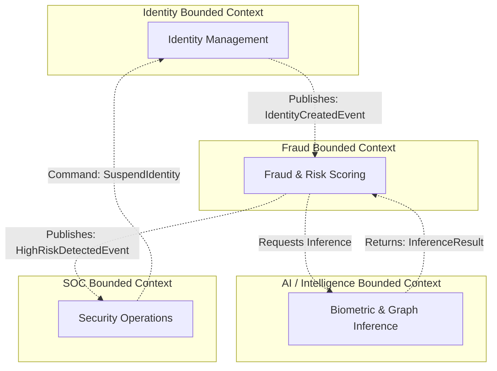

# SNISID: Domain-Driven Design (DDD) Model

This document outlines the Domain-Driven Design (DDD) architecture for the SNISID platform. By strictly defining Bounded Contexts, Aggregates, and Domain Events, we ensure that the software logic mirrors the real-world operational domains of national identity and security, preventing the "Big Ball of Mud" anti-pattern.

## 1. Bounded Context Diagram

---

## 2. Domain Models & Definitions

Within each Bounded Context, we define strict consistency boundaries using Aggregates (data that must be committed together), Entities (objects with a unique lifecycle and ID), and Value Objects (immutable descriptors).

### 2.1. Identity Domain
**Responsibility:** The core source of truth for a person's existence, demographic data, and current status.

*   **Aggregate Root: `Citizen`** (or `Resident`)
    *   Controls the consistency of all identity data. If a `Citizen` is deleted or suspended, all child entities reflect this state.
*   **Entities:**
    *   `DocumentRecord`: A passport, driver's license, or national ID card linked to the citizen.
    *   `BiometricProfile`: A reference linking the citizen to their stored biometric hashes (does not hold raw images).
*   **Value Objects (Immutable):**
    *   `NationalID`: The unique identifier string format.
    *   `Address`: Street, City, Region, Postal Code.
    *   `Demographics`: Date of Birth, Place of Birth.

### 2.2. Fraud Domain
**Responsibility:** Evaluating the risk and validity of actions taken within the system.

*   **Aggregate Root: `FraudAssessment`**
    *   A temporal record evaluating a specific transaction (e.g., "New Enrollment Assessment").
*   **Entities:**
    *   `RiskScore`: The calculated numerical risk value.
    *   `AnomalyEvent`: Specific triggers identified during the assessment (e.g., "Velocity check failed").
*   **Value Objects (Immutable):**
    *   `RuleTrigger`: The ID of the specific business rule that was violated.
    *   `RiskLevel`: Enum (`LOW`, `MEDIUM`, `HIGH`, `CRITICAL`).

### 2.3. AI / Intelligence Domain
**Responsibility:** Pure mathematical computation, biometric matching, and graph relationship analysis.

*   **Aggregate Root: `InferenceJob`**
    *   Represents a request for AI computation (e.g., 1:N face match).
*   **Entities:**
    *   `ModelPrediction`: The output from a specific AI model (e.g., ResNet-50 vs. EfficientNet).
*   **Value Objects (Immutable):**
    *   `EmbeddingVector`: The 512-dimensional float array representing a face.
    *   `ConfidenceScore`: A float between 0.0 and 1.0.
    *   `LivenessStatus`: Enum (`LIVE`, `SPOOF`, `UNDETERMINED`).

### 2.4. SOC Domain
**Responsibility:** Security monitoring, incident tracking, and active defense containment.

*   **Aggregate Root: `SecurityIncident`**
    *   A container for a tracked threat actor or systemic anomaly.
*   **Entities:**
    *   `Alert`: Individual signals from the API gateway or Fraud domain.
    *   `RemediationAction`: Actions taken by SOAR (e.g., "Quarantined IP").
*   **Value Objects (Immutable):**
    *   `Severity`: Enum (`P1`, `P2`, `P3`).
    *   `MITRETactic`: The specific ATT&CK framework code (e.g., "T1078 - Valid Accounts").

---

## 3. Domain Interaction Rules (Context Mapping)

To maintain loose coupling, Bounded Contexts must communicate via well-defined patterns.

### 3.1. Eventual Consistency (Domain Events)
Domains should primarily communicate via Domain Events over the Event Bus (Kafka).
*   *Example:* When the Identity Domain registers a user, it does *not* wait for a fraud check. It commits the `Citizen` to its database and publishes an `IdentityCreatedEvent`. The Fraud Domain listens for this event and creates a `FraudAssessment` asynchronously.

### 3.2. Anti-Corruption Layers (ACL)
When the Fraud Domain queries the AI Domain, it uses an Anti-Corruption Layer. The Fraud Domain translates the AI Domain's mathematical `InferenceResult` into a business-relevant `RiskScore`. The Fraud Domain does not bleed AI terminology (like `EmbeddingVectors`) into its own aggregate.

### 3.3. Command vs. Event
*   **Events** describe things that have already happened (e.g., `HighRiskDetectedEvent`). They are broadcasted blindly.
*   **Commands** are direct orders asking another domain to do something. The SOC Domain sends a `SuspendIdentityCommand` directly to the Identity Domain's API when an active attack is confirmed. The Identity Domain has the right to accept or reject the command based on its own internal state.
