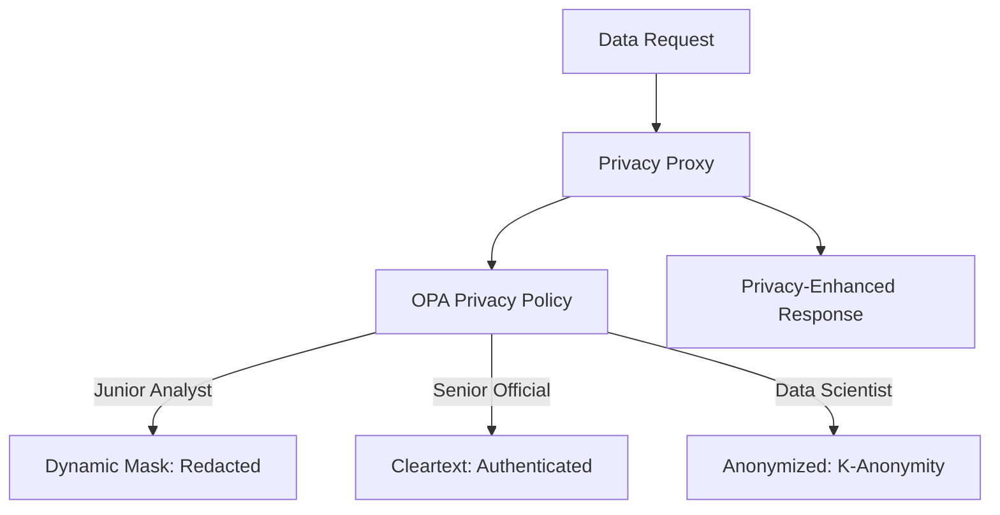

# SNISID: Data Anonymization & Masking System

The Sovereign Privacy Engine ensures that national identity data is protected not just at rest, but also during active use in analytics, auditing, and AI training. By mathematically decoupling identity from utility, we fulfill the national requirement for "Privacy by Design."

---

## 1. Masking Architecture: The Privacy Proxy

The system operates as a **Privacy-Aware Middleware** within the API Gateway and the Analytics Pipeline.

---

## 2. Dynamic Masking (Runtime)

Dynamic masking is enforced at the **Field Level** during API response serialization.

| Field Type | Junior Analyst View | Senior Official View |
| :--- | :--- | :--- |
| **National ID** | `XXXXXXXX1234` | `123-456-789-0` |
| **Phone Number** | `+509 XXXX XXXX` | `+509 3701 2345` |
| **Home Address** | `[REDACTED]` | `123 Rue de la Liberté` |
| **Biometric Score** | `0.985` | `0.985` |

**Enforcement**: The **API Gateway** intercepts the outgoing JSON and applies masking rules defined in OPA based on the requester's `clearance_level` and `agency_id`.

---

## 3. AI Training Protection: Synthetic Data

To train high-performance AI models (Biometric Matchers, Fraud Detectors) without exposing real citizen PII, SNISID uses **Synthetic Data Generation**.

- **Mechanism**: Generative Adversarial Networks (GANs) are trained on a private, air-gapped environment to learn the statistical distribution of national identity data.
- **Output**: Realistic but **mathematically fake** citizen profiles that preserve real-world correlations (e.g., age-to-location distributions) but contain zero real identities.
- **Safety**: Synthetic datasets are verified for **Membership Inference Resistance** to ensure no real training examples can be extracted.

---

## 4. Differential Privacy for Analytics

The National Analytics Dashboard utilizes **Differential Privacy** to prevent "De-anonymization" attacks.

- **Epsilon ($\epsilon$) Budget**: Controls the trade-off between privacy and accuracy. A lower epsilon provides stronger privacy by adding more noise.
- **Noise Injection**: Laplacian or Gaussian noise is added to aggregate queries (e.g., "Total active identities in Ouest department").
- **Constraint**: No query is allowed if the sample size is below a specific threshold (e.g., $n < 50$), preventing the identification of individuals in small demographics.

---

## 5. Secure Analytics Pipeline

1. **Extraction**: Raw data is pulled from the Sovereign Vault.
2. **De-identification**: Direct identifiers (Names, IDs) are stripped.
3. **Generalization**: Quasi-identifiers are generalized (e.g., `Birth_Date` $\to$ `Birth_Year`).
4. **Noise Injection**: Differential privacy applied.
5. **Consumption**: Cleaned data is sent to the **Sovereign Analytics Cluster**.

---

## 6. Compliance & Auditing

- **PII Discovery**: Automatic scanning of the database to identify and classify new PII fields for masking.
- **Unmasking Audit**: Every time a "Senior Official" requests cleartext PII, a critical audit log is generated in the **Sovereign Audit Ledger**, including the `justification_code`.
- **Data Minimization**: The Privacy Engine automatically strips any fields from an API response that were not explicitly requested by the client's scope.
