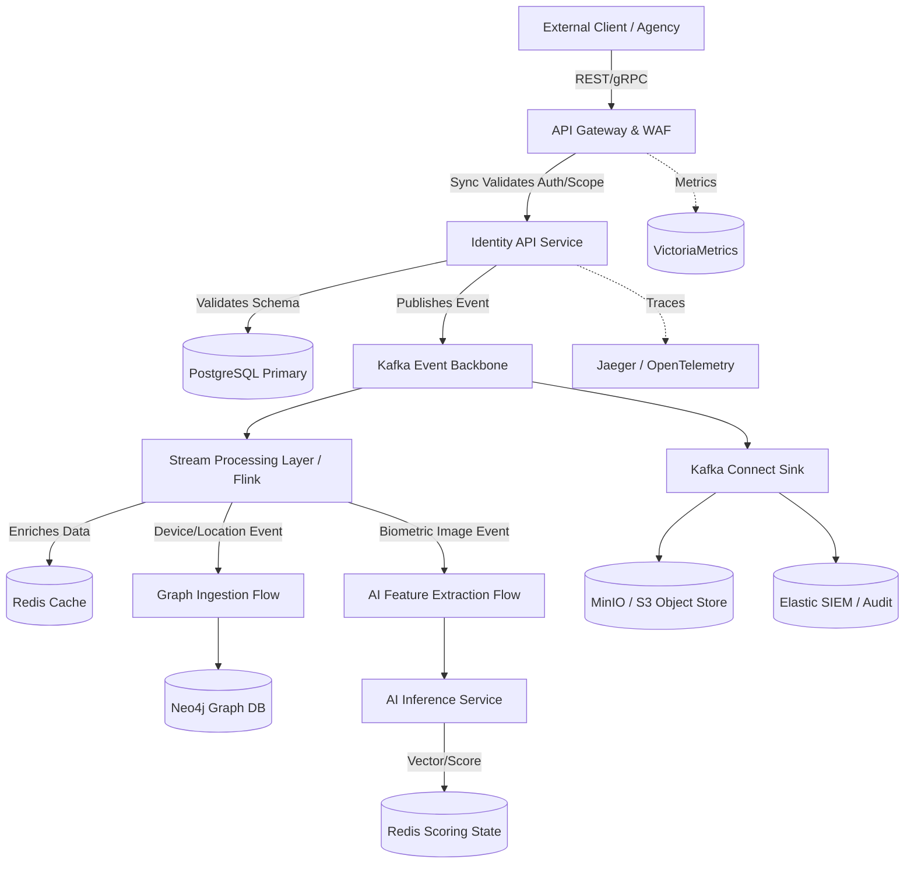

# SNISID: Data Flow Lifecycle & Processing Pipeline

This document defines the complete data lifecycle for the SNISID platform. It maps the journey of a data payload from the moment it hits the edge network, through real-time enrichment and specialized processing (AI/Graph), down to its final resting state in sovereign storage.

---

## 1. End-to-End Lifecycle Diagram

---

## 2. Data Processing Stages

The lifecycle of a data payload (e.g., a citizen enrollment request) passes through six distinct stages.

### Stage 1: API Ingestion & Validation (Synchronous)
*   **Action:** The API Gateway receives the JSON payload, terminates TLS, and enforces rate limits.
*   **Validation:** The Gateway validates the JWT signature and ABAC scopes. The Identity Service performs schema validation (e.g., ensuring date of birth formats are correct).
*   **Transformation:** The payload is transformed from external DTOs (Data Transfer Objects) into internal domain entities.

### Stage 2: Core Storage & Kafka Ingestion (Synchronous to Asynchronous)
*   **Action:** To guarantee durability, the Identity Service commits the core transactional data synchronously to **PostgreSQL**. Immediately after the database commit, it acts as a Kafka Producer, converting the state change into a standard event envelope (e.g., `identity.citizen.created`) and publishing it to the Event Backbone.
*   **Response:** The Gateway returns an `HTTP 202 Accepted` to the client, concluding the synchronous flow.

### Stage 3: Stream Processing & Enrichment Layer (Asynchronous)
*   **Action:** Apache Flink (or Kafka Streams) consumes the raw event.
*   **Enrichment:** Flink reaches out to the **Redis Cache** or external APIs to enrich the data (e.g., mapping a raw IP address to a Geo-Location object).
*   **Transformation:** The enriched payload is published back to Kafka on an internal processing topic.

### Stage 4: Specialized Processing Flows (AI & Graph)
*   **Graph Ingestion Flow:** The Graph Intelligence Service consumes the enriched event. It transforms flat JSON into Graph Edges and Nodes (e.g., taking an `address` string and creating an `(Identity)-[:LIVES_AT]->(Address)` relationship in **Neo4j**).
*   **AI Feature Extraction Flow:** If the event contains raw biometric bytes, the AI Inference Service intercepts it. It extracts features (converting a face image into a 512-D float vector) and runs liveness/deepfake detection. The raw image is routed to **MinIO (Object Storage)**, while the mathematical vectors are sent to the Fraud Detection Engine.

### Stage 5: Storage Routing Logic
*   **Relational Data:** Handled synchronously in Stage 2 (PostgreSQL).
*   **Relationship Intelligence:** Handled in Stage 4 (Neo4j).
*   **Ephemeral / Scoring State:** Handled by the Fraud Engine committing risk scores to **Redis**.
*   **Binary Blobs:** Documents and raw images are stored in **MinIO** via secure S3 APIs.

### Stage 6: Analytics & Audit
*   **Action:** Kafka Connect acts as a sink, blindly pulling all events from topics like `audit.record.logged` and dumping them into the **Elastic SIEM** for SOC querying.
*   **Privacy Layer:** Before entering the Analytics Cluster, data is processed by the **Sovereign Privacy Engine** for dynamic masking and differential privacy noise injection.
*   **Telemetry:** Metrics (CPU, network throughput) are scraped by **VictoriaMetrics**.

---

## 3. Failure Handling Strategy

Due to the distributed nature of the pipeline, failures must be contained to prevent system-wide outages.

1.  **Sync Ingestion Failures:** If the payload is malformed or the API Gateway detects a WAF violation, the pipeline terminates immediately, returning an `HTTP 400` or `403` to the client. No database writes occur.
2.  **Database Commit Failures:** If PostgreSQL is unreachable during Stage 2, the Identity Service throws an exception and the API returns `HTTP 503 Service Unavailable`. The event is **not** published to Kafka to prevent "phantom events".
3.  **Async Processing Failures:** If Flink or Neo4j fails to process an event during Stages 3 or 4, the event is routed to a **Dead-Letter Queue (DLQ)** after 3 exponential backoff retries. The primary Kafka pipeline continues to flow uninterrupted.
4.  **Distributed Transactions (Saga Pattern):** SNISID avoids two-phase commits (2PC). If a downstream async process detects an unrecoverable business error (e.g., AI detects a deepfake *after* the identity was created in Postgres), it publishes a compensating event (`identity.citizen.suspended`), which the Identity Service consumes to update PostgreSQL retroactively.

---

## 4. Traceability & Auditability Model

To guarantee legal non-repudiation and forensic tracking across all 6 stages:

*   **W3C Trace Context (OpenTelemetry):** The moment a request hits the API Gateway, a unique `correlation_id` (Trace ID) is generated. This ID is injected into HTTP Headers for sync calls and into the Kafka Event Envelope for async calls.
*   **Distributed Logging:** All services (Identity, Flink, AI, Graph) log their actions to `stdout/stderr` including this `correlation_id`. The logs are aggregated in ElasticSearch (Jaeger/Kibana). An analyst can search one ID and see the entire lifecycle graph—from API ingress, to Postgres commit, to Kafka publish, to Neo4j node creation.
*   **Immutable Audit Logs:** Every microservice must independently publish a minimal "Action Receipt" to the `audit.record.logged` Kafka topic. This topic uses WORM (Write-Once, Read-Many) storage logic, meaning no administrator can alter the history of an identity's lifecycle.
