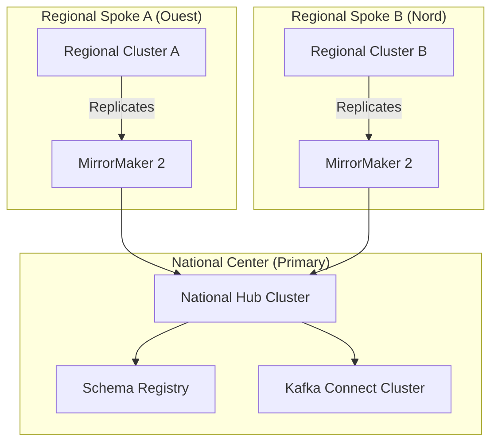

# SNISID: National Kafka Backbone & Cluster Architecture

As the "Central Nervous System" for SNISID, the Kafka infrastructure is designed for multi-region resilience, zero-data loss, and national-scale event throughput.

---

## 1. Infrastructure Topology: Multi-Region Hub-and-Spoke

SNISID utilizes a **Federated Multi-Cluster** model deployed via **Kubernetes (Strimzi Operator)**.

- **Brokers**: 6 brokers per cluster (m6g.2xlarge typical), distributed across 3 Availability Zones (Rack Awareness).
- **Controllers**: 3 dedicated KRaft controllers for sub-second failover.
- **Rack Awareness**: `broker.rack` is set to the AZ ID to ensure replicas are never placed on the same physical infrastructure.

---

## 2. Event Durability & Zero-Loss Model

| Parameter | Configuration | Justification |
| :--- | :--- | :--- |
| **Replication Factor** | `3` | Standard for high durability. |
| **Min In-Sync Replicas** | `2` | Ensures at least 2 brokers have the data before ack. |
| **Producer Acks** | `all` | Guaranteed persistence on all ISRs. |
| **Idempotence** | `true` | Prevents duplicate events during retries. |
| **Clean Leader Election** | `false` | Prefer availability loss over data loss (no dirty failover). |

---

## 3. Capacity Planning & Throughput Targets

SNISID is designed for **100M+ events per day** at peak load.

- **Ingestion Target**: 10k events/sec (Sustained), 50k events/sec (Burst).
- **Latency Target**: P99 < 10ms (Producer to Broker).
- **Tiered Storage**: Local SSDs store the most recent 500GB; MinIO handles the multi-terabyte historical tail.

---

## 4. Secure Communication & Security Layers

- **Identity**: All components (Brokers, SR, Connect) possess **SPIFFE SVIDs**.
- **AuthN**: SASL/SSL using X.509 certificates (mTLS).
- **AuthZ**: Per-topic ACLs enforced by the Strimzi Operator.
- **Encryption**: AES-256-GCM for data at rest (LUKS volumes).

---

## 5. Recovery & Disaster Recovery Workflows

### 5.1. Regional Outage (RPO: <100ms, RTO: <5m)
1.  **MirrorMaker 2** continuously replicates Spoke topics to the National Hub.
2.  If a Spoke region fails, Global DNS (GSLB) routes producers to the National Hub or the nearest available Spoke.
3.  Consumer offsets are translated by MM2, allowing services to resume where they left off.

### 5.2. Tiered Storage Recovery
- If a broker's local disk is lost, it recovers historical data seamlessly from the **Sovereign Object Storage** (Tiered Storage).

---

## 6. Production Deployment Model (Strimzi)

SNISID uses a **GitOps (ArgoCD)** workflow for Kafka management.

- **KafkaResource**: Defines the cluster size and configuration.
- **KafkaUser**: Defines the SPIFFE-based credentials.
- **KafkaTopic**: Defines partitions and retention.

---

## 7. Topic Partitioning Strategy

- **Default**: 60 partitions per topic to support 60 parallel consumers.
- **High-Throughput**: 120+ partitions for national audit and identity streams.
- **Key-Based**: All identity events use `identity_id` as the key to ensure strict per-identity ordering.

---

## 8. Multi-Cluster Replication (Prompt 101)

SNISID maintains an **Active-Active** geo-resilient topology for mission-critical topics.

- **MirrorMaker 2 (MM2)**:
  - **Topology**: Bi-directional replication between Primary and DR regions for `identity.*` topics.
  - **Latency**: Sub-200ms replication lag targets across national fiber links.
- **Cluster Linking**: Used for real-time offset synchronization, ensuring that consumer groups can failover without re-processing millions of messages.
- **Event Durability**: All replicated messages are written with `acks=all` on the target cluster.

---

## 9. Schema Registry & Validation (Prompt 102)

The **Sovereign Schema Registry** acts as the contract enforcement layer.

- **Centralized Governance**: All schemas are defined in **Protobuf** for maximum performance and strict typing.
- **Validation Workflows**:
  - **Server-Side Validation**: Brokers are configured to reject any message that does not match the registered schema ID in the header.
  - **Compatibility**: Enforced `BACKWARD_TRANSITIVE` evolution prevents breaking downstream consumers.
- **Security Validation**: Schemas include mandatory security headers (e.g., `trust_level`, `encryption_indicator`) that are verified at the ingestion gateway.

---

## 10. Event Compression & Optimization (Prompt 103)

To maximize throughput and minimize cross-region egress costs:

- **Serialization**: Protobuf is the mandated standard, offering significantly lower CPU and payload overhead compared to JSON/Avro.
- **Compression**: **Zstandard (zstd)** is used for all topics. It provides the best balance between high compression ratios (up to 5x for audit logs) and low CPU latency.
- **Batching**: Producers are tuned with `linger.ms=10` and `batch.size=64KB` to optimize network packet utilization during peak enrollment periods.
- **Zero-Copy Processing**: The engine utilizes the **Linux Sendfile** syscall to transfer bytes from storage to network without unnecessary kernel/user space copies.
