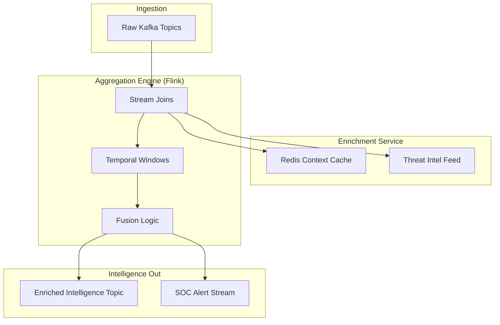

# SNISID: Event Enrichment & Aggregation Engine

The Enrichment & Aggregation Engine transforms raw data into high-value intelligence by injecting national context and correlating disparate events in real-time.

---

## 1. Real-Time Event Enrichment (Prompt 98)

Every event entering the "Sovereign Intelligence Zone" is enriched with five layers of context.

### 1.1. Contextual Layers
- **Identity Context**: Injects the citizen's current trust score, clearance level, and active session status by joining with the **GlobalKTable (Citizen Profiles)**.
- **Geo-Intelligence**: Maps IP/Device coordinates to national infrastructure (e.g., "Border Crossing Alpha") and flags "Impossible Travel" anomalies.
- **Device Intelligence**: Matches device fingerprints against the **Verified Device Registry**.
- **Threat Intelligence**: Correlates event source IPs/hashes against the **Sovereign Threat Intel (STI)** feed (Real-time Blacklists).
- **Behavioral Context**: Injects metadata about the user's historical norms (e.g., "Standard Login Time: 09:00-18:00").

### 1.2. Pipeline Optimization
- **Caching**: Enrichment services use a **Redis/Sidecar cache** (2ms latency) for frequently accessed identity metadata to avoid hitting the primary database.
- **Async Fusion**: Enrichment lookups are performed in parallel using **Async I/O** (Flink/Go) to minimize stream latency.

---

## 2. Event Aggregation & Fusion (Prompt 104)

The platform fuses millions of micro-events into meaningful security incidents.

### 2.1. Temporal Aggregation
- **Windowed Totals**: Flink aggregates events over tumbling and sliding windows (e.g., "Failed login attempts per user per 5 minutes").
- **Waterfall Accumulators**: For long-running processes (e.g., "Multi-stage visa application"), the engine maintains an aggregated state store that accumulates evidence over days or weeks.

### 2.2. Multi-Source Data Fusion
- **Entity Resolution**: The engine correlates events from different agencies (e.g., Border + Banking) using **Identity Resolvers** to build a 360-degree view of a specific event trail.
- **AI-Enhanced Fusion**: ML models analyze the aggregated stream to detect "Fuzzy Correlations" that traditional rules-based systems miss.

---

## 3. Aggregation Topology

---

## 4. Performance & Scalability

- **State Size Management**: RocksDB state stores are configured with strict TTL (Time-To-Live) to prevent memory bloat during massive temporal aggregations.
- **Parallelism**: The Aggregation Cluster is scaled per-topic-partition, ensuring that enrichment overhead does not cause consumer lag in the National Backbone.
