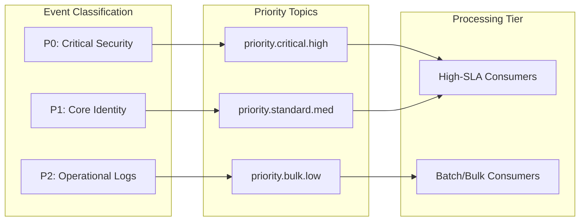

# SNISID: Event Priority Routing System

The Priority Routing System ensures that mission-critical security signals (e.g., a biometric mismatch at a border) are processed with zero-latency, even during periods of extreme system load.

---

## 1. Routing Architecture: Multi-Lane Backbone

SNISID uses **Priority-Aware Kafka Topics** to separate signal from noise.

---

## 2. Priority Classification Engine

Every event is assigned a `priority_score` (0-255) by the **Ingestion Gateway** or the **Threat Intelligence Engine**.

- **Static Rules**: Events like `identity.revocation` or `mfa.failure.admin` are hard-coded as **P0 (Critical)**.
- **Dynamic Scoring**: The **AI Risk Engine** can "Escalate" an event's priority in real-time. If a standard login is associated with a known APT IP, the priority is instantly bumped to P0.

---

## 3. Queue Hierarchy & SLA-Aware Processing

| Priority | SLA Target (Latency) | Queue Type | Worker Allocation |
| :--- | :--- | :--- | :--- |
| **P0 (Critical)** | < 10ms | Dedicated High-Speed Partition | Reserved (Always 100% available) |
| **P1 (Standard)** | < 100ms | Standard Partition | Dynamic (Scales with load) |
| **P2 (Bulk)** | < 2s | Bulk/Compacted Topic | Opportunistic (Uses excess capacity) |

---

## 4. Real-Time Escalation Workflows

- **SOC Alert Inbound**: P0 events bypass all standard normalization buffers and are routed directly to the **Live SOC Stream** via a dedicated "Fast-Path".
- **Threshold Escalation**: If a P1 topic's lag exceeds a safety threshold (e.g., 5 seconds), the engine triggers an "Emergency Reroute," moving the most critical P1 events into the P0 lane.

---

## 5. Mission-Critical Isolation

- **Resource Quotas**: P0 topics are allocated to **Dedicated Brokers** with NVMe storage and high-bandwidth network interfaces.
- **Circuit Breakers**: If the P2 lane (Bulk) is causing IO wait on the brokers, the **Storage Controller** automatically throttles P2 writes to ensure P0 throughput remains unaffected.
- **SLA Monitoring**: Real-time "Priority Health" dashboards tracking latency by priority class.
