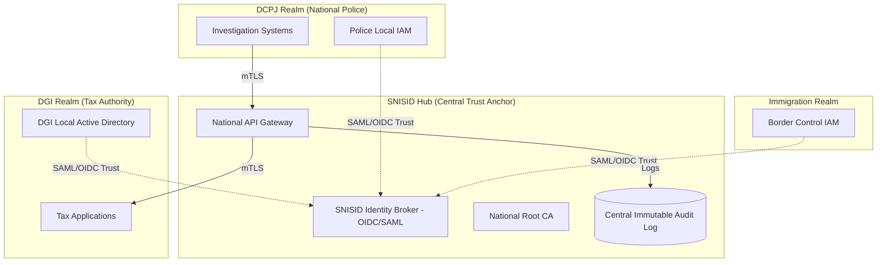

# SNISID: Multi-Agency Identity Federation Model

In a sovereign national architecture, disparate government agencies (Tax, Police, Civil Registry) must interoperate seamlessly without surrendering operational autonomy over their own staff and local systems. SNISID achieves this via a **Hub-and-Spoke Federated Identity Architecture**.

---

## 1. Federation Topology & Architecture Diagram

SNISID acts as the central Identity Broker (the "Hub"), while individual agencies (the "Spokes") maintain their local domains.

---

## 2. Trust Anchor Architecture & Relationship Model

### The SNISID Hub as the Root of Trust
SNISID does not force the Tax Authority (DGI) to delete their internal Microsoft Active Directory. Instead, SNISID establishes a **Federated Trust Relationship**.

1.  **Identity Federation (OIDC / SAML 2.0):** The SNISID Identity Broker trusts the DGI Local IdP to authenticate its own officers. When a Tax Officer logs into a cross-agency portal, they are redirected to their local DGI login screen. Upon success, SNISID issues a unified, normalized JWT that is understood across the entire national network.
2.  **Public Key Infrastructure (PKI):** SNISID operates the National Root Certificate Authority (CA). Every agency is issued an Intermediate CA certificate to mint mTLS certificates for their servers. This guarantees that all machine-to-machine traffic over the government intranet is cryptographically trusted.

### Trust Boundaries
*   **Strict Isolation:** The Police (DCPJ) have zero visibility into the DGI's local active directory, and vice versa.
*   **Decentralized Authentication, Centralized Authorization:** Agencies handle *Authentication* (verifying passwords/biometrics of their staff). SNISID handles *Authorization* (determining if an authenticated Police Officer has the legal clearance to query a specific Tax record via OPA).

---

## 3. Identity Synchronization Workflows

How does the central SNISID database map a local agency officer to a national identity?

### 3.1. SCIM (System for Cross-domain Identity Management)
For proactive synchronization, agencies use the SCIM protocol. When a new officer is hired at Immigration, the Immigration IAM automatically pushes a standardized JSON payload to SNISID via SCIM, creating a federated placeholder identity.

### 3.2. Just-In-Time (JIT) Provisioning
If SCIM is unavailable, JIT provisioning is used.
1.  An officer attempts to access the SNISID portal for the first time.
2.  They authenticate against their local Agency IdP.
3.  The Agency IdP sends a SAML Assertion containing claims (Name, Badge Number, Clearance).
4.  SNISID dynamically creates a federated profile on the fly based on these trusted claims.

### 3.3. Citizen Identity Correlation
For citizen data, SNISID is the absolute source of truth. Agencies map their local identifiers (e.g., a Taxpayer ID) to the central SNISID `national_id`. If a citizen updates their address in SNISID, SNISID publishes an `identity.citizen.updated` Kafka event. Subscribed agencies consume this event to synchronize their local databases asynchronously.

---

## 4. Agency Isolation & Federation Security Controls

To ensure that interoperability does not become a security liability:

1.  **Network Microsegmentation:** Agencies operate in isolated network VLANs. The *only* permitted ingress/egress path to another agency is through the central SNISID API Gateway.
2.  **Mutual TLS (mTLS):** Every cross-agency API call requires mTLS. If an attacker breaches the Police network and attempts to query the Tax network, the request is dropped instantly unless signed by a SNISID-issued certificate.
3.  **Data Sharing Agreements (OPA Enforced):** The Open Policy Agent (ABAC) enforces strict legal boundaries. 
    *   *Rule:* A Police Officer can query Immigration data *only if* the target citizen is actively flagged in a `fraud.case`.

---

## 5. Cross-Agency Audit Mechanisms

Federation requires absolute non-repudiation. If data leaks, the government must know exactly which agency and which officer accessed it.

1.  **Central Immutable Ledger:** Regardless of which agency initiates a request, the SNISID API Gateway logs the interaction to the Kafka `audit.record.logged` topic.
2.  **Federated Identity Tracing:** The audit log does not just record "DCPJ Server queried data". Because the access token is federated, the log explicitly records: `Officer John Doe (Local ID: POL-8821, National ID: NID-554) at Agency DCPJ executed query`.
3.  **Cryptographic Signatures:** Audit logs are cryptographically signed at the time of creation. Agencies receive read-only dashboard access (via SIEM) to audit queries made *against* their data by other agencies, ensuring mutual transparency and deterrence against abuse.
