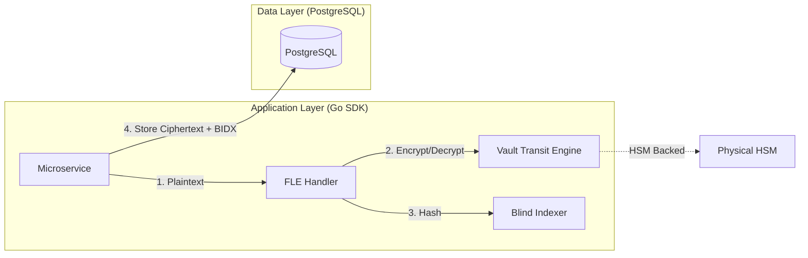

# SNISID: Field-Level Encryption (FLE) Architecture

The FLE system provides the final line of defense for citizen PII. It ensures that sensitive fields (Names, National IDs, Biometric Hashes) are stored as ciphertext, rendering the database useless to an attacker or rogue administrator.

---

## 1. FLE Architecture & Integration

SNISID implements **Application-Side Encryption** using the **Vault Transit SDK**.



---

## 2. Key Architecture: Tenant-Aware Protection

To ensure jurisdictional isolation, encryption keys are derived per-tenant.

- **Tenant KEK (Key Encryption Key)**: Each agency has its own master key in Vault (e.g., `tax-kek`, `police-kek`).
- **Identity DEK (Data Encryption Key)**: (Optional for ultra-sensitive records) A per-record key used to enable **Sovereign Crypto-Shredding**.
- **Namespace Isolation**: Vault namespaces are used to prevent cross-agency key access.

---

## 3. Searchable Encryption: Blind Indexing

Searching ciphertext is mathematically impossible without compromising randomized encryption (AES-GCM). SNISID uses **Blind Indexing** to enable secure searches.

1. **The Process**:
   - Plaintext: `John Doe`
   - Salt: `Tenant_Secret_Salt_8821` (Stored in Vault, not the DB).
   - Algorithm: `HMAC-SHA-256(Plaintext, Salt)`.
   - Result: `b8a1...f3` (The **Blind Index**).
2. **Database Storage**:
   - `name_encrypted`: `vault:v1:abc...` (Randomized, secure).
   - `name_bidx`: `b8a1...f3` (Deterministic, searchable).
3. **Querying**:
   - `SELECT * FROM citizen_profiles WHERE name_bidx = HMAC-SHA-256('John Doe', Salt)`.
   - **Benefit**: The database never sees the plaintext or the salt, but can still perform $O(1)$ index lookups.

---

## 4. Query Security Model

| Feature | Protection |
| :--- | :--- |
| **Equality Search** | Supported via Blind Indexing. |
| **Range Search** | Prohibited for encrypted fields to prevent order-revealing attacks. |
| **Partial Match** | Limited to specific "Searchable Substrings" (e.g., last 4 digits of a phone number) with their own dedicated blind indexes. |
| **Frequency Analysis** | Mitigated by using per-tenant salts, ensuring that the same name across two different agencies results in different blind indexes. |

---

## 5. Database Integration Strategy

Microservices use a **Transparent Type Handler** in the ORM (GORM/SQLx).

```go
type CitizenProfile struct {
    ID          uuid.UUID
    // Transparently encrypted field
    NationalID  EncryptedField `gorm:"type:text"`
    // Associated blind index for searching
    NationalIDBidx string      `gorm:"index"`
}
```

- **Encryption on Write**: The SDK automatically calls Vault Transit and computes the Blind Index before the SQL `INSERT`.
- **Decryption on Read**: The SDK automatically calls Vault Transit to decrypt the field when the record is fetched.

---

## 6. Performance Optimization

- **Salt Caching**: Blind index salts are cached in the microservice memory for 5 minutes to reduce Vault round-trips.
- **Batch Processing**: The SDK uses Vault's `/transit/encrypt` batch endpoint for bulk operations (e.g., during national enrollment imports).
- **Latency Target**: < 5ms overhead per field encryption/decryption.

---

## 7. Recovery & Re-keying

- **Tenant KEK Rotation**: Vault supports seamless key rotation. New data is encrypted with the latest version; old data is decrypted with the previous version.
- **Background Re-wrap**: A dedicated maintenance worker can re-wrap historical ciphertext with the new key version without cleartext exposure.
- **Integrity Check**: Periodic verification that `HMAC(Decrypt(EncryptedField), Salt) == BlindIndex`.
