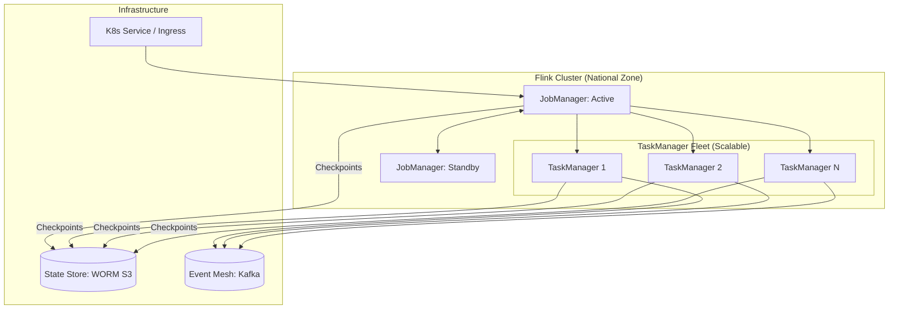

# SNISID: Flink Analytics Architecture

The Flink Analytics Cluster serves as the "Sovereign Intelligence Engine," performing complex event processing (CEP) and real-time behavioral scoring at a national scale.

---

## 1. Flink Cluster Topology: Kubernetes-Native

SNISID utilizes the **Flink Kubernetes Operator** for automated lifecycle management and horizontal scaling.

---

## 2. JobManager & TaskManager Architecture

- **JobManager (HA)**: Deployed in a high-availability configuration using **Kubernetes Native Leader Election**. The JobManager orchestrates the execution graph and manages checkpoints.
- **TaskManager Scaling**:
  - **Task Slots**: Each TaskManager is configured with 4-8 slots to match the CPU core count of the underlying node.
  - **Memory Management**: Optimized for **Off-Heap** memory to support large RocksDB state stores without excessive JVM garbage collection.
  - **Horizontal Autoscaling (HPA)**: The cluster scales TaskManagers dynamically based on the `pending_records` (consumer lag) and CPU utilization.

---

## 3. Stateful Processing & Checkpointing (Prompt 116)

To ensure exactly-once semantics and fast recovery:

- **State Backend**: **RocksDB** is the mandated backend, allowing state sizes to exceed available RAM by spilling to local NVMe storage.
- **Incremental Checkpointing**: Enabled to minimize the performance impact of frequent snapshots. Only the changes (deltas) since the last checkpoint are written to MinIO.
- **Checkpoint Alignment**: Unaligned checkpoints are used during heavy load/backpressure to ensure snapshots complete even when partitions are congested.
- **Retention**: Checkpoints are stored in **Sovereign Object Storage** with a 24-hour TTL, while Savepoints (manual) are archived indefinitely for forensic replay.

---

## 4. Load Balancing & Resource Optimization (Prompt 117)

- **Task Spread**: Flink is configured to spread tasks across TaskManagers to prevent "Hot-Node" scenarios.
- **Slot Isolation**: Different Flink jobs (e.g., `Fraud_Engine` vs. `KPI_Report`) are deployed in separate **FlinkApplication** namespaces to ensure resource isolation.
- **Dynamic Resource Sizing**: The JobManager utilizes the **Adaptive Scheduler** to resize the job's parallelism based on the current number of available TaskManagers.

---

## 5. Event-Time Processing & Watermarking

SNISID processes events based on their **Sovereign Timestamp** (Event-Time), not the arrival time at the cluster.
- **Watermarks**: 5-second out-of-order tolerance (bounded-out-of-orderness) is used to handle network jitter across regional spoke clusters.
- **Late Data**: Events arriving after the watermark are routed to a **Side-Output** topic for forensic inspection and "Delayed-State-Update" processing.

---

## 6. Observability & Runtime Monitoring

- **Flink Dashboard**: Integrated with the National SOC for real-time visibility into job graphs and backpressure status.
- **Prometheus Metrics**: Detailed monitoring of:
  - `checkpoint_duration`
  - `last_checkpoint_size`
  - `num_late_records_dropped`
  - `taskmanager_heap_memory_usage`
