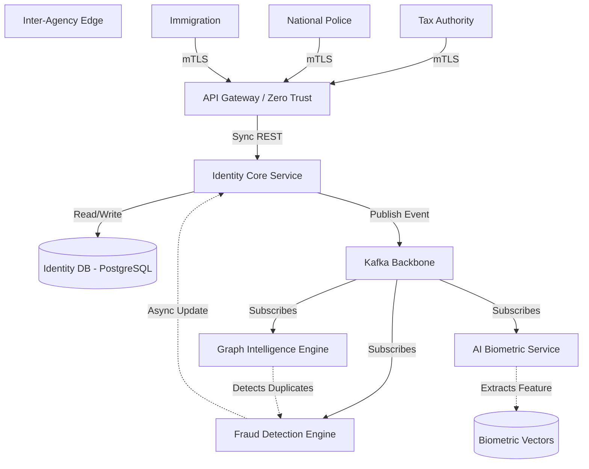

# SNISID: National Identity System Architecture

The Identity Core is the sovereign heartbeat of the SNISID platform. It operates as the absolute source of truth for the existence, demographics, and real-time status of every citizen, integrating tightly with biometrics and intelligence engines while maintaining extreme data privacy.

---

## 1. Identity Architecture Diagram

---

## 2. Identity Lifecycle States

An identity within SNISID is not simply "created" and "deleted." It moves through a strict, auditable state machine.

1.  **ENROLLING:** Temporary state during data capture at a kiosk or agency desk.
2.  **PENDING_VERIFICATION:** Data is captured and committed. Waiting on asynchronous AI and Graph Intelligence checks (deepfake, 1:N duplicate search).
3.  **ACTIVE:** Fully verified and legally recognized. Can be used for cross-agency lookups.
4.  **SUSPENDED:** Automatically triggered by the SOC or Fraud Engine due to a high-risk anomaly (e.g., identity theft suspected). Temporarily blocks agency lookups.
5.  **FRAUD_REVIEW:** Suspended status specifically requiring human L2 Analyst intervention to resolve a complex graph collision.
6.  **DECEASED:** Terminal state. Civil Registry confirms death. Prevents future authentications but retains historical audit ability.

---

## 3. Core Identity Workflows

### 3.1. Identity Creation Workflow (Asynchronous Verification)
1.  **Ingestion:** Agency submits demographics and raw biometric images to the Identity Service.
2.  **Commit:** Identity Service saves data to PostgreSQL with status `PENDING_VERIFICATION` and publishes an `identity.citizen.enrolled` event.
3.  **Biometric Processing:** The AI Service intercepts the raw images, performs liveness checks, extracts 512-D float vectors, and saves them.
4.  **1:N Duplicate Search:** The AI Service queries the vector database for a 1:N match. Concurrently, the Graph Service searches Neo4j for identical addresses or phone numbers.
5.  **Scoring & Activation:** The Fraud Engine aggregates the results. If the score is clean, it sends an `ActivateIdentityCommand` to the Identity Service, which changes the status to `ACTIVE`.

### 3.2. Identity Verification Workflow (Synchronous)
1.  **Request:** A police officer scans a fingerprint or takes a live photo.
2.  **Lookup:** The payload is sent to the API Gateway.
3.  **Matching:** The Identity Service routes the 1:1 verification request synchronously to the AI Inference Service.
4.  **Response:** The AI Service returns a boolean `true/false` based on the national confidence threshold. The Identity Service returns this boolean to the officer, ensuring rapid response times (`< 1 second`) without exposing PII.

---

## 4. Biometric Linkage & Duplicate Detection

### Biometric Linkage Architecture
The Core Identity PostgreSQL database **never** stores biometrics. It only stores a UUID (`biometric_profile_id`). 
*   Raw images are stored in **MinIO/S3** (encrypted at rest).
*   Mathematical embeddings (vectors) are stored in a specialized **Vector Database** (e.g., Milvus/pgvector) managed by the AI Service.

### Duplicate Identity Detection (Synthetic Identity Rings)
The system prevents fraud proactively rather than reactively:
*   **Biometric Collisions:** A citizen attempts to register twice with different names. The AI Service's 1:N search flags the vector similarity.
*   **Graph Collisions:** A synthetic identity uses a unique face but shares a phone number and address with 10 other identities. The Graph Service (Neo4j) detects the high clustering coefficient and flags the ring.

---

## 5. Cross-Agency Lookup Model & Interoperability

Government agencies must share intelligence, but privacy laws prohibit giving one agency raw database access to another.

*   **Zero Trust Connectivity:** Agencies connect to the SNISID Gateway using strict Mutual TLS (mTLS) over the government intranet.
*   **Data Minimization (ABAC):** Responses are filtered based on Attribute-Based Access Control.
    *   *Police Query:* Returns "Identity Valid" + "Outstanding Warrants".
    *   *Tax Authority Query:* Returns "Identity Valid" + "Registered Address".
    *   *Neither* receives the raw biometric vectors.
*   **Event Subscriptions:** Agencies can subscribe to specific Kafka webhooks. E.g., The Tax Authority is notified automatically via the API Gateway if a citizen's status changes to `DECEASED`.

---

## 6. Security & Traceability Considerations

1.  **Immutable Audit Trails:** Every time an agency queries an identity, a record is fired to `audit.record.logged` (e.g., "Officer X queried Identity Y at 14:02"). This prevents unauthorized profiling by state actors.
2.  **Crypto-Shredding:** If a court orders the deletion of an identity, the `identity_id` remains in the database to maintain referential integrity, but the specific AES encryption key used to encrypt the citizen's PII is destroyed.
3.  **Circuit Breakers:** If the AI Biometric service goes offline, the Identity Creation workflow degrades gracefully. The citizen remains in `PENDING_VERIFICATION` rather than crashing the enrollment desk UI.
