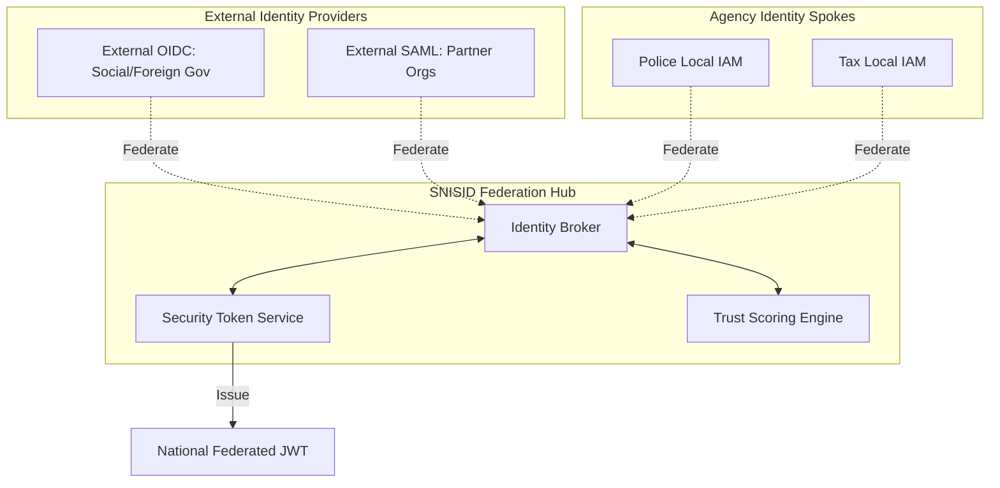

# SNISID: Advanced Identity Federation System

This system provides the cryptographic and logical "Glue" that allows sovereign government agencies and external partners to interoperate under a unified security umbrella. It enables cross-domain trust while maintaining strict jurisdictional isolation.

---

## 1. Advanced Federation Architecture

The system operates as a **Multi-Protocol Trust Broker** using a **Security Token Service (STS)** core.

---

## 2. Security Token Service (STS) & Token Exchange

SNISID handles **Protocol Translation** to ensure all services across the national mesh speak a common identity language.

- **Token Translation**: Converting an incoming SAML 2.0 Assertion (from a legacy agency system) into a hardened OIDC JWT (for the modern mesh).
- **Token Exchange (RFC 8693)**: Swapping a user's "Long-Lived" session token for a "Short-Lived", scope-limited access token when calling a specific microservice.
- **Token Binding**: Ensuring that a federated token is cryptographically bound to the user's device (FIDO2) to prevent session replay.

---

## 3. Federation Trust Scoring

SNISID evaluates the "Health" of federated partners in real-time.

| Metric | Modifier | Rationale |
| :--- | :---: | :--- |
| **MFA Strength** | +0.4 | WebAuthn/FIDO2 is significantly more trusted than SMS/TOTP. |
| **IdP Security Posture** | +0.2 | Agency IdP is running latest patches and HSM-backed signing. |
| **SOC Signals** | -0.8 | Real-time alerts of compromise in the Agency's network. |
| **Jurisdictional Trust** | +0.1 | Official sovereign government agency. |

**Dynamic Enforcement**: If an agency's **Federation Trust Score** drops below `0.6`, OPA automatically triggers mandatory step-up authentication (Biometric) for all their officers, regardless of their role.

---

## 4. Cross-Domain SSO Workflows

1. **Discovery**: The user enters their email/ID. SNISID identifies the authoritative "Home IdP" (e.g., `officer@police.gov`).
2. **Redirect**: SNISID redirects the user to the Police local IAM for authentication.
3. **Response**: The Police IdP returns a signed assertion to the SNISID Broker.
4. **Scoring**: The Broker calculates the Federation Trust Score for that specific interaction.
5. **Harmonization**: SNISID maps the local `role: patrol_officer` to the global `role: intelligence_officer_l3`.
6. **Issue**: STS issues the final National Federated JWT.

---

## 5. Policy Harmonization & Mapping

To prevent "Role Explosion," SNISID enforces a unified **National Role Catalog**.

- **Attribute Mapping**: Mapping diverse agency claims (e.g., `Clearance: Secret` vs `Access: Level_5`) into standardized national attributes.
- **Jurisdictional Scoping**: The Federated token is automatically scoped with the `tenant_id` of the originating agency to ensure data isolation.

---

## 6. Federation Governance & The Kill Switch

- **Mutual Trust Agreements**: All federation spokes must cryptographically sign a "Sovereign Trust Agreement" stored in the Policy Plane.
- **Federation Kill Switch**: In the event of a total agency compromise, the National SOC can "Sever the Spoke," instantly invalidating all trust relationships and tokens originating from that agency's IdP across the entire nation.
- **Federation Audit**: Every cross-domain authentication event is logged as a `auth.federation.success/failed` event to the **Sovereign Audit Ledger**.
