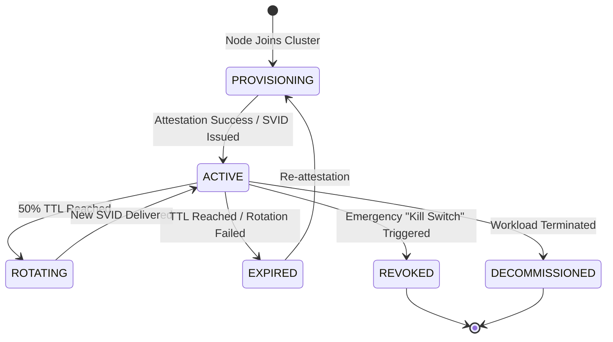

# SNISID: Service Identity Lifecycle Management (SILM)

This document defines the end-to-end management of service identities within the SNISID platform. It covers everything from the initial cryptographic bootstrap to emergency revocation and decommissioning.

---

## 1. Identity State Machine

Every service identity (SPIFFE ID) moves through a strictly defined state machine.

---

## 2. The Lifecycle Stages

### 2.1. Issuance (Bootstrap)
Identities are never static. They are issued dynamically upon workload startup.
- **Node Attestation**: Hardware-bound proof (TPM/HSM) ensures the physical/virtual host is authorized.
- **Workload Attestation**: Binary/Container-bound proof ensures the software is authorized.
- **Verification**: The SPIRE Server validates these proofs against the **National Registration Database**.

### 2.2. Verification & Trust Propagation
- **Trust Chain Validation**: Every service verifies the peer's SVID against the **National Trust Bundle**.
- **Continuous Validation**: Identities are verified at every network hop (Ingress -> Service A -> Kafka -> Service B).

### 2.3. Automated Rotation
Rotation is handled transparently to the application.
- **Interval**: 12 hours (Standard SVID), 1 hour (High-Security SVID).
- **Mechanism**: The SPIRE Agent pushes new SVIDs via the **Workload API (SDS)**.
- **Zero-Downtime**: Envoy/Proxies hold the old certificate for an overlap period (Grace Period) to ensure inflight requests are not dropped.

### 2.4. Expiration Policy
- **Hard Expiry**: If a workload fails to rotate its SVID before the TTL, it is automatically isolated by the mesh.
- **Alerting**: Expiration warnings are fired at 20% TTL remaining.

---

## 3. Emergency Revocation Protocol

In the event of a compromise (e.g., an agency endpoint is physically seized), we trigger the **Sovereign Kill Switch**.

1. **Trigger**: SOC Analyst initiates revocation via the **Security Control Plane**.
2. **Global Revocation List (GRL)**: The SPIRE Server updates the registration entry as `REVOKED`.
3. **Propagation**: 
   - **Issuance Block**: SPIRE Agents are instructed to stop rotating that specific ID.
   - **Mesh Enforcement**: Istio `AuthorizationPolicies` are updated to `DENY` the revoked principal across the entire mesh.
   - **Kafka Enforcement**: Kafka ACLs are updated to block the principal from all topics.
4. **Target Latency**: < 30 seconds for global propagation.

---

## 4. Multi-Infrastructure Support

| Environment | Bootstrap Mechanism | Trust Root |
| :--- | :--- | :--- |
| **Containers (K8s)** | Kubernetes PSAT / ServiceAccount | K8s API Server + SPIRE |
| **VMs (Cloud)** | Instance Identity Document (IID) | Cloud Metadata Svc + SPIRE |
| **Bare Metal** | TPM 2.0 Physical Quote | Physical HSM + SPIRE |
| **Edge Nodes** | Hardware Root of Trust / Secure Boot | Trusted Execution Env (TEE) |

---

## 5. Automation Pipelines (CI/CD)

Identity is integrated into the software supply chain.
- **Image Signing**: Containers are signed with **Cosign**.
- **Admission Control**: K8s only allows pods with valid signatures and corresponding SPIRE registration entries.
- **GitOps (ArgoCD)**: SPIRE registration entries are managed as code, ensuring that only declared services can ever obtain an identity.

---

## 6. Failure Scenarios & Recovery

### Scenario: SPIRE Server Outage
- **Impact**: No new identities issued; existing workloads cannot rotate.
- **Mitigation**: Regional HA SPIRE Clusters. SVIDs remain valid for their remaining TTL.
- **Recovery**: Restore from backup; re-sync Trust Bundle.

### Scenario: Trust Chain Corruption
- **Impact**: All mTLS handshakes fail.
- **Mitigation**: Automated **Trust Bundle Rotation**. 
- **Recovery**: Root CA signs a new Intermediate CA; SPIRE pushes the updated bundle to all Agents; Agents force-rotate all workloads.

---

## 7. Operational Parameters

| Parameter | Value |
| :--- | :--- |
| **Standard SVID TTL** | 12 Hours |
| **Rotation Threshold** | 50% (6 Hours) |
| **Grace Period** | 15 Minutes |
| **GRL Propagation Target** | < 30 Seconds |
| **Max Re-attestation Attempts** | 5 (then alert SOC) |
