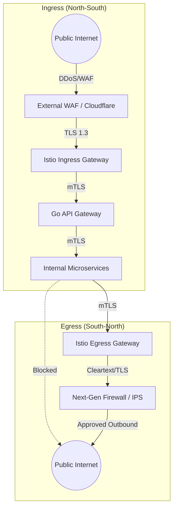

# SNISID: Ingress & Egress Traffic Control Architecture

A sovereign intelligence platform must strictly control exactly what enters its perimeter and, equally importantly, what leaves it. This document defines the high-throughput, highly inspected ingress/egress architecture for SNISID, defending against both massive DDoS attacks and covert data exfiltration.

---

## 1. Traffic Flow Architecture Diagram

---

## 2. Ingress Security Model (Protecting the Perimeter)

All traffic entering SNISID traverses a rigid, multi-layered inspection gauntlet.

### 2.1. Layer 3/4 & Layer 7 Edge Protection (WAF)
*   **DDoS Mitigation:** A global edge network (e.g., Cloudflare or dedicated ISP scrubbers) sits in front of SNISID to absorb volumetric Layer 3/4 DDoS attacks (e.g., SYN floods) before they reach government hardware.
*   **Web Application Firewall (WAF):** Evaluates Layer 7 payloads for OWASP Top 10 vulnerabilities (SQLi, XSS) and blocks known malicious IP addresses based on threat intelligence feeds.

### 2.2. TLS Termination & Re-encryption
*   Public TLS 1.3 terminates at the External WAF for payload inspection.
*   The traffic is immediately re-encrypted and forwarded to the **Istio Ingress Gateway** inside the Kubernetes cluster.
*   The Ingress Gateway terminates the edge connection and upgrades the traffic to the internal SPIFFE/SPIRE **mTLS** mesh.

### 2.3. API Gateway Integration & Rate Limiting
The Go-based SNISID API Gateway acts as the Policy Enforcement Point.
*   **Rate Limiting:** Backed by Redis (Token Bucket algorithm). Rates are tiered based on the `sub` claim in the JWT:
    *   *Unauthenticated Public IPs:* Strict limits (e.g., 5 requests/min).
    *   *Authenticated Citizens:* Medium limits (e.g., 60 requests/min).
    *   *Internal Agencies (Police/Tax):* High limits (e.g., 5000 requests/min).

---

## 3. Egress Filtering Strategy (Preventing Exfiltration)

A compromised microservice must not be able to "call home" to a Command & Control (C2) server or exfiltrate a database dump to an external S3 bucket.

### 3.1. Default Deny Outbound
By default, SNISID Kubernetes pods have zero internet access. A `NetworkPolicy` drops all egress traffic. If the `fraud-service` attempts to run `curl google.com`, the request instantly times out.

### 3.2. Istio Egress Gateway
When a microservice legitimately needs to communicate with an external third-party API (e.g., sending an SMS via Twilio, or querying an Interpol database):
1.  The microservice sends traffic to the **Istio Egress Gateway**.
2.  The Egress Gateway is explicitly whitelisted (via Istio `ServiceEntry`) to allow routing *only* to specific, pre-approved external domains (e.g., `api.twilio.com`).

### 3.3. Threat Detection & IPS Integration
Before traffic leaving the Egress Gateway hits the public internet, it passes through a hardware Next-Generation Firewall (NGFW) / Intrusion Prevention System (IPS). 
*   **Deep Packet Inspection (DPI):** The IPS inspects the outbound traffic for malware signatures or known C2 beaconing patterns. If a compromise is detected, the physical port is shut down, and a `soc.alert.critical` is fired.

---

## 4. API Exposure Strategy

Not all SNISID APIs are exposed to the internet.

1.  **Public Edge (Zone 1):** Endpoints explicitly tagged for citizen interaction (e.g., `/api/v1/auth/login`, `/api/v1/citizen/register`).
2.  **Agency Extranet (Zone 2):** High-privilege endpoints (e.g., `/api/v1/fraud/cases`) are **not** exposed to the public WAF. They are only routable via the dedicated SD-WAN/IPSec tunnels connected to partner agencies.
3.  **Internal Only (Zone 0):** Endpoints like `/metrics` or gRPC internal methods are strictly bound to `localhost` or the internal Istio mesh and cannot be routed by the Ingress Gateway.

---

## 5. Traffic Auditing & Observability

*   **Ingress Access Logs:** The Istio Ingress Gateway logs every incoming HTTP request, including User-Agent, original Client IP (via `X-Forwarded-For`), latency, and HTTP status code. These are piped directly to ElasticSearch/SIEM.
*   **Egress Traffic Auditing:** The Egress Gateway provides absolute forensic proof of all outbound connections. If SNISID is accused of scraping an external database, the Egress logs can mathematically prove exactly how many bytes were transferred to that specific domain.
