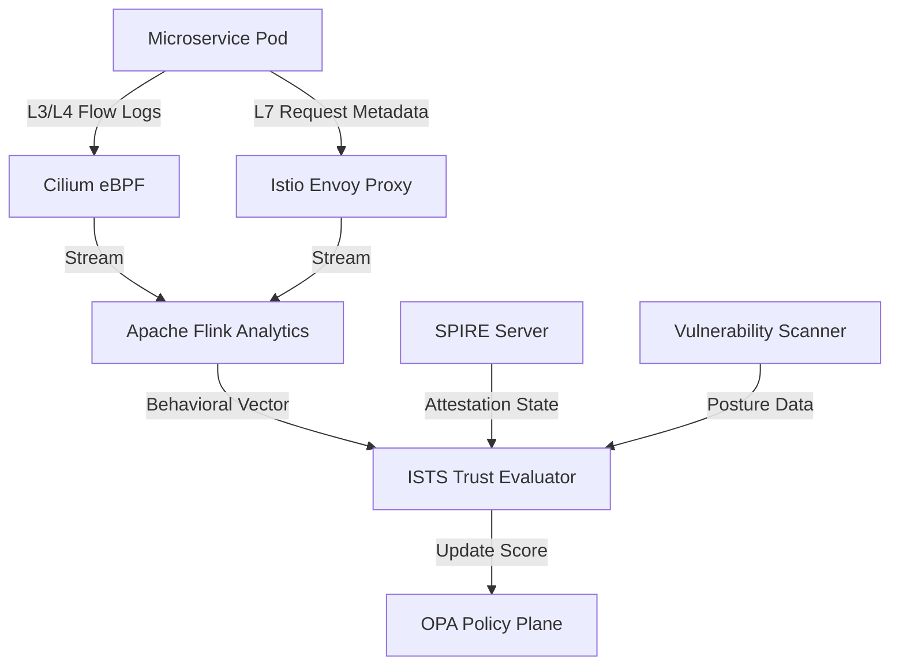

# SNISID: Internal Service Trust Scoring (ISTS)

Within the SNISID platform, microservices do not maintain static trust. Every workload must continuously "earn" its right to communicate through a dynamic trust scoring system that monitors its cryptographic health, security posture, and behavioral integrity.

---

## 1. The Trust Scoring Formula

A service's **Total Trust Score ($T_s$)** is a weighted aggregate of four primary dimensions, ranging from 0 to 100.

$$T_s = (W_a \cdot A) + (W_p \cdot P) + (W_b \cdot B) + (W_h \cdot H)$$

| Dimension | Variable | Weight ($W$) | Description |
| :--- | :---: | :---: | :--- |
| **Attestation** | $A$ | 0.40 | Validity of SPIFFE ID, SVID TTL, and HSM/TPM quote. |
| **Posture** | $P$ | 0.20 | Known vulnerabilities (CVEs), container image age, and OS patching. |
| **Behavioral** | $B$ | 0.30 | Anomaly score from eBPF flow logs and Envoy request patterns. |
| **Historical** | $H$ | 0.10 | Uptime consistency and successful previous rotations. |

---

## 2. Trust Decay Mechanism

Trust is ephemeral. If a service does not undergo active re-validation, its score decays exponentially.

- **Decay Rate**: -5 points per hour of inactivity.
- **Refresh**: A successful SPIRE SVID rotation or a successful deep-health check resets the decay timer.
- **Logic**: This ensures that "zombie" services or orphaned pods eventually lose access to the network.

---

## 3. Runtime Monitoring Architecture

The ISTS engine processes high-fidelity telemetry to update scores in real-time.

---

## 4. Service Evaluation Workflow

1. **Continuous Ingestion**: The ISTS Engine consumes streams from Cilium, Envoy, and security scanners.
2. **Anomaly Detection**: AI models compare current traffic (e.g., gRPC call frequency) against the service's "Identity Profile."
3. **Score Calculation**: The formula is applied. If $T_s$ falls below the **Critical Threshold (50)**, an automated isolation event is triggered.
4. **Enforcement**: The ISTS Engine pushes an update to OPA and Istio to block the service.

---

## 5. Isolation & Recovery Procedures

### 5.1. Automated Isolation (Quarantine)
When a service is compromised (Score < 50):
- **mTLS Revocation**: SPIRE is instructed to stop SVID rotation for the principal.
- **Mesh Block**: Istio `AuthorizationPolicy` is updated to `DENY` all traffic to/from the SPIFFE ID.
- **Network Block**: Cilium applies a `Quarantine` policy, dropping all packets at the eBPF layer.

### 5.2. Recovery & Re-entry
To regain trust, a service must undergo a **Hardened Re-bootstrap**:
1. **Remediation**: The underlying pod/node must be replaced or patched.
2. **Fresh Attestation**: Full hardware-attested bootstrap via TPM 2.0.
3. **Manual Validation**: For core services (Identity, Auth), a SOC Analyst must manually approve the re-entry after reviewing the incident root cause.

---

## 6. Trust-Based Access Control (TBAC)

Service permissions are tied directly to their Trust Score.

| Score Band | Permissions Level | Allowed Operations |
| :--- | :--- | :--- |
| **90 - 100** | **Unrestricted** | Full read/write to upstream and persistence. |
| **70 - 89** | **Monitored** | Read/Write; all actions logged to "High-Resolution" audit. |
| **50 - 69** | **Restricted** | Read-Only; no access to PII-sensitive endpoints. |
| **< 50** | **Isolated** | No network access. |
