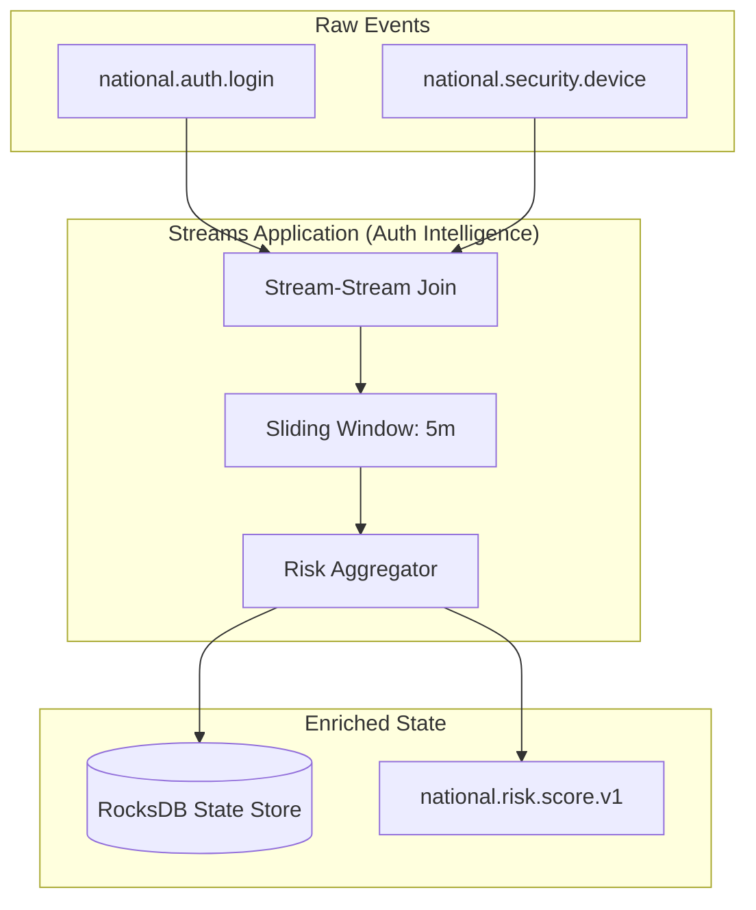

# SNISID: Kafka Streams & Stateful Processing Architecture

Kafka Streams serves as the lightweight, distributed compute layer for SNISID's real-time identity intelligence and service transformations.

---

## 1. Processing Topology: Decentralized & Scalable

Unlike centralized Flink clusters, SNISID uses Kafka Streams for **Domain-Specific Transformations** embedded within microservices.

---

## 2. Stateful Stream Processing

SNISID leverages **RocksDB** for high-performance state management on the broker nodes.

- **State Stores**: Used for storing cross-event context (e.g., "Has this user logged in from 3 different countries in the last hour?").
- **Windowing Strategy**:
  - **Tumbling Windows**: For aggregate reports (e.g., "Total logins per minute").
  - **Sliding Windows**: For anomaly detection (e.g., "Pattern recognition across the last 100 events").
  - **Session Windows**: For tracking user activity bursts.

---

## 3. Event Correlation & Stream Joins

To build the **Unified Identity Context**, the platform performs complex joins:
- **KStream-KStream Join**: Correlating a `login_attempt` with a `biometric_verify_result` using a shared `correlation_id`.
- **KStream-KTable Join**: Enriching a live `transaction_event` with a static `citizen_profile` state (KTable).
- **GlobalKTable**: Used for high-speed broadcast variables (e.g., "National Security Alert Level") across all stream instances.

---

## 4. Exactly-Once Semantics (EOS)

To ensure the integrity of the national ledger, SNISID enforces **Exactly-Once Semantics (EOS v2)**.
- **Transactional Writes**: All outputs to Kafka and updates to the State Store are atomic. If a pod crashes during processing, the transaction is rolled back, and no duplicate data is ever committed.
- **Deduplication**: Inherent in the EOS model, preventing "Double-Spend" or "Double-Login" errors in the fraud engine.

---

## 5. Recovery & Resilience Mechanisms

- **Changelog Topics**: Every update to a local RocksDB state store is backed by a Kafka **Changelog Topic**. If a pod is moved to a new node, it rebuilds its local state by replaying the changelog.
- **Standby Replicas**: High-priority services (e.g., Border Control) maintain "Hot Standby" state stores on neighboring nodes to achieve near-zero RTO during pod failure.
- **Local Checkpointing**: RocksDB state is periodically checkpointed to persistent volumes (PVs) to speed up recovery.

---

## 6. Scaling & Security Enforcement

- **Horizontal Scaling**: Each stream task is mapped to a Kafka partition. To scale, we simply add more pods to the consumer group.
- **Security**:
  - **Identity**: Each stream app runs with a unique **SPIFFE ID**.
  - **Encryption**: Data in RocksDB is encrypted at rest using **LUKS**.
  - **Isolation**: Stream apps for the `Police` agency are physically isolated on dedicated Kubernetes node pools from the `Education` agency.
