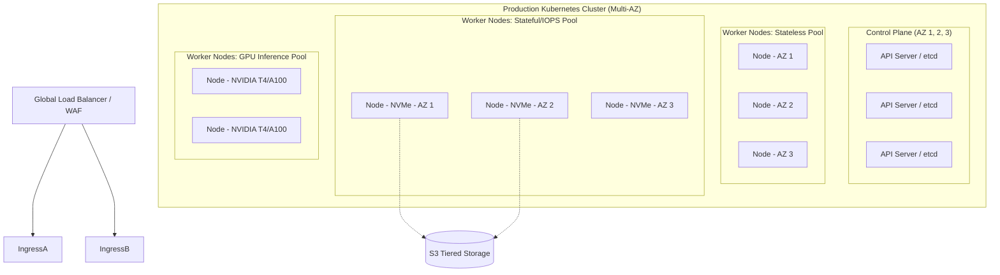

# SNISID: Kubernetes Production Cluster Architecture

As a national-scale cyber intelligence and identity platform, SNISID's infrastructure must withstand massive traffic bursts, hardware failures, and sophisticated attacks. This document outlines the highly available, segmented, multi-node Kubernetes architecture required for production.

---

## 1. Kubernetes Topology & High Availability Design

To survive the total failure of a datacenter zone, the cluster spans 3 distinct Availability Zones (AZs) within the primary national region.

### High Availability (HA) Guarantees
*   **Control Plane:** 3+ Dedicated Master Nodes spread across 3 AZs. Quorum is maintained even if one AZ dies.
*   **Pod Anti-Affinity:** Hard rules (`requiredDuringSchedulingIgnoredDuringExecution`) enforce that replicas of the same critical microservice (e.g., `identity-service`) are *never* scheduled on the same physical Node or in the same AZ.

---

## 2. Node Role Architecture & Worker Segmentation

To prevent "noisy neighbors" (e.g., Kafka consuming all disk I/O and crashing the API Gateway), worker nodes are segmented into dedicated pools using strict Taints, Tolerations, and Node Affinities.

| Node Pool | Hardware Profile | Allowed Workloads (Tolerations) | Purpose |
| :--- | :--- | :--- | :--- |
| **Control Plane** | Medium Compute | Kubernetes system pods only | API Server, Controller Manager, etcd. |
| **Stateless Pool** | Compute Optimized | General Microservices | API Gateway, Identity Svc, Auth Svc. Can scale infinitely via Spot/Preemptible instances if budget requires. |
| **Stateful Pool** | High I/O, Local NVMe | StatefulSets only | Kafka Brokers, Neo4j, PostgreSQL. Extremely stable, reserved instances. |
| **GPU Pool** | GPU Enabled (e.g., A100) | AI / Inference only | Biometric extraction, Liveness detection. Expensive nodes that scale to zero when unused. |
| **Management Pool** | Memory Optimized | Observability tools | Prometheus, Jaeger, ElasticSearch SIEM, ArgoCD. |

---

## 3. Namespace Isolation & Security Boundaries

SNISID implements strict multi-tenancy at the network level. Namespaces map directly to the Domain-Driven Design contexts.

*   `snisid-edge`: API Gateways, Ingress Controllers, WAF.
*   `snisid-core`: Identity, Auth, and Fraud services.
*   `snisid-state`: Kafka, Neo4j, PostgreSQL, Redis.
*   `snisid-ai`: GPU-bound inference services.
*   `snisid-soc`: Security tooling, SIEM, Alerting.

### Security Boundaries (Network Policies)
*   **Default Deny:** A foundational `NetworkPolicy` blocks all ingress and egress traffic in every namespace.
*   **Explicit Allow:** Traffic must be explicitly whitelisted. For example, `snisid-edge` is allowed to communicate with `snisid-core` via port 8443, but `snisid-edge` cannot communicate directly with `snisid-state`.

---

## 4. Workload Placement & Persistent Storage Strategy

Stateful workloads in Kubernetes require extreme care to prevent data loss.

*   **StatefulSets & Headless Services:** Databases (Neo4j, Postgres) and Message Buses (Kafka) are deployed exclusively as `StatefulSets`, granting them stable network identities (e.g., `kafka-0.kafka-headless.snisid-state.svc.cluster.local`).
*   **Persistent Volume Claims (PVCs):** 
    *   *High-Performance:* Kafka logs and Neo4j graph data use a StorageClass backed by physically attached NVMe SSDs (using `local-path-provisioner` or equivalent fast block storage).
    *   *Standard:* PostgreSQL and ElasticSearch use standard SSD block storage with automated daily volume snapshots via CSI drivers.

---

## 5. Autoscaling Architecture

Scaling is handled automatically across three dimensions:

1.  **Horizontal Pod Autoscaler (HPA):** Monitors CPU and Memory. If the `fraud-service` hits 75% CPU utilization, HPA provisions additional Pod replicas dynamically.
2.  **Event-Driven Autoscaling (KEDA):** HPA is too slow for asynchronous spikes. KEDA monitors the Kafka `identity.citizen.enrolled` topic. If consumer lag exceeds 500 messages, KEDA instantly scales up the Graph Ingestion worker pods, then scales them to zero when the queue is empty.
3.  **Cluster Autoscaler (or Karpenter):** If HPA/KEDA requests more pods than the physical Nodes can handle, the Pods enter a `Pending` state. Karpenter detects this and provisions a brand-new VM from the cloud provider/hypervisor in `< 60 seconds`, adding it to the correct Node Pool.

---

## 6. Disaster Recovery & GitOps Integration

*   **GitOps (ArgoCD):** Human engineers **never** execute `kubectl apply` in production. The entire desired state of the cluster (Deployments, ConfigMaps, Secrets via ExternalSecrets) is stored in a secure Git repository. ArgoCD continuously monitors Git and forces the cluster to match the repository.
*   **Multi-Cluster Federation:** A completely distinct, passive cluster sits in a geographically separated disaster recovery site. ArgoCD is configured to sync the exact same stateless manifests to the DR cluster. If the primary region is physically destroyed, the Global Load Balancer redirects traffic to the DR cluster, which connects to the asynchronous database replicas.
