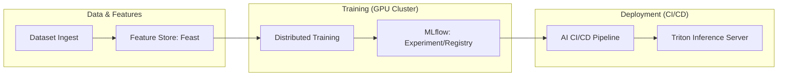

# SNISID: Machine Learning Pipeline Architecture (201–215)

The ML Pipeline provides the factory for national intelligence, enabling the rapid development, training, and deployment of high-assurance AI models for fraud detection and biometric verification.

---

## 1. End-to-End ML Lifecycle (Prompt 201)

SNISID implements a distributed, event-driven ML platform.

---

## 2. Distributed Training & GPU Cluster (Prompt 207, 208)

- **Infrastructure**: Kubernetes-managed GPU nodes (NVIDIA A100/H100).
- **Orchestration**: **Kubeflow** or **Volcano** for distributed scheduling.
- **Training Frameworks**: **PyTorch Distributed** (DDP) for gradient synchronization and **Ray** for elastic scaling.
- **Fault Tolerance**: Automated checkpointing to Sovereign Object Storage; failed training nodes are replaced instantly by the K8s scheduler.

---

## 3. Feature Engineering & Feature Store (Prompt 205)

- **Feast Feature Store**: Acts as the single source of truth for features.
  - **Online Store (Redis)**: Low-latency access for real-time inference.
  - **Offline Store (ClickHouse)**: High-throughput access for historical training.
- **Feature Categories**: Identity (biometric scores), Behavioral (velocity), Geo (impossible travel), and Graph-derived (risk centrality).

---

## 4. Model Governance & Versioning (Prompt 206)

- **MLflow Tracking**: Records every training run, including hyperparameters, code version, and dataset SHA.
- **Model Registry**: Models are staged through `Staging` -> `Production` with mandatory **Sovereign AI Governance** approval.
- **Lineage**: Full traceability from a real-time decision back to the specific training dataset used.

---

## 5. Model Deployment & Inference (Prompt 212, 213)

- **CI/CD for ML**: Automated pipelines that run validation tests (Precision/Recall) before promoting a model.
- **Deployment Strategies**: 
  - **Canary**: Deploying to 5% of traffic.
  - **Shadow**: Running the new model in parallel with the current one to compare performance.
- **Inference Serving**: **NVIDIA Triton** provides multi-model orchestration and GPU acceleration for streaming Kafka events.

---

## 6. Monitoring, Drift & Rollback (Prompt 214, 215)

- **Performance Monitoring**: Flink-based monitoring of model accuracy and latency.
- **Drift Detection**: Automated detection of "Feature Drift" (input distribution changes) and "Concept Drift" (model accuracy degradation).
- **Secure Rollback**: If a canary fails or drift is detected, the **Model Rollback System** restores the previous version in < 10 seconds.

---

## 7. Specialized Data Pipelines (Prompt 204, 210, 211)

- **Biometric Ingestion**: Encrypted, PII-compliant pipelines for face, finger, and iris datasets.
- **Human + AI Labeling**: A collaborative interface for SOC analysts to label "Confirmed Fraud" samples, which are fed back into the training loop.
- **Synthetic Data Engine**: Generates adversarial fraud scenarios to train models on "Zero-Day" attack patterns without exposing real citizen data.
