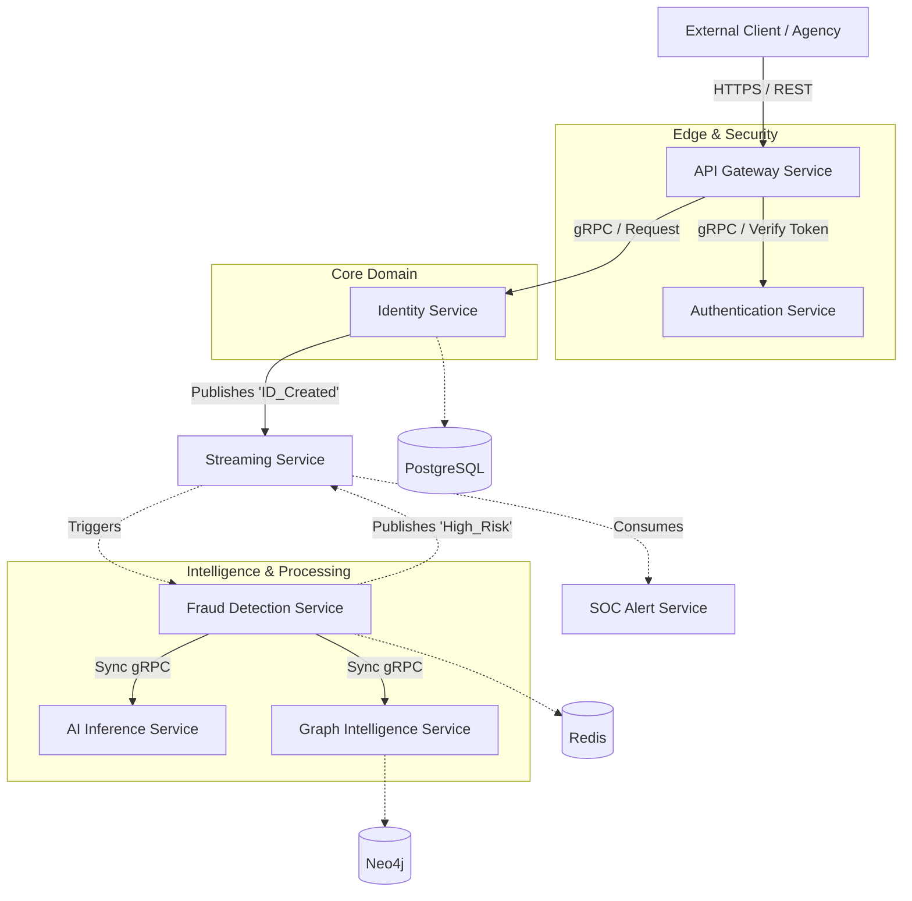

# SNISID: Microservices Decomposition Model

This document outlines the microservices architecture for the SNISID platform. It balances the need for independent deployment and scaling with the risk of over-fragmentation, ensuring that each service maintains a strict, cohesive boundary and a single area of responsibility.

## 1. Full Microservice Map

The system is decomposed into the following core microservices, grouped by their domain context:

### Edge & Security Domain
1.  **API Gateway Service**
2.  **Authentication Service**

### Core Business Domain
3.  **Identity Service**

### Intelligence & Processing Domain
4.  **AI Inference Service**
5.  **Graph Intelligence Service**
6.  **Fraud Detection Service**

### Infrastructure & Operations Domain
7.  **Streaming Service (Event Orchestrator)**
8.  **SOC Alert Service**

---

## 2. Responsibilities and Boundaries

To avoid over-fragmentation, each service encompasses a complete, logical domain rather than splitting into hyper-granular functions (e.g., we have one `Identity Service` rather than separate `Address Service` and `Name Service`).

### 1. API Gateway Service
*   **Responsibility:** Acts as the single entry point for all external traffic. Handles L7 routing, rate limiting, Web Application Firewall (WAF) execution, and initial payload inspection.
*   **Boundary:** Does not execute business logic. Simply proxies traffic after validating that the request conforms to API specifications.

### 2. Authentication Service
*   **Responsibility:** Manages trust. Verifies passwords, API keys, and mTLS certificates. Issues and validates JSON Web Tokens (JWTs) and SPIFFE identities for service-to-service communication.
*   **Boundary:** Only cares about *who* the caller is and issuing proof of identity. It does not dictate what actions the caller is allowed to perform (authorization is handled by individual services or an OPA sidecar).

### 3. Identity Service
*   **Responsibility:** The core CRUD (Create, Read, Update, Delete) engine for the National Identity Registry. Manages demographic data, links to biometric hashes, and tracks the lifecycle status (Active, Suspended, Deceased).
*   **Boundary:** Sole owner of the primary PostgreSQL database. No other service is allowed to query the Identity DB directly.

### 4. Streaming Service (Event Orchestrator)
*   **Responsibility:** Acts as the intelligent producer/consumer layer interfacing with Apache Kafka. It standardizes event schemas, handles data enrichment, and guarantees exactly-once delivery across the platform.
*   **Boundary:** Does not store permanent state. It is the transient nervous system moving data asynchronously between the Identity, Fraud, and AI domains.

### 5. AI Inference Service
*   **Responsibility:** A stateless, GPU-accelerated service dedicated strictly to executing machine learning models (e.g., 1:N biometric matching, liveness detection, deepfake analysis).
*   **Boundary:** Takes raw data (images, embeddings) as input and returns mathematical confidence scores. It has no knowledge of *why* the inference was requested.

### 6. Graph Intelligence Service
*   **Responsibility:** Maintains the relational graph of identities (e.g., shared addresses, familial links, financial associations) to detect hidden synthetic identity rings.
*   **Boundary:** Sole owner of the Neo4j Graph Database. Translates relational queries into structural insights but does not make final fraud determinations on its own.

### 7. Fraud Detection Service
*   **Responsibility:** The rules and scoring engine. It consumes events, requests scores from the AI and Graph services, applies business rules (e.g., velocity checks), and assigns an overall Fraud Risk Score.
*   **Boundary:** Does not own primary identity data. It maintains ephemeral scoring state (in Redis) and flags transactions, acting as a real-time policy enforcer.

### 8. SOC Alert Service
*   **Responsibility:** Consumes anomalous events and high-risk fraud flags. Standardizes them into the MITRE ATT&CK schema and forwards them to the SIEM/SOAR platforms for L2 analyst review.
*   **Boundary:** A one-way outbound integration layer. It alerts and triggers playbooks but does not directly block user requests synchronously.

---

## 3. Dependencies Graph

The following diagram illustrates the inter-service communication paths. Solid lines indicate synchronous (blocking) HTTP/gRPC calls, while dashed lines indicate asynchronous (non-blocking) event streaming.

### Dependency Rules:
1.  **No Circular Dependencies:** The architecture is strictly directed. For example, Fraud Detection can query Graph Intelligence, but Graph Intelligence cannot query Fraud Detection.
2.  **Synchronous vs Asynchronous:** The API Gateway and Identity Service must respond synchronously to the user. All fraud scoring, graphing, and AI operations happen asynchronously to prevent system latency from blocking core identity creation.
