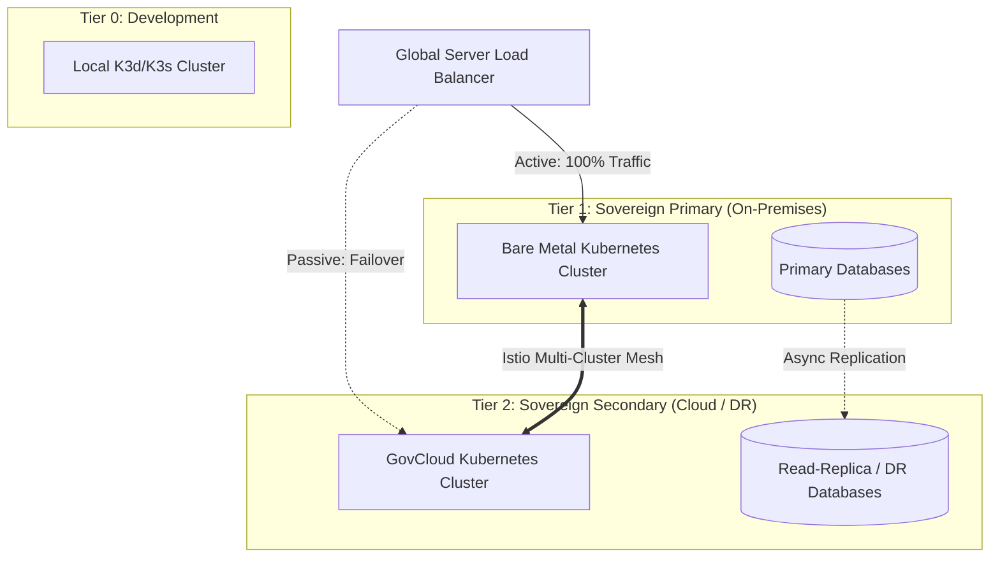

# SNISID: Multi-Cluster Federation Architecture

As a sovereign digital asset, SNISID cannot afford a single point of failure at the datacenter level. Furthermore, the system must seamlessly evolve from a developer's local `k3s` laptop environment to a massive hybrid-cloud, multi-region production deployment. This document defines the multi-cluster federation model.

---

## 1. Federation Topology & Cluster Hierarchy

SNISID supports a tiered infrastructure model. A developer's local environment runs the exact same Helm charts as the national production environment.

---

## 2. Cross-Cluster Communication Architecture

SNISID utilizes **Istio Multi-Cluster (Multi-Primary on different networks)** to fuse multiple distinct Kubernetes clusters into a single logical Service Mesh.

*   **East-West Traffic Gateway:** Services do not communicate over the public internet. Instead, an Istio East-West Gateway is deployed in each cluster. When a Pod in Cluster A needs to talk to a Pod in Cluster B, traffic is routed securely through these gateways over mTLS.
*   **Locality Load Balancing:** The mesh is topology-aware. If the API Gateway in the Cloud cluster calls the Identity Service, Istio will first attempt to route to an Identity Service Pod *within the same cloud cluster*. If all local pods fail, Istio automatically routes the request across the East-West gateway to an Identity Service Pod in the On-Prem cluster.

---

## 3. Service Discovery & Global DNS

Service discovery across clusters must be transparent to application developers. A Go developer should only need to call `http://fraud-service.snisid.global`.

1.  **Global Service Entries:** Services designed to be accessible across clusters are registered with a `.global` suffix.
2.  **CoreDNS Stubbing:** Kubernetes CoreDNS in both clusters is configured to forward any request ending in `.global` to the Istio control plane, which knows the IP addresses of the East-West Gateways.
3.  **Endpoint Synchronization:** Istio continuously synchronizes the endpoints of healthy pods across all federated clusters, ensuring the routing tables are always up to date.

---

## 4. Failover Model & Global Traffic Routing

For North-South (External) traffic entering the system:

1.  **Global Server Load Balancing (GSLB):** A DNS-based GSLB (e.g., Cloudflare, Route53, or F5 BIG-IP) acts as the absolute ingress point.
2.  **Health Checking:** The GSLB constantly monitors the `/health` endpoints of both the On-Prem and Cloud clusters.
3.  **Failover Scenario (Active-Passive):**
    *   *Normal Ops:* 100% of national traffic routes to the Sovereign On-Prem cluster.
    *   *Disaster:* If the On-Prem datacenter loses power, the GSLB detects the outage within seconds and automatically updates DNS records to point 100% of traffic to the Cloud cluster.
4.  **Zero-Touch Recovery:** Because the Cloud cluster is synchronized, it begins processing API requests instantly, reading from the asynchronously replicated databases.

---

## 5. Cluster Synchronization Strategy (GitOps)

Human administrators do not manually configure multiple clusters. Drift between the On-Prem and Cloud clusters is a severe security risk.

*   **ArgoCD ApplicationSets:** SNISID uses ArgoCD configured with ApplicationSets. When an engineer merges a Pull Request to deploy a new version of the Fraud Service to `main`, ArgoCD simultaneously applies the exact same Kubernetes manifests to *both* the On-Prem and Cloud clusters.
*   **Data Synchronization:** Stateful data is synchronized via backend mechanisms (Kafka MirrorMaker 2 for events, PostgreSQL asynchronous logical replication for relational data).

---

## 6. Federation Security Model

Trusting traffic from another cluster requires cryptographically linking their trust domains.

*   **SPIRE Federation:** SNISID utilizes SPIFFE/SPIRE federation. Cluster A has its own SPIRE server, and Cluster B has its own. By exchanging trust bundles (public keys), Cluster A can cryptographically verify that a JWT/mTLS connection originating from Cluster B is genuinely from the SNISID Fraud Service, not an imposter.
*   **Zero Trust Edges:** Even though Cluster B is trusted, any request crossing the East-West Gateway is still subjected to OPA (Open Policy Agent) ABAC rules before being executed.

---

## 7. Cross-Cluster Observability

When an API request bounces between On-Prem and Cloud clusters, tracking latency and failures is critical.

*   **Prometheus Federation (Thanos):** Each cluster has a local Prometheus instance scraping metrics. A central **Thanos** instance acts as a global query layer, aggregating metrics from all clusters so administrators see a single unified dashboard (e.g., "Total 500 Errors Globally").
*   **Distributed Tracing (Jaeger):** OpenTelemetry `correlation_id`s persist across the East-West Gateway. An analyst can view a single Jaeger trace showing a span starting in the Cloud API Gateway and finishing in the On-Prem Identity database.
