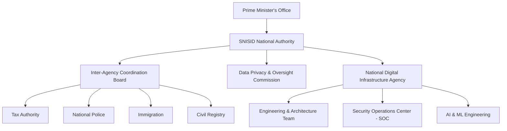
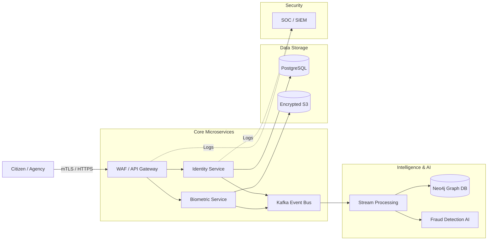
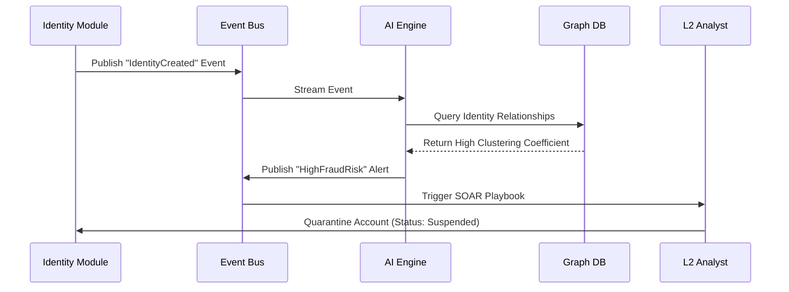

# SNISID: National Secure Identity & Intelligence System
**National Digital Infrastructure Blueprint**

---

## 1. Executive Summary

The **National Secure Identity & Intelligence System (SNISID)** is a sovereign-grade, highly secure, and distributed digital infrastructure designed to provide irrefutable digital identity, advanced fraud detection, and inter-agency intelligence. Beyond a software application, SNISID represents a paradigm shift in national governance, blending zero-trust security principles, cutting-edge AI (biometrics, deepfake detection, graph-based anomaly detection), and robust distributed systems (event streaming, graph databases) to build a resilient foundation for e-government and national security.

This blueprint serves as the definitive reference for the World Bank, IMF, national ICT agencies, and implementation contractors, defining the organizational, technical, and operational dimensions necessary to deploy this system at scale.

---

## 2. National Governance Model

A robust institutional model guarantees accountability, legality, and interoperability across the government.

*   **System Owner:** The newly formed **SNISID National Authority**, operating under the Prime Minister's Office or the Ministry of Interior, holding absolute authority over data sovereignty.
*   **System Operator:** The **National Digital Infrastructure Agency (NDIA)**, responsible for technical maintenance, scaling, and daily operations.
*   **Audit & Compliance:** An independent **Data Privacy & Oversight Commission**, ensuring compliance with national data protection laws and international human rights standards.
*   **Inter-Agency Coordination Board:** A steering committee comprising representatives from the Tax Authority, National Police, Immigration, Civil Registry, and the Central Bank.
*   **AI Ethics & Governance Board:** A specialized committee overseeing AI model bias, biometric fairness, and the legality of automated decision-making.

---

## 3. Organizational Charts

### SOC Internal Structure
*   **L1 Triage:** 24/7 Monitoring & Alert Routing.
*   **L2 Incident Response:** Attack analysis, threat hunting, and containment.
*   **L3 Advanced Threat Intel:** Reverse engineering, malware analysis, and policy creation.

---

## 4. System Architecture

SNISID is built on a distributed, event-driven microservices architecture.

*   **API Gateway Layer:** The primary ingress point. Handles JWT/SPIFFE authentication, WAF, rate limiting, and request routing.
*   **Identity Management System (Go/PostgreSQL):** The core CRUD service for managing the lifecycle of citizens and residents.
*   **Event Streaming Backbone (Kafka):** Ensures asynchronous decoupling. Every identity creation or update emits an event.
*   **AI Fraud Detection Engine (Python/GPU):** Consumes streams to score transactions in real-time.
*   **National Identity Graph (Neo4j):** Models relationships (familial, financial, associative) to detect synthetic identity rings.
*   **SOC Security Platform:** Aggregates logs via ELK/Splunk for SIEM capabilities.

---

## 5. Data Architecture

Data sovereignty and high availability are achieved through Polyglot Persistence:

*   **Transactional State (PostgreSQL):** Stores immutable identity records, cryptographic hashes, and biographic data. Replicated synchronously across active zones.
*   **Identity Graph (Neo4j):** Maps relationships (`PERSON`-`MARRIED_TO`->`PERSON`, `PERSON`-`REGISTERED_AT`->`ADDRESS`) for real-time cluster analysis.
*   **Event Log (Apache Kafka):** Serves as the source of truth for the system's state over time (Event Sourcing).
*   **Binary Storage (S3-Compatible Object Store):** Secure, encrypted storage for raw biometric captures, ID document scans, and system backups.

---

## 6. AI Architecture

AI is embedded at the core of SNISID to shift from reactive to proactive defense:

*   **Biometric Recognition System:** 1:N and 1:1 facial recognition utilizing deep learning embeddings for high-accuracy matching.
*   **Deepfake Detection Module:** Analyzes micro-expressions, texture inconsistencies, and liveness to thwart presentation attacks.
*   **Graph Neural Network (GNN) Fraud Detection:** Analyzes the Neo4j graph to detect structural anomalies indicative of organized fraud rings.
*   **Continuous Learning (MLOps):** Automated pipelines (Kubeflow) that retrain models based on flagged false positives/negatives to combat model drift.

---

## 7. SOC Architecture

The Security Operations Center is the nervous system protecting SNISID from advanced persistent threats (APTs).

*   **Monitoring:** Centralized log aggregation (Elastic Stack) capturing every API call, DB query, and network flow.
*   **Alerting Engine:** Rules-based (Suricata/Wazuh) and ML-based anomaly detection mapping to the MITRE ATT&CK framework.
*   **Containment:** Automated Playbooks (SOAR) capable of isolating compromised nodes, revoking JWTs, and blocking malicious IPs instantly.

---

## 8. Network Architecture

A dedicated, isolated network ensures that national intelligence data never traverses the public internet unencrypted.

*   **Government Intranet (X-Road / Secure Backbone):** Agencies connect to SNISID via a secure, leased-line/VPN backbone.
*   **API-Based Interoperability:** Agencies do not get direct database access. They query the API Gateway using Mutual TLS (mTLS) and standardized REST/gRPC contracts.
*   **Data Exchange Protocol:** Responses are digitally signed and minimized (e.g., Police requesting verification only receive "True/False" rather than full biometrics).

---

## 9. Security Model

*   **Zero Trust Architecture:** "Never trust, always verify." Microsegmentation ensures that even if one microservice is compromised, lateral movement is impossible.
*   **Access Control:** Strict Role-Based Access Control (RBAC) and Attribute-Based Access Control (ABAC).
*   **Encryption:** AES-256 for data at rest. TLS 1.3 for all data in transit. Biometrics are hashed and salted; raw images are encrypted with KMS keys.
*   **Immutability:** Audit logs are written to an append-only, tamper-evident ledger.

---

## 10. Deployment Strategy

A phased, low-risk rollout approach.

*   **Phase 1: Pilot Deployment (Months 1-4):** Deployment in a controlled environment (e.g., government employees only). Core identity and PostgreSQL setup.
*   **Phase 2: Inter-Agency Integration (Months 5-8):** Integrating Tax and Police APIs. Establishing the secure network and SOC.
*   **Phase 3: National Rollout (Months 9-16):** Public enrollment centers open. Full cloud/on-prem hybrid scaling.
*   **Phase 4: Optimization & AI Scaling (Months 17+):** Enabling GNN fraud detection, deepfake protection, and advanced MLOps.

*Risks & Mitigation:* Phase 3 faces high scaling risks. Mitigation: rigorous load testing and Kubernetes HPA configuration during Phase 2.

---

## 11. Operational Model

*   **High Availability:** Multi-zone Active-Active Kubernetes clusters.
*   **Disaster Recovery:** A geographically separated, cold-standby site with asynchronous data replication (RPO < 5 mins, RTO < 4 hours).
*   **Maintenance:** Blue-Green deployments via ArgoCD ensure zero-downtime updates.
*   **Incident Response:** Defined SLAs for severity levels (e.g., P1 Core Outage requires 15-minute response).

---

## 12. Risk Analysis

| Risk | Probability | Impact | Mitigation Strategy |
| :--- | :--- | :--- | :--- |
| **Data Breach / Exfiltration** | Low | Critical | Zero Trust, Encryption at rest/transit, automated SOC quarantines. |
| **Biometric Spoofing** | Medium | High | Mandatory Liveness and Deepfake detection AI models. |
| **Inter-Agency Misuse** | Medium | High | Strict ABAC, data minimization APIs, and immutable audit logs. |
| **System Overload (DDoS)** | High | Medium | API Gateway Rate Limiting, WAF, autoscaling K8s pods. |

---

## 13. Diagrams

### 13.1 System Architecture & Data Flow

### 13.2 Decision Flow: Fraud Detection Escalation

