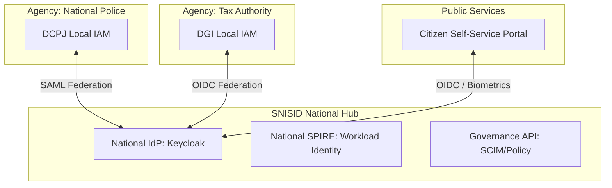

# SNISID: National IAM Architecture & Governance

The National Identity and Access Management (IAM) system is the sovereign authority for all identities within the nation. It provides a unified, zero-trust framework for governing citizens, government agency staff, and the machine identities that process their data.

---

## 1. Central Identity Authority

SNISID operates as the **National Identity Hub**, the root of trust for all federated agencies.

- **Unified Identity Schema**: Every actor is mapped to a `National Identity UUID (NID)`.
- **Central IdP**: A high-availability OIDC/SAML engine (Keycloak-based) that handles cross-agency authentication.
- **Machine Root**: SPIRE Server acting as the CA for all workload identities.

---

## 2. Identity Lifecycles

### 2.1. Citizen Identity (Civil Registry)
1. **Enrollment**: Capture of demographics and biometrics (Face, Finger) at an authorized kiosk.
2. **Verification**: AI-driven 1:N duplicate search and liveness check.
3. **Activation**: Identity is marked as `ACTIVE` in the National Registry.
4. **Lifecycle**: Status updates for marriage, relocation, or terminal states (Deceased).

### 2.2. Agency Staff (Administrative IAM)
1. **Provisioning**: SCIM-based sync from Agency local directories (Active Directory).
2. **Clearance Level**: Attribute-Based Access Control (ABAC) defining the officer's role (e.g., `role: border_agent`, `clearance: l2`).
3. **Offboarding**: Automated revocation of all national access when an officer leaves their agency.

**Detailed Provisioning Workflows**: See the [SNISID User Provisioning & Governance](file:///c:/Users/sopil/Desktop/SNISID/SNISID_User_Provisioning_Governance.md) for JML (Joiner-Mover-Leaver) automation and HR integration.

---

## 3. Human + Machine Identity Convergence

A request in SNISID is only valid if it carries **Dual Identity Proof**.

- **Human Proof**: A signed JWT from the National IdP containing the user's NID and claims.
- **Machine Proof**: An X.509 SVID from SPIRE proving the workload's identity.
- **Enforcement**: The API Gateway validates that the *User* is authorized for the action AND the *Service* is authorized to perform that action on behalf of the user.

---

## 4. AI-Assisted Risk Evaluation

The IAM system consumes real-time risk scores from the **Continuous Authentication (CAS)** engine.

- **Baseline Login**: Username/Password + TOTP.
- **Elevated Risk**: (Detected by AI) -> Trigger mandatory **Biometric Push** to the citizen's mobile device.
- **Critical Risk**: (Impossible Travel / Hijacked Device) -> Automatic session termination and identity lock.

---

## 5. Security & Governance Workflows

### 5.1. Secure Onboarding
All identity creation requires **Hardware Root of Trust**. Kiosks used for enrollment are cryptographically attested before they can push data to the National IdP.

### 5.2. Federated Login (SSO)
Agencies maintain their local IdPs (e.g., Police AD). SNISID brokers the trust, allowing a Police Officer to log in once and access Tax or Immigration systems (based on OPA policies) without re-authenticating.

**Advanced Federation Infrastructure**: See the [SNISID Identity Federation System](file:///c:/Users/sopil/Desktop/SNISID/SNISID_Identity_Federation_System.md) for dynamic trust scoring, Security Token Service (STS) mechanics, and multi-protocol brokering.

### 5.3. Emergency Revocation (The National Kill Switch)
The National IAM can globally suspend any identity—citizen or staff—instantly.
- **Propagation**: The revocation is pushed to all Federated Agency IdPs and the National API Gateway in < 30 seconds.

---

## 6. Compliance & Auditability

- **Non-Repudiation**: Every IAM action (creation, update, login, denial) is cryptographically signed and stored in the **Sovereign Audit Ledger**.
- **Data Residency**: While identities are federated, agency-specific PII (e.g., criminal records) remains within the Agency Data Core and is only exposed via the Gateway under strict OPA rules.

**Technical Isolation Model**: See the [SNISID Multi-Tenant Isolation](file:///c:/Users/sopil/Desktop/SNISID/SNISID_Multi_Tenant_Isolation.md) for network, data, and encryption-level agency boundaries.
- **GDPR/Sovereign Privacy**: Citizens can audit which agencies have queried their identity via the "National Transparency Portal."
