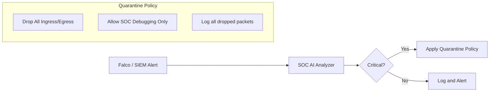

# SNISID: Network Micro-segmentation Architecture

This document defines the strategy for isolating workloads and data zones within the SNISID platform. We implement **Multi-Layer Micro-segmentation** (L3/L4 via Cilium eBPF and L7 via Istio) to eliminate lateral movement and enforce the principle of least privilege.

---

## 1. Segmentation Matrix

The following matrix defines the default communication permissions between logical zones. 

| Source \ Destination | Public Edge | Core Compute | Intelligence (AI) | Persistence | SOC / Control |
| :--- | :---: | :---: | :---: | :---: | :---: |
| **Public Edge** | — | **L7 ONLY** | DENY | DENY | DENY |
| **Core Compute** | DENY | **ALLOW** | **L7 ONLY** | **L4 ONLY** | **L4 ONLY** |
| **Intelligence (AI)** | DENY | **L7 ONLY** | — | DENY | **L4 ONLY** |
| **Persistence** | DENY | DENY | DENY | — | **L4 ONLY** |
| **SOC / Control** | **ALLOW** | **ALLOW** | **ALLOW** | **ALLOW** | — |

- **L7 ONLY**: Communication must use mTLS and is inspected at the application layer.
- **L4 ONLY**: Restricted to specific IP/Port combinations (e.g., PostgreSQL port 5432).

---

## 2. Policy Hierarchy

We apply security policies in a hierarchical "layered" approach.

### Level 1: Global Default-Deny
All traffic is blocked by default across all namespaces.
- **Implementation**: K8s `NetworkPolicy` with empty `ingress` and `egress` rules.

### Level 2: Namespace & Agency Isolation
Strict isolation between different government agencies and environments (Prod, Staging, DR).
- **Implementation**: Cilium `CiliumNetworkPolicy` enforcing labels (e.g., `agency: dcpj`, `env: prod`).

### Level 3: Service-Level Least Privilege (L7)
Granular control over which service can call which API endpoint.
- **Implementation**: Istio `AuthorizationPolicy` using SPIFFE IDs.

---

## 3. Specialized Zone Isolation

### 3.1. AI Workload Isolation
AI Inference (NVIDIA Triton) is a high-compute, high-risk zone.
- **Isolation**: Dedicated namespace `snisid-ai`.
- **Egress Control**: Deny all egress to the public internet. Allow egress only to Kafka and specific logging endpoints.

### 3.2. Kafka Event Backbone Isolation
- **Client Isolation**: Only workloads with valid SVIDs and specific `Producer`/`Consumer` labels can connect.
- **Port Security**: Only port 9094 (mTLS) is exposed; plaintext port 9092 is disabled.

### 3.3. Database & Persistence Segmentation
- **Access Control**: Only the "Owner" service for a specific database (e.g., Identity Service for Identity DB) is allowed to initiate a connection.
- **Protocol Filtering**: Cilium enforces that only PostgreSQL/Neo4j wire protocols are allowed on database ports.

---

## 4. Runtime Segmentation & Dynamic Enforcement

Segmentation is not static; it responds to real-time threats.
- **eBPF Monitoring**: Cilium monitors flow logs for unexpected connection attempts (e.g., a frontend pod trying to SSH into a database).
- **Behavioral Analysis**: If a workload deviates from its baseline (e.g., increased egress volume), its trust score is lowered.

---

## 5. Breach Containment Strategy (Quarantine)

In the event of a detected breach, the SOC can trigger an automated containment protocol.

- **Quarantine Policy**: A pre-defined `CiliumNetworkPolicy` that overrides all other rules, isolating the pod while allowing forensic analysts to inspect its state.

---

## 6. Implementation Model

### Kubernetes (L3/L4)
We use **Cilium** as the CNI to leverage eBPF for high-performance filtering.
- **NetworkPolicies**: Restrict traffic to specific labels and namespaces.
- **Host Firewall**: Protects the underlying K8s nodes from unauthorized access.

### Istio (L7)
We use **Envoy Sidecars** for deep packet inspection and identity-based authorization.
- **AuthorizationPolicies**: Enforce that `spiffe://snisid.gov/ns/core/svc/identity-api` can only be called by `spiffe://snisid.gov/ns/gateway/sa/api-gateway`.
