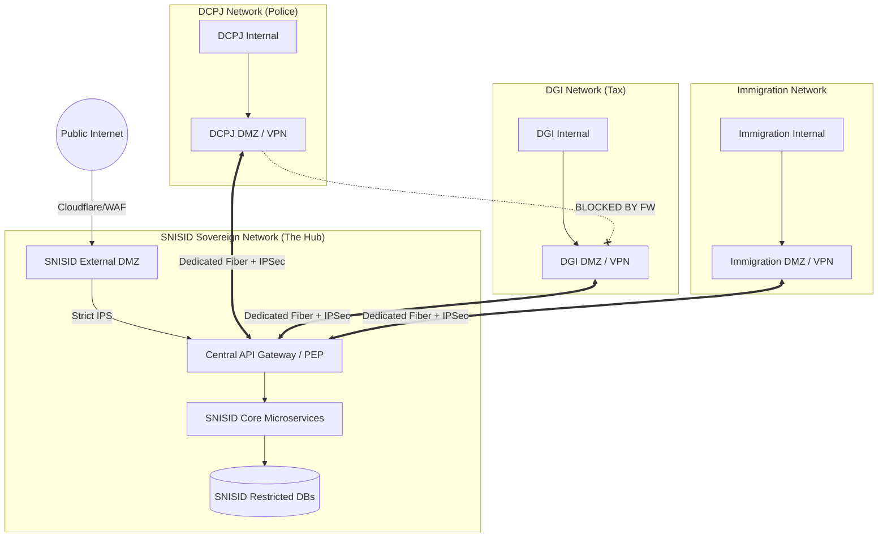

# SNISID: Secure Government Network Topology

To protect the sovereign SNISID platform from lateral movement by state-sponsored actors, the network topology enforces absolute physical and logical isolation. Agencies cannot communicate directly with one another; all cross-agency interactions are brokered through the SNISID Zero Trust Core.

---

## 1. Network Topology Diagram (Hub-and-Spoke)

---

## 2. Trust Zone Architecture & DMZ Segmentation

The network is physically and logically divided into nested Trust Zones.

1.  **Zone 0: Public Internet (Untrusted)**
    *   No direct access to SNISID databases. All traffic terminates at the WAF.
2.  **Zone 1: External DMZ (Semi-Trusted)**
    *   Hosts public-facing portals (e.g., Citizen self-service). Terminates public TLS. Strictly isolated from the internal Government Extranet.
3.  **Zone 2: Government Extranet / Agency DMZs (Trusted but Isolated)**
    *   The perimeter for all government agencies (ANH, DGI, DCPJ, Courts). Hosts the Agency-side IPSec VPN endpoints and API clients.
4.  **Zone 3: SNISID Compute Core (Restricted)**
    *   Hosts the Kubernetes stateless worker nodes (Identity, Fraud, AI). Denies all ingress except from the Central API Gateway.
5.  **Zone 4: SNISID Data Core (Highly Restricted)**
    *   Hosts PostgreSQL, Neo4j, Kafka, and the HSM/Vault. Absolutely no internet or Extranet ingress is permitted. Only Zone 3 Compute nodes can connect here.

---

## 3. IP Addressing Strategy & VLAN/VXLAN Segmentation

A unified IP supernetting strategy prevents routing collisions while maintaining strict segmentation across the nation.

*   **Supernet:** `10.0.0.0/8` (Reserved for SNISID and Federated Government Networks).
*   **SNISID Core Allocation:** `10.10.0.0/16`
    *   `10.10.1.0/24`: Core Gateway / DMZ
    *   `10.10.2.0/24`: Compute Nodes
    *   `10.10.3.0/24`: Database Nodes
*   **Agency Allocations:**
    *   DCPJ (Police): `10.20.0.0/16`
    *   DGI (Tax): `10.30.0.0/16`
    *   Immigration: `10.40.0.0/16`
    *   Courts: `10.50.0.0/16`
    *   ANH: `10.60.0.0/16`

### VXLAN Overlay
To support seamless scaling across multiple physical datacenters (e.g., Primary and Disaster Recovery sites) without complex BGP reconfiguration, SNISID utilizes **VXLAN** (Virtual Extensible LAN) overlays, creating logically unified Layer 2 networks over a Layer 3 underlay.

---

## 4. Secure Communication Flow & Lateral Movement Controls

### Preventing Lateral Movement
The most critical rule of the SNISID topology is the elimination of lateral (East-West) movement between government agencies.
*   **Rule:** DGI (Tax) cannot `ping`, `SSH`, or execute HTTP requests directly to DCPJ (Police).
*   **Enforcement:** Hardware firewalls and the SD-WAN routing tables are configured in a strict Hub-and-Spoke model. If DGI needs to verify a Police record, the request *must* go to the `10.10.1.0/24` SNISID API Gateway. The SNISID Gateway evaluates the ABAC policy, then proxies the request to the Police network if authorized.

### East-West Traffic within SNISID (Micro-segmentation)
Inside the SNISID Core Kubernetes cluster, lateral movement is also restricted via **Cilium Network Policies**.
*   The `fraud-service` pod cannot communicate directly with the `postgresql` pod. It must go through the `identity-service`.

---

## 5. WAN Connectivity & Redundancy Paths

To ensure absolute availability during national crises (e.g., natural disasters cutting fiber cables), SNISID utilizes a highly redundant SD-WAN architecture.

1.  **Primary Path (Dedicated Fiber Rings):** Agencies connect to the SNISID Core via dark fiber or dedicated MPLS links over the Government Intranet, guaranteeing high throughput (`>10 Gbps`) for biometric data transfers.
2.  **Secondary Path (IPSec VPN over Public Internet):** If the fiber is cut, the SD-WAN router automatically fails over to a highly encrypted IPSec VPN tunnel traversing standard ISPs.
3.  **BGP Routing:** Border Gateway Protocol (BGP) manages automatic, sub-second failover between these paths, ensuring that a physical link failure does not drop active API sessions.
