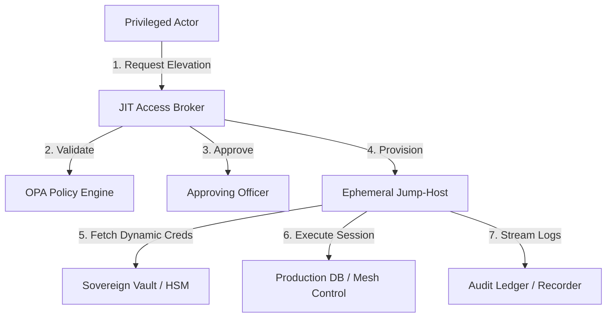

# SNISID: Privileged Access Management (PAM) Architecture

The PAM system secures the platform's "Root of Trust" and its most sensitive operational interfaces. It eliminates standing privileges, mandates ephemeral sessions, and provides total visibility into every administrative interaction.

---

## 1. PAM Architecture: The Sovereign Vault & Bastion Core

The system is built on three architectural pillars.

1. **The Sovereign Vault (HashiCorp Vault + HSM)**: Centralized, hardware-encrypted storage for all static and dynamic secrets.
2. **JIT Access Broker**: The orchestration layer that validates elevation requests against OPA policies and coordinates the "Four-Eyes" approval workflow.
3. **Ephemeral Jump-Hosts (Bastion)**: Hardened, containerized environments where privileged sessions are executed. No direct SSH or RDP is allowed to production nodes.

---

## 2. Privileged Workflows (The JIT Lifecycle)

Standing administrative access is strictly forbidden.

1. **Request**: An admin requests the `role:db_administrator` for 60 minutes to perform a migration.
2. **Multi-Party Approval**: A second authorized officer must cryptographically sign the request (Four-Eyes Principle).
3. **Session Issuance**: The JIT Broker provisions an ephemeral container and injects a short-lived, identity-bound SVID.
4. **Active Session**: The admin performs the task within the isolated container.
5. **Auto-Termination**: At $T+60$ minutes, the session is killed, the container is destroyed, and the credentials are revoked.

---

## 3. Session Security Model (Isolation & Recording)

### 3.1. Privileged Session Isolation (PSI)
Administrative sessions never touch the production host directly. They are encapsulated in a hardened container with:
- **No Egress**: Blocked from the public internet.
- **Protocol Proxying**: Envoy proxies the administrative protocol (e.g., gRPC, SQL, SSH) and injects mTLS.

### 3.2. Session Recording & Forensic Audit
Every privileged interaction is recorded:
- **Video Recording**: Frame-by-frame capture of web consoles or graphical sessions.
- **Keystroke Logging**: Full capture of all CLI commands.
- **Tamper-Proofing**: Recordings are streamed in real-time to the **Sovereign Audit Ledger** and signed with the session's ephemeral key.

---

## 4. SOC Operator Isolation

SOC analysts operate in a **Secure Access Zone (SAZ)**.
- **Hardware-Binding**: Access is only permitted from terminals with a verified TPM 2.0 signature.
- **Air-Gapped Equivalent**: The SAZ uses physically or logically isolated networking to prevent an administrative session from being used as a pivot point for a lateral attack.

---

## 5. Emergency "Break-Glass" Access

In catastrophic scenarios where the central IAM is unreachable:
1. **Multi-Sig Activation**: Requires the physical insertion of $M$ of $N$ (e.g., 3 of 5) hardware security keys.
2. **Offline Root**: Grants access to the **Offline Root CA** and critical cluster recovery credentials.
3. **Post-Incident Forensics**: Triggers a platform-wide audit event that cannot be cleared, even by the Root Admin.

---

## 6. Behavioral Monitoring Pipeline

Administrative sessions are continuously analyzed by AI for anomalies:
- **Command Anomaly**: Detection of unusual CLI flags or dangerous operations (e.g., `rm -rf`, `DROP TABLE`).
- **Speed Anomaly**: Identifying automated script injection when a human is expected.
- **Context Drift**: Alerting if an admin accesses data outside the specific scope of their approved JIT request.

---

## 7. Threat Mitigation Strategy

| Threat Scenario | PAM Defense |
| :--- | :--- |
| **Credential Theft** | Credentials are ephemeral and dynamically generated per-session by Vault; stolen credentials expire in minutes. |
| **Lateral Movement** | Admin sessions are isolated in containers with no egress; cross-service movement is blocked by Istio mTLS. |
| **Insider Threat** | "Four-Eyes" approval and real-time session recording provide massive deterrence and immediate detection. |
| **Ransomware** | Jump-hosts are read-only and ephemeral; malware cannot persist across sessions. |
