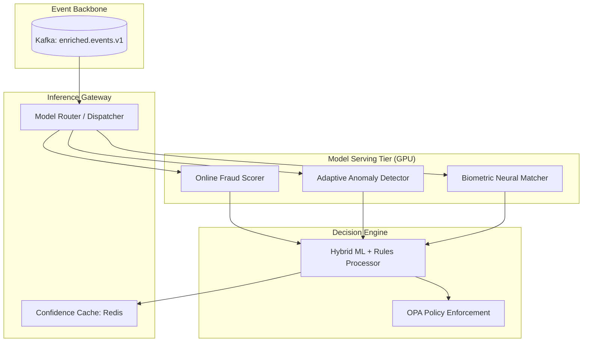

# SNISID: Real-Time AI Inference Pipeline

The AI Inference Pipeline provides the "Predictive Brain" of SNISID, executing complex neural models on live event streams to generate instant fraud scores and security decisions.

---

## 1. Inference Architecture: Distributed & Accelerated

SNISID utilizes a **Microservice-based Model Serving** architecture deployed on GPU-accelerated Kubernetes nodes.

---

## 2. Model Serving Topology & Scaling (Prompt 136, 137)

- **Runtime**: Models are served via **NVIDIA Triton Inference Server** or **BentoML**, supporting TensorFlow, PyTorch, and ONNX.
- **GPU Acceleration**: Utilizes NVIDIA A100/H100 MIG (Multi-Instance GPU) to isolate different inference jobs (e.g., Fraud vs. Biometrics) on a single physical card.
- **Scaling**: **KEDA (Kubernetes Event-Driven Autoscaling)** scales inference pods based on the Kafka topic lag.

---

## 3. Online Fraud Scoring & Adaptive Detection (Prompt 137, 138)

- **Streaming Inference**: Features are extracted from the Kafka stream in real-time (e.g., "Velocity of logins for Identity X") and fed into the model.
- **Adaptive Detection**: The AI model continuously updates its local "Working Memory" (Stateful Flink) to adapt to shifting fraud patterns without requiring a full retraining cycle.

---

## 4. Confidence Scoring & Decision Logic (Prompt 140)

Every AI decision includes a **Confidence Metric** ($C$).

- **High Confidence ($C > 0.9$)**: Automatic action (e.g., account lock).
- **Medium Confidence ($0.6 < C < 0.9$)**: Triggers a Step-Up challenge (e.g., Biometric MFA).
- **Low Confidence ($C < 0.6$)**: Routes the event to a **Human SOC Operator** for manual verification.

---

## 5. Hybrid ML + Rules Engine (Prompt 141)

SNISID combines the predictive power of ML with the deterministic safety of Rego rules.
- **The Wrapper Pattern**: The AI model suggests a decision, but the **OPA Enforcement Layer** has the final "Veto" based on national legal policies (e.g., "Never lock a Government Minister's account without Four-Eyes approval").

---

## 6. Failure Recovery & Resilience

- **Circuit Breakers**: If the GPU cluster exceeds latency thresholds (e.g., > 50ms), the system falls back to a **Rules-Only Lightweight Mode** to ensure service continuity.
- **Shadow Mode**: New models are first deployed in "Shadow Mode," where they process live data but their decisions are only recorded for comparison, not enforced.
