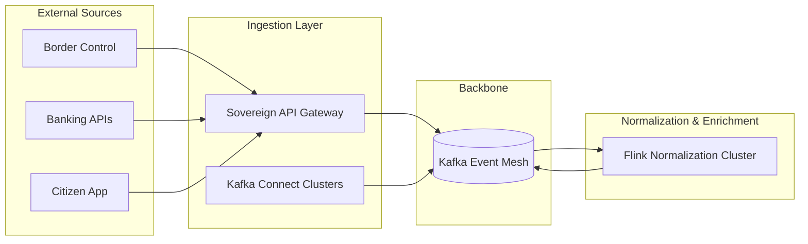

# SNISID: Real-Time Event Ingestion Pipeline

The SNISID Ingestion Pipeline provides a high-scale, secure gateway for streaming data from diverse national sources into the Kafka Backbone.

---

## 1. Ingestion Topology

SNISID uses a **Tiered Ingestion Model** to handle millions of concurrent events from internal and external agencies.

---

## 2. Source Integration Strategies

| Source Type | Integration Mechanism | Protocol |
| :--- | :--- | :--- |
| **Identity Systems** | Direct SDK | gRPC / Kafka Lib |
| **Security Sensors** | Kafka Connect (Syslog/Netflow) | UDP/TCP |
| **Mobile Apps** | API Gateway Proxy | HTTPS/mTLS |
| **Banking/External** | Webhook / API Polling | REST + JWT |
| **AI Engines** | Real-Time Feedback Loop | gRPC / Kafka |

---

## 3. Normalization & Enrichment Lifecycle

Every raw event passes through a **Stateless Normalization Pipeline** before being admitted to "Golden" topics.

1.  **Validation**: Verify the payload against the Protobuf schema in the Registry.
2.  **Normalization**: Map source-specific fields to the **Open Event Cloud Schema (OECS)**.
3.  **Enrichment**: 
    - **Identity Enrichment**: Look up `identity_id` from the cache.
    - **Geo-Enrichment**: Map IP addresses to national jurisdictions.
    - **Security Tagging**: Add `trust_score` and `risk_flags`.
4.  **Sanitization**: Scrub any accidental PII from operational fields.

---

## 4. Scalability & Backpressure Handling

To handle national-scale spikes (e.g., during elections or border crises):

- **Consumer-Side Backpressure**: Flink and Kafka Streams automatically slow down consumption if the downstream (Database/AI) is overwhelmed.
- **Producer-Side Throttling**: The API Gateway uses **Leaky Bucket** rate limiting per source to prevent a single agency from flooding the Kafka backbone.
- **Horizontal Scaling**: All ingestion components (Gateway, Connect, Flink) are deployed on K8s with **HPA (Horizontal Pod Autoscaler)** based on CPU and message lag.

---

## 5. Event Durability & Fault Tolerance

- **Zero-Loss Buffer**: Kafka acts as the primary buffer. If the normalization service fails, events remain safe in the `raw.ingest` topic.
- **Dead Letter Queues (DLQ)**: Malformed events are routed to agency-specific DLQs for manual inspection.
- **Idempotency**: All ingestion producers use `enable.idempotence=true` to prevent duplicates during network retries.

---

## 6. Real-Time Observability

- **Lag Monitoring**: Real-time dashboards (Prometheus/Grafana) tracking the time from `Event Produced` to `State Updated`.
- **Throughput Heatmaps**: Visualizing event volume by agency and domain.
- **Lineage Tracking**: Every event includes a `trace_id` (W3C), allowing auditors to trace an ingestion event back to the original source API call.
