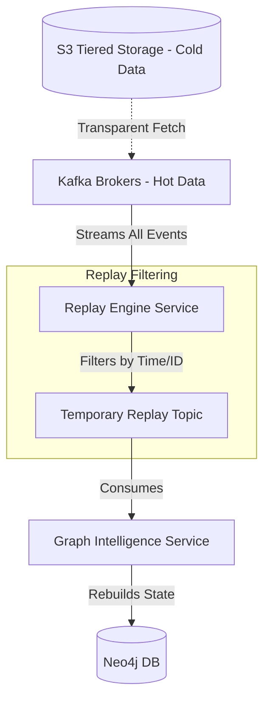

# SNISID: Event Replay & Auditability Architecture

A defining characteristic of a sovereign-grade digital system is its ability to withstand extreme catastrophic failures or sophisticated compromises, and reconstruct its state flawlessly. This document defines the architectural patterns for forensic auditability and event replay in SNISID.

---

## 1. Event Retention Strategy & Immutable Logs

To support indefinite historical replay while managing infrastructure costs, SNISID relies on a tiered retention strategy for Apache Kafka.

*   **Hot Storage (Kafka Brokers):** SSD-backed volumes retaining the last 7 days of events. Ensures lightning-fast reads for active fraud checks and real-time operations.
*   **Cold Storage (Tiered S3 / MinIO):** Older events are automatically and transparently offloaded to Object Storage. This provides **infinite retention** of immutable logs.
*   **WORM Compliance:** The S3 buckets holding the tiered Kafka data are configured with Write-Once, Read-Many (WORM) Object Lock. No administrator, not even with root privileges, can alter or delete a forensic event before the legal retention period expires (e.g., 10 years for audits).

---

## 2. Replay Engine Architecture

If a critical database (e.g., Neo4j Graph DB) is completely corrupted or lost, or if a new AI model needs to be back-tested on 5 years of historical data, SNISID utilizes a dedicated **Replay Service**.

### Event Reconstruction Capabilities (Event Sourcing)
Because SNISID is built on Event Sourcing, the current state of any entity is simply the sum of all its past events. By streaming events from Kafka starting at `offset = 0`, a microservice can perfectly reconstruct its relational tables, graph nodes, or Redis caches from scratch.

---

## 3. Replay Filtering Mechanisms

A "Full Replay" of billions of events is computationally expensive. The Replay Service supports **Partial Replay** through strict filtering mechanisms:

1.  **By Time Window:** The Replay Service sets the Kafka consumer offset to a specific timestamp (e.g., replay all events from `2025-01-01T00:00:00Z` to `2025-02-01T00:00:00Z`).
2.  **By Aggregate ID:** Filtering by `identity_id` to rebuild the entire historical lifecycle of a single, highly suspicious citizen.
3.  **By Domain/Topic:** Replaying only `fraud.case.*` events to backtest a new machine learning model without wasting compute on `identity` events.

---

## 4. Correlation ID Tracking & Forensic Auditability

Traceability is guaranteed by distributed context propagation.

*   **W3C Trace Context:** When a request arrives at the API Gateway, an OpenTelemetry `correlation_id` is generated.
*   **Metadata Envelope:** This ID is embedded into the standard metadata envelope of every Kafka event.
*   **The Forensic Chain:** If a SOC analyst identifies a malicious API request, they can take the `correlation_id` and search ElasticSearch/Jaeger. They will instantly see:
    1.  The API request payload.
    2.  The resulting database commit.
    3.  The specific Kafka event published.
    4.  The Graph Intelligence node created 30 milliseconds later.

---

## 5. Dead-Letter Queue (DLQ) Replay Workflow

When a consumer receives a "poison pill" (e.g., an event schema validation failure), the event is routed to the DLQ after 3 retries. The recovery workflow is as follows:

1.  **Quarantine:** Event lands in `identity.dlq`.
2.  **Alerting:** SOC/Data Engineering team is alerted.
3.  **Correction:** An engineer writes a schema migration or fixes the consumer code bug.
4.  **DLQ Replay:** The engineer uses the Replay Engine to route the fixed event from `identity.dlq` back into the main `identity.citizen.events` topic for reprocessing.
5.  **Audit:** The DLQ replay action is itself recorded in `audit.record.logged`.

---

## 6. Compliance & Legal Considerations

*   **Legal Admissibility:** Because events are cryptographically signed, immutable, and stored in WORM storage, SNISID event logs satisfy the legal criteria for admissibility in national courts regarding fraud prosecution.
*   **Right to Erasure (GDPR style):** In a purely immutable event log, deleting a citizen's data is mathematically impossible. SNISID handles "Right to be Forgotten" mandates via **Cryptographic Erasure (Crypto-Shredding)**. Sensitive PII in the event payload is encrypted with a unique key per citizen. To "delete" the citizen from the immutable Kafka log, their specific encryption key is destroyed in the HSM (Hardware Security Module). The event remains in the log forever, but the payload becomes permanently indecipherable.
