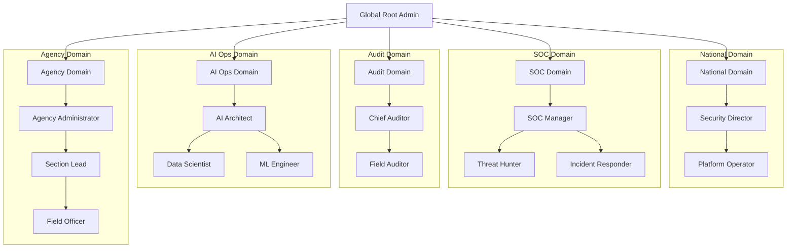

# SNISID: Comprehensive Role Hierarchy Model

This model defines the structured "Tree of Power" for the SNISID platform. It ensures that every action is governed by a clear hierarchy, strict inheritance rules, and cryptographic separation of duties (SoD) across all government domains.

---

## 1. The Multi-Domain Inheritance Tree

Roles are grouped into five logical domains, each with its own internal hierarchy. Inheritance flows **downwards** (higher roles possess the powers of lower roles within their domain).

---

## 2. Permission Inheritance Logic

- **Additive Inheritance**: Within a domain, Level $N$ inherits all permissions of Level $N+1$.
- **Cross-Domain Isolation**: A `SOC Manager` does **not** inherit permissions from the `Agency Administrator`. They are distinct hierarchies.
- **Top-Down Overrides**: `Global Root Admin` can revoke any permission but cannot perform functional data operations (e.g., cannot view a citizen's tax record) to maintain SoD.

---

## 3. Domain Specific Hierarchies

### 3.1. SOC Hierarchy (The Guardians)
- **Threat Hunter**: Full read-access to telemetry, network logs, and OPA decision logs. No write access.
- **Incident Responder**: Ability to trigger JIT elevations, revoke SVIDs, and activate the National Kill Switch.

### 3.2. Auditor Hierarchy (The Inspectors)
- **Chief Auditor**: Ability to cryptographically verify the integrity of the **Sovereign Audit Ledger**.
- **Field Auditor**: Read-only access to specific agency audit trails for compliance verification.

### 3.3. AI Operations Hierarchy (The Intelligence)
- **Data Scientist**: Access to **Anonymized/Masked** biometric datasets for model training. Prevented from viewing unmasked PII.
- **ML Engineer**: Governs the CI/CD pipeline for model deployment. No access to raw citizen data.

---

## 4. Separation of Duties (SoD) Matrix

Certain roles are **Mutually Exclusive**. A single user account cannot hold both roles simultaneously.

| Role A | Role B | Conflict Rationale |
| :--- | :--- | :--- |
| **Incident Responder** | **Chief Auditor** | Prevents an officer from clearing their own audit logs after a lockdown event. |
| **Agency Administrator**| **Data Scientist** | Prevents local admins from tampering with national AI models. |
| **ML Engineer** | **National Security** | Ensures platform security controls are independent of the AI supply chain. |

---

## 5. Delegation & Escalation Controls

### 5.1. Temporary Access Delegation
- **Rule**: A Section Lead can delegate their L3 permissions to a Field Officer for a max of 24 hours.
- **Protocol**: Requires a digital signature from the Section Lead and a biometric re-auth from the Officer.

### 5.2. Escalation Limits
- **Emergency Break-Glass**: Standard Field Officers can elevate to `Emergency Responder` but **never** to `Agency Admin` or `SOC Lead`. Escalation is capped at the immediate parent level.

**Technical Enforcement**: See the [SNISID PAM Architecture](file:///c:/Users/sopil/Desktop/SNISID/SNISID_PAM_Architecture.md) for JIT elevation workflows, session recording, and Four-Eyes approval mechanisms.

---

## 6. Governance & Recertification Rules

- **Cryptographic Signing**: All role assignments (User -> Role) must be signed by the National IdP and logged to the immutable ledger.
- **Quarterly Recertification**: All L0, L1, and L2 roles are automatically suspended every 90 days unless explicitly recertified by a superior in a different domain (Cross-Domain Governance).
- **Least Privilege Default**: Users with no assigned role default to `L4: Citizen` (Self-service only).
