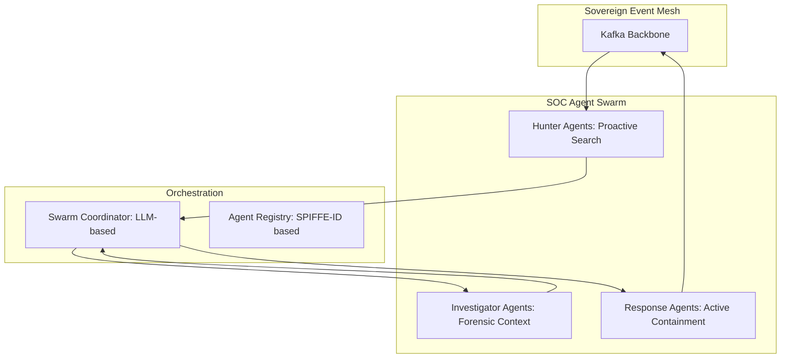

# SNISID: AI SOC Agent Swarm Architecture

The SOC Agent Swarm provides a decentralized, autonomous layer of defense that operates at machine speed to detect, investigate, and contain threats across the national infrastructure.

---

## 1. Swarm Topology: Decentralized Intelligence

The swarm is a collection of specialized AI agents that communicate via a dedicated **Kafka Intelligence Topic** (`national.soc.swarm.v1`).

---

## 2. Specialized Agent Roles

### 2.1. Hunter Agents (Proactive Defense)
- **Objective**: Identify "Weak Signals" and behavioral anomalies that bypassed the primary Flink CEP.
- **Data Sources**: Flink streams, VPC Flow Logs, and Graph relationships.
- **Action**: Emit a `Swarm_Incident_Proposed` event when a suspicious pattern is found.

### 2.2. Investigator Agents (Deep Analysis)
- **Objective**: Validate the findings of the Hunter Agents by gathering multi-domain evidence.
- **Actions**:
  - Query **Neo4j** for relationship history.
  - Request **Forensic Replay** of the last 15 minutes of the identity's activity.
  - Check **Sovereign Threat Intel (STI)** for IP/Device reputation.
- **Action**: Emit an `Evidence_Package` with a calculated confidence score.

### 2.3. Response Agents (Active Containment)
- **Objective**: Execute automated containment actions based on approved playbooks.
- **Actions**:
  - Trigger **OPA Lockdown** (via the Policy Plane).
  - Issue **SPIFFE SVID Revocation** (via SPIRE).
  - Inject **Auto-Quarantine** network rules (via Cilium/Istio).

---

## 3. Swarm Orchestration Layer

The **Swarm Coordinator** acts as the "Brain" that manages the multi-agent workflow.

- **Orchestration Model**: **Hierarchical Task Planning**. The Coordinator receives a proposed incident, evaluates its severity using an LLM-based reasoning engine, and assigns sub-tasks to the relevant Investigator and Response agents.
- **Agent Communication**: Uses **Protobuf-based RPC** over Kafka, ensuring that all agent interactions are recorded in the Sovereign Audit Ledger.
- **Resilience**: The Coordinator is deployed as an HA cluster on Kubernetes. If the primary Coordinator fails, a standby takes over and resumes active investigations from the Kafka state.

---

## 4. Security & Governance

- **Identity**: Every agent has a unique **SPIFFE SVID**. An agent cannot perform any action (e.g., query Neo4j) without a valid identity and specific RBAC permissions.
- **Trust Scoring**: The **ISTS (Internal Service Trust Scoring)** engine monitors agent behavior. If an agent begins acting anomalously (e.g., requesting too many revocations), it is instantly quarantined by the master OPA policy.
- **Four-Eyes Control**: High-impact actions (e.g., national-scale revocation) require a human "Approval Token" injected into the Kafka stream before the Response Agent can proceed.

---

## 5. Runtime Workflows

1.  **Detection**: Hunter Agent detects an unusual lateral movement pattern.
2.  **Tasking**: Coordinator assigns Investigator Agent 01 (Graph Specialist) and Investigator Agent 02 (Network Specialist).
3.  **Synthesis**: Coordinator combines the graph and network evidence into an **Attack Story**.
4.  **Action**: If Confidence > 0.95, Coordinator tasks the Response Agent to isolate the compromised pod and revoke the associated Identity Token.
5.  **Audit**: The entire chain of reasoning is logged to the **AI Audit Ledger**.
