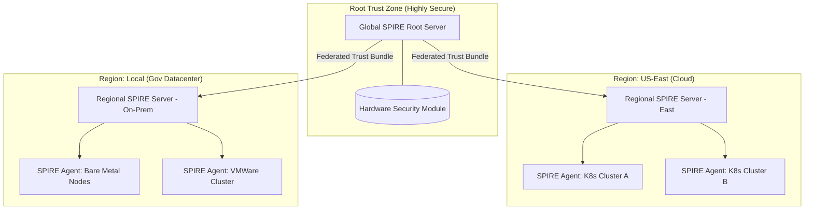

# SNISID: National SPIFFE/SPIRE Identity Framework

This framework defines the cryptographic foundation for all workload identities within the SNISID ecosystem. It ensures that every service, from AI inference engines to Kafka brokers, possesses a hardware-attested, verifiable, and short-lived identity.

---

## 1. Identity Taxonomy (SPIFFE ID Schema)

We use a hierarchical trust domain model to support multi-agency and multi-regional federation.

**Global Trust Domain:** `spiffe://snisid.gov`

| Component | SPIFFE ID Format | Example |
| :--- | :--- | :--- |
| **API Gateways** | `spiffe://snisid.gov/ns/{{ns}}/sa/{{sa}}` | `spiffe://snisid.gov/ns/gateway/sa/ingress-controller` |
| **Core APIs** | `spiffe://snisid.gov/ns/{{ns}}/svc/{{svc}}` | `spiffe://snisid.gov/ns/core/svc/identity-api` |
| **Kafka Brokers** | `spiffe://snisid.gov/infra/kafka/broker/{{id}}` | `spiffe://snisid.gov/infra/kafka/broker/001` |
| **AI Services** | `spiffe://snisid.gov/ai/engine/{{type}}` | `spiffe://snisid.gov/ai/engine/triton-face` |
| **SOC Systems** | `spiffe://snisid.gov/security/soc/{{system}}` | `spiffe://snisid.gov/security/soc/flink-cep` |
| **Agencies** | `spiffe://{{agency}}.gov/ns/{{ns}}/sa/{{sa}}` | `spiffe://dcpj.gov/ns/border/sa/biometric-scanner` |

---

## 2. SPIRE Server Topology

The architecture follows a tiered, federated model to support high availability and multi-region resilience.

---

## 3. Attestation Model

Trust is built from the hardware up, avoiding reliance on soft credentials.

### 3.1. Node Attestation
Nodes must prove their validity to the SPIRE server before being allowed to host workloads.
- **On-Prem/Hybrid**: TPM 2.0 or HSM-based attestation.
- **AWS**: Amazon Instance Identity Document (IID).
- **GCP**: Google Instance Identity Token (IIT).
- **Kubernetes**: Projected Service Account Token (PSAT) attestation for nodes.

### 3.2. Workload Attestation
Once a node is trusted, the SPIRE Agent validates the specific process requesting an identity.
- **K8s Selector**: Validates Namespace, ServiceAccount, and Image ID (SHA256 hash).
- **Linux Selector**: Validates UID/GID, binary path, and parent process ID.

---

## 4. Identity Lifecycle

For a complete operational breakdown, see the [SNISID Identity Lifecycle Management (SILM)](file:///c:/Users/sopil/Desktop/SNISID/SNISID_Identity_Lifecycle_Management.md).

### 4.1. Issuance & Rotation
- **SVID Type**: X.509 SVIDs (Standard) or JWT-SVIDs (for edge/unauthenticated protocols).
- **Short Life-span**: Certificates are issued with a 1-4 hour TTL.
- **Automated Rotation**: SPIRE Agents rotate certificates when they reach 50% of their lifespan without service interruption.

### 4.2. Revocation
Since SVIDs are short-lived, revocation is primarily handled by **stopping issuance**:
1. **Immediate Revocation**: SPIRE Server marks the entry as disabled.
2. **Propagated Death**: The agent stops rotating the certificate.
3. **Natural Expiry**: The existing certificate expires within 60 minutes, and the workload is blocked from all mTLS communication.

---

## 5. Security Flows

### 5.1. The "First Identity" Flow
1. **Bootstrap**: A new K8s node joins the cluster.
2. **Node Attestation**: The Node Agent sends its PSAT/TPM quote to the SPIRE Server.
3. **Registration**: The SPIRE Server verifies the quote and registers the node.
4. **Workload Request**: An AI service pod starts and requests an identity via the Unix Domain Socket.
5. **Workload Attestation**: The Agent identifies the pod's metadata (Image ID, Namespace).
6. **SVID Delivery**: The Agent delivers the X.509 SVID to the pod's sidecar (Envoy/SDS).

---

## 6. Multi-Region & Hybrid Federation

### 6.1. Trust Bundles
Each regional trust domain maintains a **Trust Bundle** (public keys of its root CA). 
- **Federation**: Trust domains exchange bundles. A service in `spiffe://snisid.gov` can verify a certificate from `spiffe://dcpj.gov` by checking it against the federated bundle.

### 6.2. Connectivity
- **Bundle Endpoint**: SPIRE Servers expose a standard SPIFFE Bundle Endpoint over mTLS.
- **Air-Gap Support**: Bundles can be manually synced via secure out-of-band channels for high-security, non-connected environments.

---

## 7. Failure Recovery & Resilience

| Failure Scenario | Impact | Recovery Strategy |
| :--- | :--- | :--- |
| **Regional SPIRE Server Down** | No new SVIDs or rotations in that region. | Secondary Regional Server (Active-Active) or Root Server failover. |
| **Root CA Compromise** | Entire trust domain compromised. | **Root Key Rotation**: Revoke all current SVIDs and distribute a new Trust Bundle. Requires hardware-level HSM re-initialization. |
| **Node Agent Down** | Local workloads cannot rotate certs. | Kubernetes HPA/Self-healing restarts the Agent. SVIDs remain valid until expiry. |

---

## 8. Operational Integration

- **Istio**: Configured to use SPIRE as the Custom CA via Envoy SDS.
- **Kafka**: Brokers and clients use SPIRE-issued certificates for `security.protocol=SSL`.
- **Monitoring**: Prometheus metrics track SVID expiration dates and attestation failure rates.
