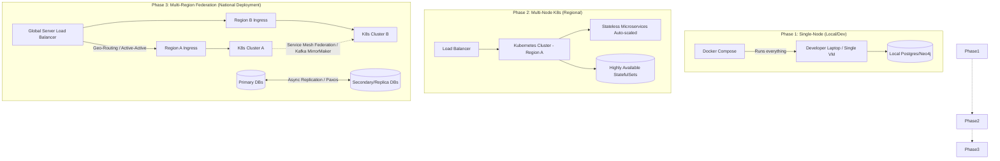

# SNISID: System Scalability Model

This document outlines the scalability model for the SNISID platform. It defines how the system evolves from a simple local development environment to a sovereign, multi-region national deployment while maintaining zero downtime.

## 1. Scalability Evolution Diagram

---

## 2. Stateless vs. Stateful Service Classification

To support massive horizontal scaling, SNISID strictly separates compute from state.

### Stateless Services
These services maintain no local memory between requests and can be scaled infinitely.
*   **API Gateway & WAF**
*   **Identity Service APIs** (REST/gRPC endpoints)
*   **AI Inference Workers** (Stateless model serving)
*   **Event Consumers** (Stateless transformation/enrichment workers)

### Stateful Services
These services manage data persistence and require specialized scaling strategies (e.g., StatefulSets, clustering, sharding).
*   **Relational Database:** PostgreSQL (Identity records)
*   **Graph Database:** Neo4j (Relationship intelligence)
*   **Event Backbone:** Apache Kafka (Event sourcing log)
*   **In-Memory Store:** Redis (Distributed locking, JWT blocklists, rate limit counters)

---

## 3. Scaling Rules and Triggers

SNISID uses a combination of standard Kubernetes metrics and event-driven triggers to scale workloads dynamically.

*   **Rule 1: Resource-Based Auto-Scaling (HPA):**
    *   **Trigger:** CPU utilization > 70% or Memory utilization > 80% over a 1-minute window.
    *   **Action:** Horizontal Pod Autoscaler (HPA) spins up additional replica pods.
*   **Rule 2: Event-Driven Auto-Scaling (KEDA):**
    *   **Trigger:** Kafka consumer lag (unprocessed events in a topic) > 1,000 messages.
    *   **Action:** Kubernetes Event-Driven Autoscaling (KEDA) dynamically adds worker pods to clear the queue, scaling down to zero when the queue is empty.
*   **Rule 3: AI/GPU Scaling:**
    *   **Trigger:** Inference queue length or GPU memory utilization > 85%.
    *   **Action:** Cluster Autoscaler provisions new GPU-enabled K8s worker nodes to handle biometric matching bursts.

---

## 4. Load Balancing and Zero-Downtime Strategy

### Load Balancing Strategy
*   **External Traffic (L7):** Handled by an Ingress Controller (e.g., NGINX or Envoy) providing TLS termination, routing based on HTTP headers, and URL paths.
*   **Internal Traffic (L4/L7):** Handled by a Service Mesh (e.g., Istio). Provides intelligent client-side load balancing, circuit breaking, and automatic retries between microservices.

### Zero-Downtime Scaling Strategy
*   **Rolling Updates:** K8s gradually replaces old pods with new ones. A Readiness Probe ensures a new pod is fully booted and connected to the DB before routing traffic to it.
*   **Connection Draining:** When scaling down, pods receive a `SIGTERM` signal and are given a grace period (e.g., 30 seconds) to finish processing active requests before termination.
*   **Schema Migrations:** Database schemas are strictly append-only or use the Expand/Contract pattern. Application code is deployed to support both the old and new schema simultaneously during the transition.

---

## 5. Data Replication Strategy

*   **PostgreSQL (Identity Data):** Synchronous streaming replication within the same region (Active-Passive or Active-Active Read Replicas) for high availability.
*   **Neo4j (Graph Data):** Causal Clustering architecture. One Leader node handles writes, while multiple Follower nodes handle reads. Followers scale horizontally to support massive read queries.
*   **Apache Kafka (Event Data):** Topic partitions are replicated across multiple brokers (Replication Factor = 3).
*   **Redis (Ephemeral State):** Redis Cluster mode for horizontal sharding of rate limits and caching data.

---

## 6. Multi-Cluster Federation Model

For national, multi-region deployment, SNISID operates in an Active-Active or Active-HotStandby federation:
1.  **Global Server Load Balancer (GSLB):** Routes traffic based on geography (e.g., routing citizens to the nearest data center) or health status.
2.  **Federated Service Mesh:** Istio multi-cluster allows a microservice in Region A to seamlessly call a microservice in Region B if the local service fails.
3.  **Cross-Region Data Sync:** 
    *   PostgreSQL: Asynchronous logical replication across regions to prevent high latency from blocking writes.
    *   Kafka: MirrorMaker 2 synchronizes event topics between regional clusters.

---

## 7. Bottleneck Identification Strategy

To proactively identify scaling bottlenecks before they cause outages, the SNISID SOC employs the **USE (Utilization, Saturation, Errors)** method:

1.  **Distributed Tracing:** All requests are injected with trace IDs (OpenTelemetry) and visualized in Jaeger. This quickly identifies the exact microservice or database query causing latency.
2.  **Saturation Monitoring:** Monitoring queue depths, thread pool exhaustion, and database connection pool limits. A CPU might be at 50%, but if the DB connection pool is exhausted, the system is bottlenecked.
3.  **Latency Histograms:** Tracking the 95th and 99th percentile (p95, p99) response times rather than averages, to detect tail latency issues during traffic spikes.
4.  **Continuous Load Testing:** Automated scripts in the staging environment that simulate 150% of peak expected load to intentionally break the system and map out new bottlenecks.
