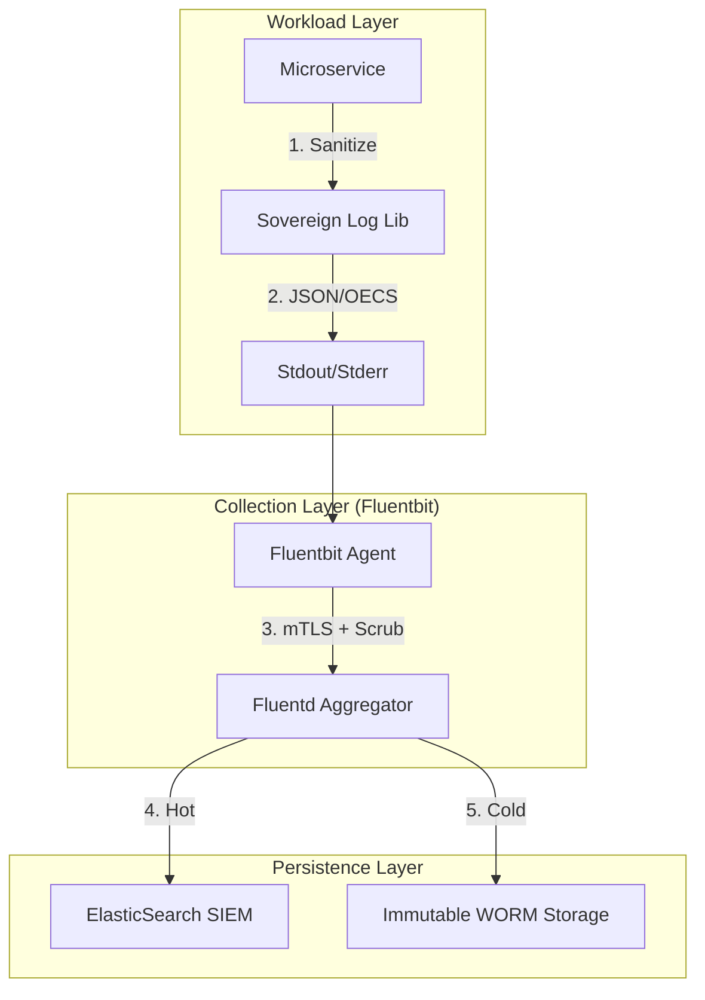

# SNISID: Secure Logging & Intelligence Architecture

The Sovereign Logging & Intelligence Platform (SLIP) ensures that all operational and security events are captured with absolute integrity, while strictly preventing the leakage of sensitive citizen PII into the logging infrastructure.

---

## 1. Logging Architecture & Collection

SNISID employs a **Distributed Collector Model** to gather logs from Kubernetes nodes, microservices, and network appliances.

---

## 2. Data Sanitization & Scrubbing Workflows

Logs must never contain PII. Sanitization occurs at two layers:

### 2.1. Source-Level (Application)
Microservices use a mandatory logging library that wraps standard loggers (e.g., `zap` or `logrus` in Go).
- **Auto-Redaction**: Uses optimized Regex to identify and mask patterns matching National IDs, Biometric Hashes, and JWTs.
- **Structured Schema**: Logs are enforced into the **Open Event Cloud Schema (OECS)**, ensuring consistent fields like `trace_id`, `service_name`, and `event_code`.

### 2.2. Collector-Level (Infrastructure)
Fluentbit performs a secondary "Defense-in-Depth" scan.
- **Plugin**: A custom Lua filter scans the `log` field. Any unmasked PII found is replaced with `[REDACTED_BY_INFRA]`, and a high-priority "Insecure Logging" alert is sent to the developer.

---

## 3. Log Encryption & Tamper-Proof Storage

Operational logs are treated as legal evidence.

- **Envelope Encryption**: Log blocks are encrypted using a **Log Encryption Key (LEK)** managed in Vault.
- **Digital Signatures**: Every log batch is signed by the **Logging Service Identity (SPIFFE ID)** using an HSM-backed key.
- **WORM Storage**: Logs in the **Archive Tier** are stored on **Write Once, Read Many** media with a mandatory 10-year lock, preventing any modification or deletion by administrators.

---

## 4. Threat Monitoring & SIEM Integration

The logging pipeline feeds the **National SIEM (Security Information and Event Management)**.

- **Real-time Detection**: The pipeline uses **Sigma Rules** to detect attack patterns (e.g., "Brute force attempts on MFA", "Anomalous Vault access").
- **Anomaly Detection**: ML models baseline "Normal Log Velocity." A sudden spike in logs from a single pod triggers automated isolation.
- **Log Correlation**: Every log includes a `correlation_id` (W3C Trace Context), allowing the SIEM to link a log from the API Gateway to a log from a database microservice in a single view.

---

## 5. Retention & Tiering Strategy

| Tier | Purpose | Retention | Storage Type |
| :--- | :--- | :--- | :--- |
| **Hot** | Live Troubleshooting & SIEM | 7 Days | SSD / ElasticSearch |
| **Cold** | Forensic Analysis | 90 Days | Object Storage (MinIO) |
| **Archive** | National Compliance | 10 Years | WORM / Tape |

---

## 6. Compliance Reporting Model

- **Automated Audit Reports**: The system generates weekly "Security Compliance Summaries" showing:
  - Total logs processed vs. anomalies detected.
  - Success/Failure rate of PII scrubbing.
  - Integrity verification status of the WORM storage.
- **Judicial Access**: Access to the Archive Tier requires a **"Four-Eyes" Approval** workflow and a valid warrant code, with all access recorded in the Sovereign Audit Ledger.
