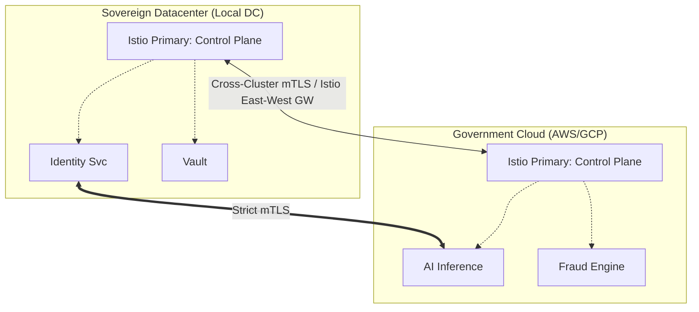

# SNISID: Sovereign Service Mesh Architecture (Istio)

The SNISID Service Mesh is the distributed security engine of the platform. It enforces cryptographic identity, strict mTLS, and granular authorization across all clusters, regions, and agencies, ensuring that the network itself is the primary Policy Enforcement Point (PEP).

---

## 1. Mesh Topology: Multi-Primary Federation

SNISID utilizes a **Multi-Primary on Multiple Networks** topology to ensure maximum resilience and local sovereignty.

- **Sovereignty**: The Local DC remains operational even if the Gov Cloud is disconnected.
- **East-West Gateways**: All cross-cluster traffic passes through hardened gateways that perform identity-bound authorization.

---

## 2. Sidecar Security & Hardened Envoy

The Envoy sidecar is the most critical security component. We apply a "Hardened" configuration profile.

### 2.1. Sidecar Isolation
- **Resource Limits**: Every sidecar is strictly limited (CPU/Memory) to prevent resource exhaustion attacks.
- **Syscall Filtering**: We use **Seccomp** and **AppArmor** to restrict the sidecar's ability to interact with the host kernel.

### 2.2. Envoy Configuration (L7 Filtering)
- **Deep Packet Inspection (DPI)**: Envoy is configured to inspect request headers and payloads for anomalous signatures.
- **Protocol Sniffing**: Restricted to specific allowed protocols (HTTP/2, gRPC, TLS).
- **Header Sanitization**: Removes potentially sensitive internal metadata headers before forwarding requests.

---

## 3. Security Enforcement Flow

1. **Request Initiation**: Service A makes a call to Service B.
2. **Local Interception**: The outbound request is intercepted by Service A's Envoy.
3. **Identity Verification**: Envoy fetches the latest SVID via **SPIRE SDS**.
4. **Policy Lookup**: Envoy checks local OPA/Istio policies to see if Service A is authorized to talk to Service B.
5. **mTLS Handshake**: Envoy performs a **TLS 1.3 mTLS** handshake with Service B's Envoy.
6. **Authorization Check**: Service B's Envoy validates the incoming SPIFFE ID against its local whitelist.
7. **Delivery**: If all checks pass, the request is delivered over `localhost`.

---

## 4. Advanced Telemetry Pipeline

The mesh acts as the primary data source for the **Observability Plane**.

- **Sovereign Audit Ledger**: Every mTLS handshake and authorization decision is logged as an immutable event to Kafka.
- **ISTS Integration**: Envoy generates high-fidelity telemetry (L7 metrics, latency, error rates) that feeds the **Internal Service Trust Scoring (ISTS)** engine.
- **Distributed Tracing**: Full end-to-end visibility via **OpenTelemetry** and **Jaeger**, allowing forensic analysts to reconstruct any request chain.

---

## 5. Disaster Recovery (DR) & Fail-Safe Modes

### 5.1. Cross-Region Failover
- **Global Load Balancing**: Integrated with the GSLB to redirect mesh traffic to the secondary region if the primary region's control plane or 50% of its workloads fail.
- **State Synchronization**: Kafka MirrorMaker 2 and Postgres Replication ensure that DR regions have the context required to resume processing.

### 5.2. Mesh "Fail-Safe" States
- **Emergency Lockdown**: When the platform enters **Defcon 1**, the mesh instantly applies a `STRICT` deny-all policy, allowing only pre-authorized emergency service principals to communicate.
- **Fail-Closed Policy**: If the Istio Control Plane (`istiod`) is unreachable, Envoy proxies continue to enforce the last-known-good security policy (Fail-Closed).

---

## 6. Infrastructure Integration: SPIRE + Istio

SNISID decouples identity from the mesh control plane for increased security.
- **Secret Discovery Service (SDS)**: Istio is configured to use the SPIRE Agent's Unix Domain Socket for all certificate management.
- **Hardware Roots**: SPIRE ensures that the identities delivered to Istio are backed by **TPM 2.0** or Cloud KMS, preventing identity spoofing even if the mesh control plane is compromised.
