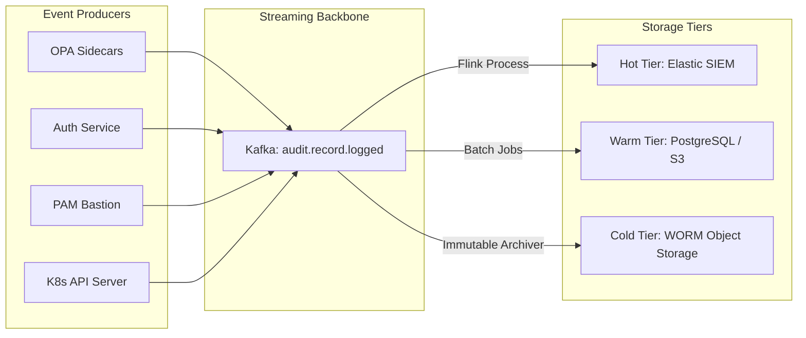

# SNISID: Sovereign Audit Ledger Architecture

The Sovereign Audit Ledger is the platform's immutable memory. It provides a tamper-proof record of every authentication, authorization, and administrative event, ensuring absolute non-repudiation and forensic readiness for national security operations.

---

## 1. Audit Architecture: The Multi-Tiered Ledger

SNISID uses a decoupled logging architecture to balance real-time observability with long-term forensic integrity.

---

## 2. Integrity Verification Model (Chain of Custody)

To prevent even "Root Admins" from tampering with history, SNISID employs a **Merkle Tree** integrity model managed by the **Sovereign Truth Engine (STE)**.

**Detailed Cryptographic Verification**: See the [SNISID Cryptographic Audit & Integrity Verification](file:///c:/Users/sopil/Desktop/SNISID/SNISID_Cryptographic_Audit_Integrity.md) for Merkle proof generation, continuous background auditing, and legal admissibility standards.

---

## 3. Security Event Pipelines

### 3.1. Authentication Pipeline
- **Events**: Login success/failure, MFA challenges, session starts/ends.
- **Traceability**: All events are bound by the user's **National Identity (NID)** and the device's **TPM ID**.

### 3.2. Authorization Pipeline (OPA Decisions)
- **Events**: Every `ALLOW` or `DENY` decision made by OPA.
- **Context**: Includes the full SREAK attribute set (Subject, Resource, Environment, Action, Risk) present at the time of the decision.

### 3.3. Administrative Pipeline (PAM/JIT)
- **Events**: JIT elevation requests, approval signatures, session start/end timestamps.
- **Forensics**: Links the keystroke/video logs to the specific administrative action.

---

## 4. Real-Time Monitoring & SIEM Integration

- **Correlation IDs**: Every security event carries a global `correlation_id`, allowing the SIEM to stitch together a full attack chain (e.g., from an anomalous login to a database query).
- **Automated Alerting**:
  - `Critical`: 3+ failed MFA attempts from a high-clearance officer.
  - `Warning`: Privilege elevation during non-standard shift hours.
- **Direct Integration**: Native streaming to Elastic SIEM (ECS format) and Splunk (HEC).

---

## 5. Retention & Compliance Strategy

| Event Class | Tier | Retention Period | Disposal Rule |
| :--- | :---: | :--- | :--- |
| **System Health** | Warm | 90 Days | Auto-Delete |
| **Standard Authn** | Cold | 2 Years | Crypto-Shred |
| **High-Risk Authz** | Cold | 10 Years | Manual Review Required |
| **Admin (PAM)** | Cold | Permanent | No Disposal permitted by Law |

---

## 6. Forensic Readiness Controls

- **Log Injection Protection**: All log producers use a secure SDK that sanitizes inputs and prevents CRLF injection attacks.
- **Clock Synchronization**: All nodes are synchronized via **PTP (Precision Time Protocol)** with hardware-backed time sources to ensure timestamp accuracy.
- **Masking at Source**: OPA policies automatically mask PII in audit logs before they leave the node, ensuring "Privacy-by-Design."
