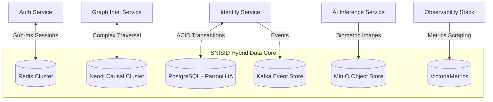

# SNISID: Hybrid Storage Architecture

SNISID rejects the "one-size-fits-all" database anti-pattern. To achieve national-scale throughput, sub-millisecond latency, and advanced analytical capabilities simultaneously, the platform employs a Polyglot Persistence strategy, routing specific data workloads to purpose-built storage engines.

---

## 1. Unified Storage Architecture Diagram

---

## 2. Storage Decision Matrix

Microservices must strictly adhere to the following routing rules when persisting data.

| Data Type / Workload | Target Engine | Characteristics | Example Use Case |
| :--- | :--- | :--- | :--- |
| **Relational / Transactional** | PostgreSQL 16+ | ACID compliance, strong consistency. | Citizen demographics, Audit metadata. |
| **Graph / Relational Intel** | Neo4j | Multi-hop traversal, clustering. | Fraud ring detection, synthetic identity linking. |
| **Ephemeral / Key-Value** | Redis Cluster | `< 1ms` latency, TTL expiration. | JWT Blocklist, API Gateway rate limits. |
| **Binary Large Objects (BLOBs)** | MinIO (S3 API) | High capacity, immutable storage. | Raw biometric images, PDF documents. |
| **Immutable Event Streams** | Apache Kafka | Sequential append-only, high throughput. | System nervous system, CQRS event sourcing. |
| **Time-Series / Telemetry** | VictoriaMetrics | High ingest rate, temporal aggregation. | CPU utilization, HTTP 500 error rates over time. |

---

## 3. Core Database Architectures & Scalability Models

### 3.1. PostgreSQL Architecture (Transactional Core)
*   **High Availability:** Deployed using **Patroni** and Etcd/Consul. The cluster maintains 1 Primary (Read/Write) and 2 Synchronous Replicas (Read-Only) spread across 3 Availability Zones.
*   **Failover:** If the Primary node crashes, Patroni automatically detects the failure and promotes a Replica to Primary within `< 10 seconds` with zero data loss.
*   **Connection Pooling:** **PgBouncer** is deployed as a sidecar to the Postgres pods to multiplex thousands of microservice connections down to a few hundred physical database connections, preventing memory exhaustion.

### 3.2. Redis Cache Architecture (Ephemeral State)
*   **Scalability:** Deployed as a **Redis Cluster** utilizing horizontal sharding. Keys are hashed to specific slots across multiple master nodes.
*   **Persistence:** Configured with AOF (Append-Only File) `everysec` persistence. While Redis is primarily an in-memory cache, this ensures that if a pod restarts, critical state (like the JWT Blocklist) is recovered instantly from disk.

### 3.3. Object Storage Architecture (MinIO)
*   **S3 Compatibility:** Applications interact with MinIO using standard AWS S3 SDKs, entirely avoiding lock-in to a specific cloud vendor.
*   **Erasure Coding:** MinIO shards biometric images across multiple physical drives. It can sustain the loss of half its physical drives and still perfectly reconstruct the data without corruption.

### 3.4. Time-Series Storage (VictoriaMetrics)
*   Chosen over Prometheus for long-term storage due to its drastically lower RAM requirements and higher compression ratios when storing billions of telemetry data points across the massive Kubernetes cluster.

---

## 4. Replication Topology & Disaster Recovery

SNISID utilizes a dual-tier replication strategy.

1.  **Intra-Cluster Replication (Synchronous):** Inside the primary datacenter, writes to PostgreSQL and Kafka require acknowledgment from multiple replicas across different Availability Zones before returning `200 OK` to the API. This guarantees RPO = 0 (zero data loss) for local hardware failures.
2.  **Cross-Cluster Replication (Asynchronous):** To survive a total datacenter loss (e.g., natural disaster), storage systems replicate asynchronously to the Cloud DR cluster.
    *   *Postgres:* Asynchronous logical/streaming replication to the DR site.
    *   *MinIO:* S3 bucket replication mirroring objects.
    *   *Kafka:* MirrorMaker 2 continuously syncing topics.

---

## 5. Data Lifecycle Management & Governance

Keeping petabytes of data on hot NVMe drives is cost-prohibitive. SNISID enforces strict Data Lifecycle Management (DLM) rules.

*   **Kafka Tiered Storage:** Events older than 7 days are automatically flushed from expensive broker disks into cheaper MinIO object storage, remaining fully queryable.
*   **S3 Lifecycle Policies:** Biometric images in MinIO transition across storage tiers:
    *   *Hot Tier (NVMe):* First 30 days for active investigation.
    *   *Warm Tier (HDD):* Months 1 to 12.
    *   *Cold Tier (Glacier/Tape):* Years 1 to 10 for legal compliance.
*   **Encryption at Rest:** All storage volumes (Postgres, Neo4j, MinIO) are encrypted via AES-256 (LUKS/TDE).
*   **Crypto-Shredding:** To comply with sovereign privacy laws ("Right to be Forgotten"), individual citizens' records are encrypted at the application level with unique Data Encryption Keys (DEKs). Deleting the DEK in the central Vault renders the data permanently unreadable across *all* databases and backups simultaneously.
