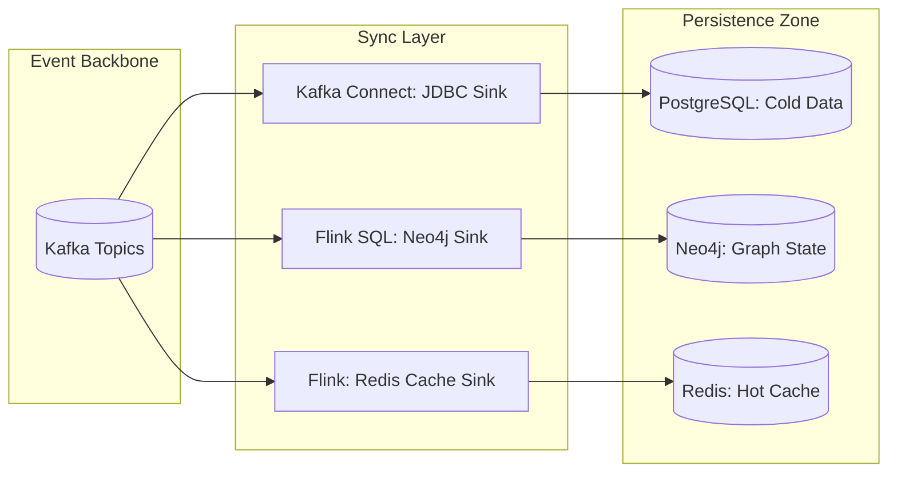

# SNISID: Stream-to-Database Synchronization

The Synchronization Layer ensures that the state of SNISID's persistent databases (PostgreSQL, Neo4j, Redis) is always consistent with the real-time event mesh.

---

## 1. Synchronization Architecture

SNISID uses **Kafka Connect** and **Flink SQL Sinks** to perform low-latency persistence.

---

## 2. Consistency & Fault Tolerance

- **Exactly-Once Persistence**: Using Flink's **Two-Phase Commit (2PC)** sink for Neo4j and PostgreSQL. This ensures that a message is committed to the database *only if* the Kafka offset is also committed.
- **Idempotent Upserts**: All database sinks use `UPSERT` logic (ON CONFLICT DO UPDATE) based on the `event_id`, ensuring that replayed events do not create duplicate records.
- **Transaction Grouping**: Small events are batched into transactions (e.g., 500 records or 1 second) to maximize database write throughput.

---

## 3. Change Data Capture (CDC) Integration

To ensure the "Loop is Closed," SNISID uses **Debezium** to capture changes *from* the databases and feed them back into Kafka.
- **Loop Prevention**: CDC events are tagged with an `origin_service` ID to prevent infinite loops where a database write triggers a Kafka event that triggers the same database write.
- **Audit Synchronization**: Every manual database update performed by an administrator via PAM is captured via CDC and routed to the **Sovereign Audit Ledger**.

---

## 4. Multi-Database Synchronization Workflows

1.  **Identity Update**: `identity-service` publishes `identity.updated` to Kafka.
2.  **Parallel Sync**:
    - **PostgreSQL Sink**: Updates the master identity table.
    - **Neo4j Sink**: Updates the relationship graph (e.g., address change).
    - **Redis Sink**: Updates the high-speed identity cache for the API Gateway.
3.  **Integrity Check**: A background "Consistency Auditor" periodically compares row counts and checksums across the three stores.

---

## 5. Recovery Mechanisms

- **Lag Alerting**: If a database sink falls behind (lag > 10,000 messages), the system triggers an automated **Scaling Event** for the Connect cluster.
- **Dead Letter Queue (DLQ)**: If a database write fails (e.g., schema mismatch), the event is moved to a DLQ topic, and a Data Engineer is alerted.
