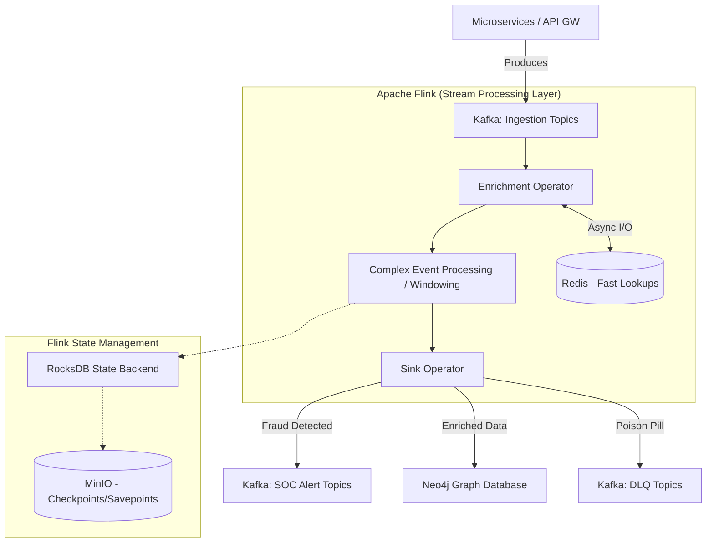

# SNISID: Real-Time Streaming Pipeline (Kafka + Flink)

While the Go microservices handle synchronous API logic, the true analytical power of SNISID lies in its asynchronous streaming pipeline. By combining **Apache Kafka** (for durable ingestion) with **Apache Flink** (for stateful stream processing), SNISID can execute Complex Event Processing (CEP), real-time enrichment, and velocity-based fraud detection across millions of events per second.

---

## 1. Streaming Architecture Diagram

---

## 2. Flink Job Orchestration & Resilience Strategy

Flink is deployed natively on the SNISID Kubernetes cluster.

### 2.1. State Management (Exactly-Once Semantics)
Flink maintains state for long-running aggregations (e.g., counting failed logins over a 24-hour window).
*   **RocksDB State Backend:** Active state is stored locally on the worker nodes using RocksDB, allowing the pipeline to maintain state larger than available RAM.
*   **Checkpointing:** Every 10 seconds, Flink takes an asynchronous distributed snapshot of its exact state and Kafka offsets, saving it to MinIO (S3). If a Kubernetes Node crashes, Flink automatically restarts the Job on a new node and resumes processing from the last checkpoint, guaranteeing **Exactly-Once** processing.

### 2.2. Seamless Upgrades (Savepoints)
If SNISID developers need to deploy a new version of the Fraud Scoring algorithm:
1.  They trigger a **Savepoint** (a manual, persistent checkpoint).
2.  The Flink Job is gracefully cancelled.
3.  The new Flink code is deployed.
4.  The new Job is started *from the Savepoint*, picking up the exact state and Kafka offsets precisely where the old code left off.

---

## 3. Real-Time Analytics Topology

### 3.1. The Event Enrichment Pipeline
Raw events entering Kafka are often sparse. Flink acts as the enrichment engine.
*   **Flow:** The `auth.session.started` event contains an IP address but no location data. 
*   **Async I/O:** Flink uses asynchronous I/O to query an internal Redis GeoIP cache, appending the physical country to the event stream in real-time, without blocking the high-throughput processing pipeline.

### 3.2. Complex Event Processing (CEP)
Flink's CEP library is the primary engine for real-time velocity and behavioral fraud detection.
*   **Scenario (Velocity Attack):** An attacker attempts to guess a citizen's OTP code.
*   **Flink Pattern:** Flink defines a pattern searching for *5 sequential `auth.session.failed` events* followed by *1 `auth.session.started` event*, all occurring within a **Tumbling Window of 60 seconds** for the same `identity_id`.
*   **Action:** If this strict pattern is matched, Flink immediately generates a `soc.alert.critical` event indicating a likely successful brute-force attack, triggering instant SOAR containment.

---

## 4. Dead-Letter Handling & Replay Architecture

Data corruption must never crash the national pipeline.

### 4.1. Side Outputs (DLQ)
If Flink receives a malformed JSON payload that fails schema deserialization, it does not throw an exception and crash the TaskManager.
*   The malformed record is routed to a **Flink Side Output**.
*   The Sink operator writes these isolated records directly to a `<topic>.dlq` Kafka topic.
*   The main pipeline continues processing healthy events uninterrupted.

### 4.2. Historical Replay
If a new sophisticated fraud ring is discovered, data scientists can write a new Flink Job to scan history.
*   The Flink job connects to the Kafka Tiered Storage (S3).
*   It is configured with `auto.offset.reset=earliest`.
*   Flink streams through the last 5 years of historical events at maximum IOPS speed to back-test the new detection algorithm, before eventually catching up to the live stream and transitioning to real-time processing seamlessly.

---

## 5. Cross-Cluster Replication & DR

To ensure the streaming pipeline survives a primary datacenter loss:

*   **MirrorMaker 2 (MM2):** Runs as a continuous background process, replicating all Kafka topics from the Primary cluster to the Cloud DR cluster asynchronously.
*   **Offset Translation:** MM2 translates the consumer group offsets. 
*   **Failover:** If the Primary Flink cluster burns down, Kubernetes automatically spins up the Flink Jobs in the Cloud DR cluster. Because the offsets were translated, Flink knows exactly where it left off on the replicated topics and resumes streaming with near-zero data loss.
