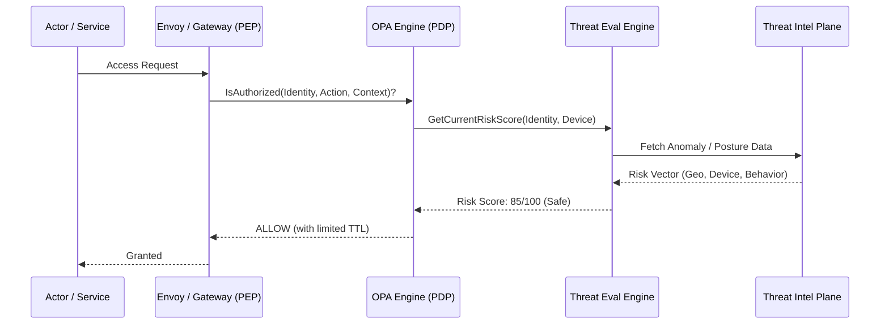

# SNISID: Threat-Aware Access Control (TAAC)

In the SNISID Zero Trust model, authorization is not a static set of permissions. It is a dynamic, risk-adaptive process that adjusts access privileges based on real-time threat intelligence and context.

---

## 1. The Authorization Workflow (Context + Risk)

Authorization decisions are made at the **Policy Enforcement Point (PEP)** by querying the **Policy Decision Point (PDP)**, which integrates with the **Threat Evaluation Engine (TEE)**.

---

## 2. Threat Evaluation Engine (TEE)

The TEE aggregates heterogeneous data sources to produce a unified **Risk Vector**.

| Input Source | Contextual Data | Risk Impact |
| :--- | :--- | :--- |
| **Device Posture** | OS Version, Disk Encryption, TPM Status | High |
| **Geo-Risk** | Source IP Country, Proxy/VPN Detection | Medium |
| **Behavioral Analysis** | API request frequency, sensitive data volume | High |
| **Global Threat Feeds** | Compromised credential lists, known botnet IPs | Critical |
| **System Health** | Current "Defcon" level of the platform | Critical |

---

## 3. Decision Matrix (Risk-Adaptive Policy)

Access is granted in "Bands" based on the current Risk Score.

| Risk Score | Access Band | Privileges |
| :--- | :--- | :--- |
| **0 - 20 (Elite)** | **Full Access** | Administrative, Read/Write, Data Export. |
| **21 - 40 (Trusted)** | **Standard Access** | Read/Write, No Bulk Export. |
| **41 - 60 (Elevated)** | **Restricted Access** | Read-Only, Mandatory MFA for every action. |
| **61 - 80 (High Risk)** | **Sanitized Access** | Metadata-Only, No PII access. |
| **81 - 100 (Critical)** | **No Access** | Immediate session termination + SOC Alert. |

---

## 4. Access Adaptation Strategy

### 4.1. Dynamic Privilege Downgrading
If a user's risk score increases during an active session (e.g., they move from an agency office to a public network), their permissions are instantly downgraded from "Standard" to "Restricted" without terminating the session.

### 4.2. Just-In-Time (JIT) Elevation
Permissions are granted for the minimum time required. High-privilege actions (e.g., identity deletion) require a JIT approval from a second authorized peer (Four-Eyes Principle).

---

## 5. Emergency Privilege Lockdown (Defcon System)

The SOC can manually or automatically set the system-wide **Defcon Level**.

- **Defcon 5 (Normal)**: Standard risk-adaptive policies.
- **Defcon 4 (Elevated)**: Mandatory MFA for all inter-agency queries.
- **Defcon 3 (Guarded)**: Bulk data exports disabled across the entire platform.
- **Defcon 2 (Hostile)**: Read-only mode for all non-essential government services.
- **Defcon 1 (Breach)**: **Total Lockdown**. Only the SOC and Emergency Response principals have access. All other identities are suspended.

---

## 6. Runtime Enforcement Architecture

- **OPA Sidecars**: Deployed alongside every microservice for local, low-latency authorization decisions.
- **Centralized Management**: Rego policies are distributed via a GitOps pipeline, ensuring consistency across all regions and clusters.
- **Telemetry Loop**: Every denial is logged to the **Observability Plane**, which feeds back into the TEE to refine anomaly detection models.

---

## 7. AI-Based Anomaly Detection

- **Clustering**: Groups users into "Behavioral Archetypes" (e.g., Enrollment Officer, Analyst). Requests that deviate from the archetype baseline (e.g., an Enrollment Officer querying millions of records) trigger an immediate risk score spike.
- **Predictive Scoring**: Uses historical data to predict if a specific sequence of API calls represents a credential harvesting attempt.
