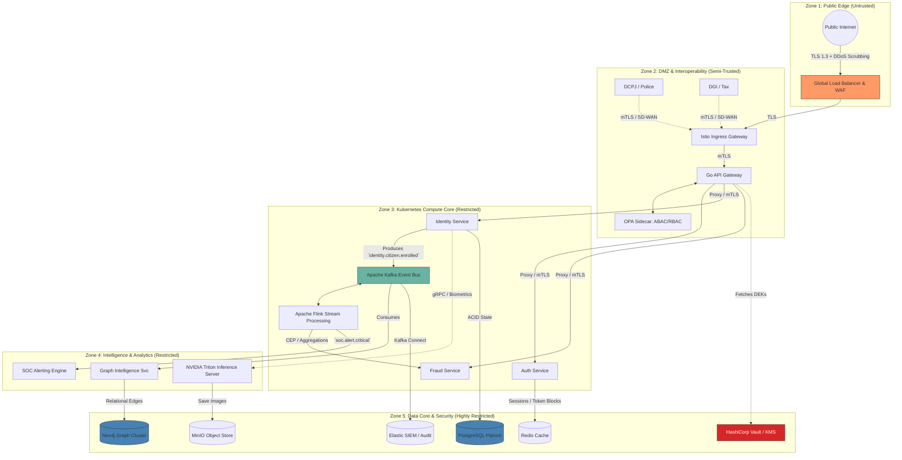

# SNISID: Final Unified System Architecture

This document represents the culmination of all architectural blueprints for the SNISID platform. It maps the end-to-end integration of networking, identity federation, event streaming, artificial intelligence, and physical persistence into a single, cohesive sovereign intelligence framework.

---

## 1. Unified Architecture Layer Map

---

## 2. Layer Interaction Explanations

The flow of intelligence through the system is meticulously choreographed:

1.  **Ingress & Validation (Zones 1-2):** A request arrives at the public WAF, terminating public TLS. It enters the Istio Ingress Gateway, which upgrades it to internal mTLS. The Go API Gateway checks the Redis blocklist for revoked JWTs, while the OPA Sidecar evaluates ABAC policies (e.g., ensuring a Tax Officer is not accessing Police data).
2.  **Synchronous Commit (Zones 3 & 5):** The Identity Service validates the payload, fetches Data Encryption Keys (DEKs) from HashiCorp Vault to crypto-shred PII, and synchronously commits the core transactional state to PostgreSQL.
3.  **Asynchronous Streaming (Zone 3):** The Identity Service immediately publishes an `identity.citizen.enrolled` event to Kafka. Apache Flink consumes this stream, executing real-time Complex Event Processing (CEP) to detect behavioral anomalies.
4.  **Intelligence Augmentation (Zone 4):** 
    *   *AI:* The raw biometric images are sent via gRPC to the NVIDIA Triton GPU cluster for Liveness detection and ArcFace vector extraction. 
    *   *Graph:* The Kafka event triggers the Graph Intelligence Service to instantly map the citizen's IP Address, Device, and Physical Address into Neo4j, exposing synthetic identity collisions.
5.  **Audit & SOC (Zones 4 & 5):** Every microservice action fires an immutable audit event to Kafka, which Kafka Connect dumps directly into the Elastic SIEM. If Flink or Neo4j detects a critical threat, the SOC Engine automatically triggers a containment protocol (revoking the active session in Redis).

---

## 3. Critical Infrastructure Dependencies

*   **Apache Kafka as the Source of Truth:** Kafka is not just a message broker; via Tiered Storage (S3), it is the immutable, replayable ledger of the nation. If the Neo4j database is physically destroyed, the system can rebuild the entire multi-million node graph by replaying the Kafka logs from `offset=0`.
*   **Zero Trust Maturity (ZTA):** The system adheres to a full Zero Trust Architecture across five planes (Identity, Policy, Enforcement, Observability, and Threat Intel). No entity has implicit trust. For details, see the [SNISID Zero Trust Architecture Master Blueprint](file:///c:/Users/sopil/Desktop/SNISID/SNISID_Zero_Trust_Architecture.md).
*   **Istio & SPIRE (Identity & Enforcement):** The architecture inherently assumes that the physical network is already compromised. Without the hardware-attested, rotating mTLS certificates provided by SPIRE and enforced by Istio Envoy sidecars, microservices cannot communicate.
*   **HashiCorp Vault (KMS):** Holds the master keys to the kingdom. If Vault goes offline, no microservice can authenticate to a database (dynamic secrets) or decrypt citizen PII.

---

## 4. Scaling and Resilience Strategy

The system is designed to scale dynamically from a baseline load to a national crisis without human intervention.

*   **Multi-Dimensional Autoscaling:** 
    *   *Stateless (Zone 3):* Scaled by HPA (CPU/Memory) and Karpenter (physical nodes).
    *   *Asynchronous (Kafka/Flink):* Scaled by KEDA based on consumer lag queue depth.
    *   *AI (Zone 4):* GPU node pools scale from zero to maximum capacity instantly based on inference load.
*   **Active-Passive Disaster Recovery:** A Global Server Load Balancer (GSLB) sits at the absolute edge. If the primary sovereign datacenter completely fails, the GSLB instantly redirects traffic to the Cloud DR cluster. The DR cluster is kept perfectly synchronized via ArgoCD (GitOps) for configuration, MirrorMaker 2 for Kafka events, and asynchronous Postgres/Neo4j streaming replication.
