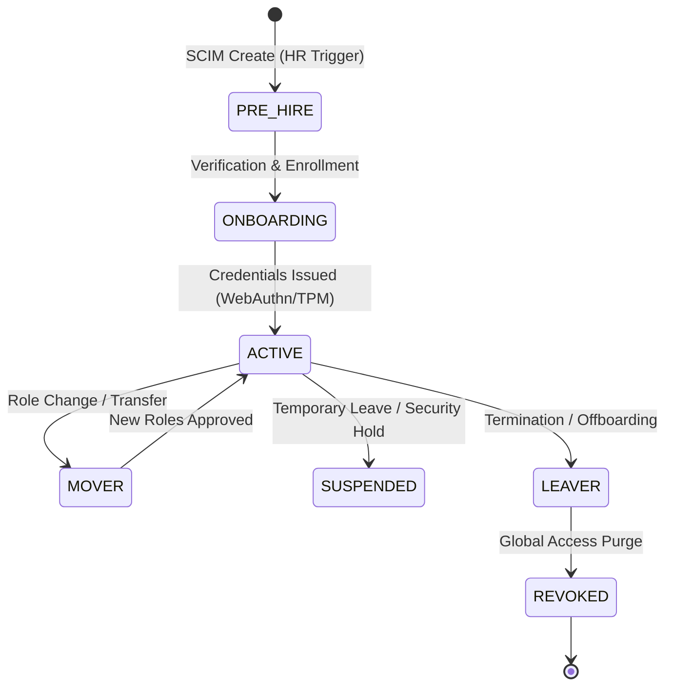

# SNISID: User Provisioning & Governance Architecture

The SNISID Provisioning System ensures that identity lifecycles for human actors (Joiner-Mover-Leaver) are automated, cryptographically verified, and instantly revocable across the national ecosystem.

---

## 1. The Provisioning Lifecycle (JML Model)

Every identity follows a strict lifecycle triggered by authoritative HR events.

---

## 2. Automated Onboarding & Identity Verification

1. **HR Trigger**: The Agency HR system pushes a `UserCreated` event via **SCIM 2.0**.
2. **Pre-Verification**: SNISID cross-references the new hire with the **National Civil Registry**.
3. **Biometric Enrollment**: The user visits an authorized kiosk for 1:N face/fingerprint validation.
4. **Credentialing**: A hardware-bound **FIDO2/WebAuthn** token is issued and cryptographically linked to the user's NID.
5. **Baseline Access**: Minimal "Agency Base" roles are assigned automatically.

---

## 3. Workflow Engine & Approval Chains

High-privilege role assignments (e.g., `role:police_investigator`) require **Multi-Party Approval**.

- **Workflow Engine**: Built on **Temporal** for durable, long-running state management.
- **Approval Chain**: 
    1. Request initiated by User/Manager.
    2. Policy Check (OPA): Is the request legally permitted?
    3. Technical Approval: Signed by the Agency IT Lead.
    4. Operational Approval: Signed by the Department Head.
- **JIT Elevation**: Temporary roles (e.g., for a specific case) are approved via the same engine but with an automated expiration timer.

---

## 4. Access Revocation Propagation (The Kill Switch)

Offboarding must be instantaneous to prevent "Grievous Leaver" attacks.

1. **Trigger**: HR system sends a `DeleteUser` or `SuspendUser` event.
2. **Invalidation**: 
    - **Global Cache**: The user's active JWTs and session IDs are purged from the Redis cluster.
    - **Policy Plane**: OPA is updated with a `deny_list` entry for the user's NID.
    - **Mesh Layer**: Istio `AuthorizationPolicy` is updated to block the user principal.
3. **Hardware Revocation**: The user's hardware token (TPM/FIDO2) is revoked in the National CA.
4. **Target Latency**: **< 30 seconds** for platform-wide enforcement.

---

## 5. HR System Integration (SCIM 2.0)

SNISID acts as the **SCIM Service Provider**, consuming events from Agency IdPs (the SCIM Clients).

- **Standardization**: All attributes (Name, Badge, Agency, Role) are mapped to the **Unified Identity Schema**.
- **Sync Direction**: Inbound (HR -> SNISID) for provisioning; Outbound (SNISID -> HR) for security status updates and audit confirmations.

---

## 6. Credential Management & Expiration

- **Password-less Default**: No legacy passwords permitted for government staff. All authn is FIDO2 + Biometric.
- **Short-Lived Sessions**: User sessions expire after 8 hours or upon 30 minutes of inactivity.
- **Re-Certification**: High-privilege access must be manually re-certified by a manager every 90 days. Failure to re-certify triggers automated suspension.

---

## 7. Audit & Compliance

- **Immutable Audit Trail**: Every stage of the provisioning lifecycle is logged as a signed event to the **Sovereign Audit Ledger**.
- **Proof of Verification**: The kiosk biometric enrollment hash is cryptographically bound to the user's identity record.
- **Compliance Reports**: Automated generation of "Access Transparency" reports for national regulatory audits, showing who approved which roles and when.
