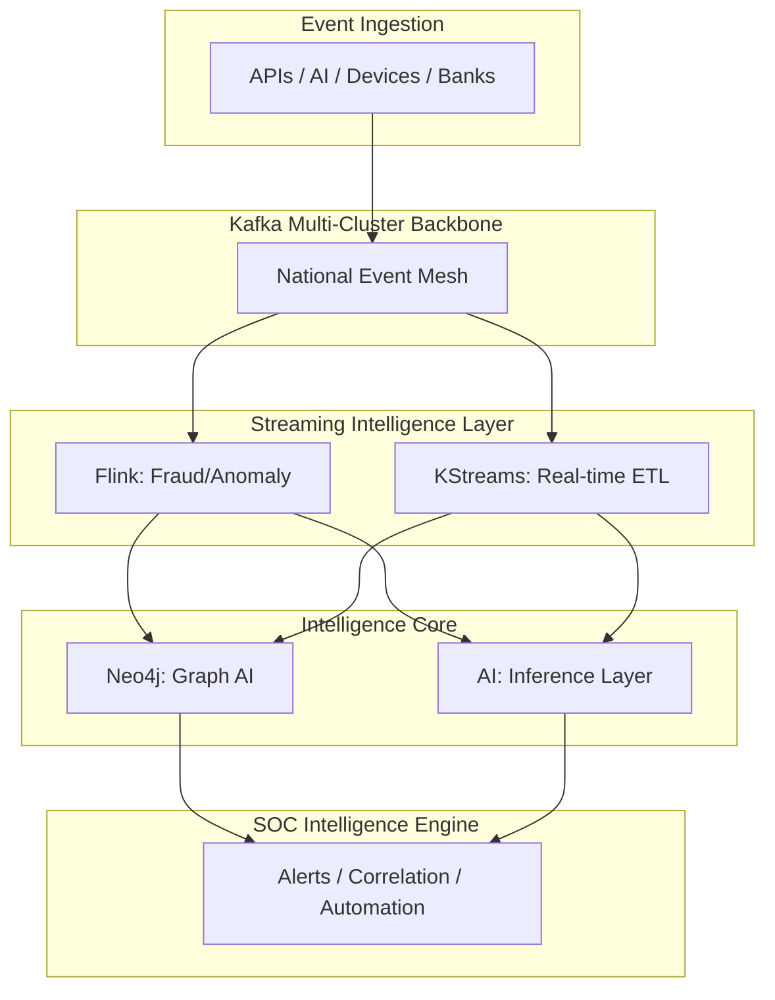
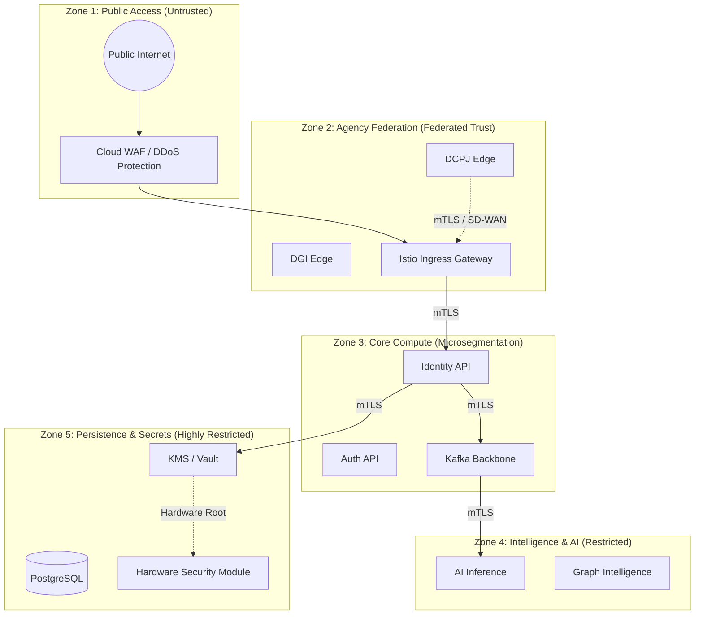
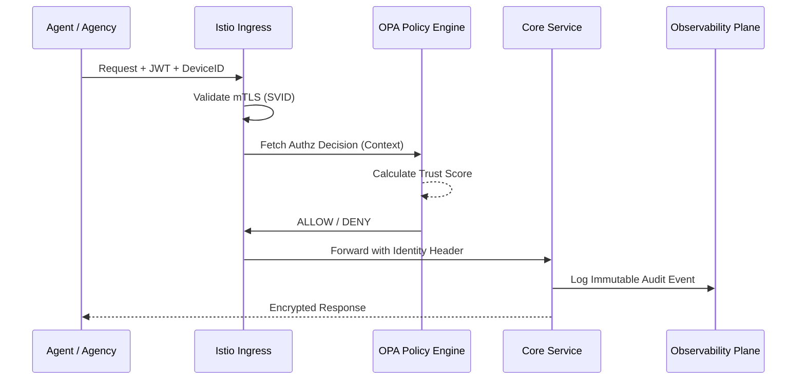

# SNISID: National Zero Trust Architecture (ZTA) Blueprint

As the Chief Security Architect for SNISID, this document defines the sovereign-grade security framework protecting the national identity intelligence platform. This architecture operates on the principle of **Never Trust, Always Verify**, ensuring that no entity—regardless of network location—is granted implicit access.

---

## 1. The Five Planes of Zero Trust

The SNISID ZTA is organized into five functional planes that separate logic, identity, and data flow.

| Plane | Function | Key Technologies |
| :--- | :--- | :--- |
| **Identity Plane** | Cryptographic identity for all actors (Human, Workload, Device). | SPIFFE/SPIRE, Keycloak, Vault (KMS) |

**Detailed Blueprint**: [Key Management System (KMS)](file:///c:/Users/sopil/Desktop/SNISID/SNISID_Key_Management_System.md) (Sovereign Root of Trust)

**Detailed Blueprints**:
- [SPIFFE/SPIRE Framework](file:///c:/Users/sopil/Desktop/SNISID/SNISID_SPIFFE_SPIRE_Framework.md) (Workloads)
- [Identity Lifecycle (SILM)](file:///c:/Users/sopil/Desktop/SNISID/SNISID_Identity_Lifecycle_Management.md) (Governance)
- [Continuous Authentication](file:///c:/Users/sopil/Desktop/SNISID/SNISID_Continuous_Authentication.md) (Human/Session)
- [National IAM Architecture](file:///c:/Users/sopil/Desktop/SNISID/SNISID_National_IAM_Architecture.md) (Governance & Federation)
- [Identity Federation System](file:///c:/Users/sopil/Desktop/SNISID/SNISID_Identity_Federation_System.md) (Multi-IdP Trust & STS)
- [Token Lifecycle Architecture](file:///c:/Users/sopil/Desktop/SNISID/SNISID_Token_Lifecycle_Architecture.md) (DPoP & Revocation)
- [Secrets Rotation System](file:///c:/Users/sopil/Desktop/SNISID/SNISID_Automatic_Secrets_Rotation.md) (Credential Automation)
- [User Provisioning & Governance](file:///c:/Users/sopil/Desktop/SNISID/SNISID_User_Provisioning_Governance.md) (Lifecycle Automation)
- [Privileged Access Management (PAM)](file:///c:/Users/sopil/Desktop/SNISID/SNISID_PAM_Architecture.md) (Admin & SOC Security)
| **Policy Plane** | Centralized decision engine for access and trust scoring. | OPA (Open Policy Agent), Rego |

**Detailed Blueprint**: 
- [Threat-Aware Access Control (TAAC)](file:///c:/Users/sopil/Desktop/SNISID/SNISID_Threat_Aware_Access_Control.md) (Risk-Adaptive)
- [RBAC Architecture](file:///c:/Users/sopil/Desktop/SNISID/SNISID_RBAC_Architecture.md) (Hierarchy & Governance)
- [Role Hierarchy Model](file:///c:/Users/sopil/Desktop/SNISID/SNISID_Role_Hierarchy_Model.md) (Domain Inheritance & SoD)
- [ABAC Architecture](file:///c:/Users/sopil/Desktop/SNISID/SNISID_ABAC_Architecture.md) (Contextual & Intelligence)
- [OPA Decision Engine](file:///c:/Users/sopil/Desktop/SNISID/SNISID_OPA_Architecture.md) (The Policy Brain)
| **Enforcement Plane** | Distributed PEPs (Policy Enforcement Points) in the data path. | Istio Envoy, Cilium, API Gateway |

**Detailed Blueprints**: 
- [mTLS Communication Architecture](file:///c:/Users/sopil/Desktop/SNISID/SNISID_mTLS_Architecture.md) (Encryption)
- [Cryptographic Architecture](file:///c:/Users/sopil/Desktop/SNISID/SNISID_Cryptographic_Architecture.md) (End-to-End & PQC)
- [Field-Level Encryption (FLE)](file:///c:/Users/sopil/Desktop/SNISID/SNISID_Field_Level_Encryption.md) (Searchable PII Protection)
- [Network Micro-segmentation](file:///c:/Users/sopil/Desktop/SNISID/SNISID_Network_Microsegmentation.md) (Isolation)
- [Multi-Tenant Isolation](file:///c:/Users/sopil/Desktop/SNISID/SNISID_Multi_Tenant_Isolation.md) (Agency Boundaries)
- [API Gateway Security](file:///c:/Users/sopil/Desktop/SNISID/SNISID_API_Gateway_Security.md) (Frontier PEP)
- [Sovereign Service Mesh](file:///c:/Users/sopil/Desktop/SNISID/SNISID_Service_Mesh_Architecture.md) (Distributed Enforcement)
| **Data Plane** | High-performance persistence and event-driven communication. | PostgreSQL, Neo4j, Kafka, MinIO |

**Detailed Blueprints**: 
- [Data Persistence Strategy](file:///c:/Users/sopil/Desktop/SNISID/SNISID_Data_Architecture.md) (Schemas & Models)
- [Secure Object Storage](file:///c:/Users/sopil/Desktop/SNISID/SNISID_Secure_Object_Storage.md) (WORM & SSE-KMS)
- [Data Anonymization & Masking](file:///c:/Users/sopil/Desktop/SNISID/SNISID_Data_Anonymization_Masking.md) (Privacy-Aware Analytics)
- [Backup & Restore Architecture](file:///c:/Users/sopil/Desktop/SNISID/SNISID_Backup_Restore_Architecture.md) (Ransomware & DR)
| **Observability Plane** | Real-time telemetry, audit trails, and flow analysis. | Prometheus, Jaeger, Elastic SIEM |

**Detailed Blueprints**: 
- [Sovereign Audit Ledger](file:///c:/Users/sopil/Desktop/SNISID/SNISID_Sovereign_Audit_Ledger.md) (Immutable Traceability)
- [Secure Logging Architecture](file:///c:/Users/sopil/Desktop/SNISID/SNISID_Secure_Logging_Architecture.md) (SIEM & Threat Intel)
- [Cryptographic Audit & Integrity](file:///c:/Users/sopil/Desktop/SNISID/SNISID_Cryptographic_Audit_Integrity.md) (Mathematical Proof)
| **Threat Intel Plane** | Adaptive scoring and automated containment. | Flink CEP, Neo4j Graph, AI/ML SOC |

**Detailed Blueprints**: 
- [National Kafka Backbone](file:///c:/Users/sopil/Desktop/SNISID/SNISID_Event_Architecture.md) (Real-Time Mesh)
- [Kafka Topic Governance](file:///c:/Users/sopil/Desktop/SNISID/SNISID_Kafka_Governance.md) (Event Standards)
- [Real-Time Ingestion Pipeline](file:///c:/Users/sopil/Desktop/SNISID/SNISID_RealTime_Ingestion_Pipeline.md) (Data Inflow)
- [Kafka Streams Architecture](file:///c:/Users/sopil/Desktop/SNISID/SNISID_Kafka_Streams_Architecture.md) (Stateful Processing)
- [Event Consistency & Deduplication](file:///c:/Users/sopil/Desktop/SNISID/SNISID_Event_Consistency_Deduplication.md) (Exact Integrity)
- [ISTS Scoring](file:///c:/Users/sopil/Desktop/SNISID/SNISID_Internal_Service_Trust_Scoring.md) (Service Integrity)
- [National Graph Intelligence](file:///c:/Users/sopil/Desktop/SNISID/SNISID_Neo4j_Graph_Architecture.md) (Relationship Base)
- [Advanced Graph Analytics](file:///c:/Users/sopil/Desktop/SNISID/SNISID_Advanced_Graph_Intelligence.md) (GDS & Communities)
- [Real-Time AI Inference](file:///c:/Users/sopil/Desktop/SNISID/SNISID_RealTime_AI_Inference_Pipeline.md) (Predictive Decisions)
- [AI Governance & Lifecycle](file:///c:/Users/sopil/Desktop/SNISID/SNISID_AI_Governance_Lifecycle.md) (XAI & Resilience)

---

## 3. Intelligence Plane: The Sovereign Brain (Batch 4)

SNISID has transitioned into a real-time, event-driven intelligence ecosystem.

### 3.1. Event Streaming Backbone (Kafka)
- **Scale**: 50M+ daily events, < 50ms latency.
- **Topology**: Multi-cluster active-active replication with MirrorMaker 2 and Tiered Storage.
- **Governance**: Protobuf schema enforcement and automated PII isolation.

### 3.2. Real-Time Analytics Engine (Flink)
- **Capabilities**: Behavioral fraud scoring, identity abuse detection, and sliding-window analytics.
- **Resilience**: Exactly-once semantics and distributed checkpointing to Sovereign Object Storage.

### 3.3. National Graph Intelligence (Neo4j)
- **Model**: Millions of nodes (Citizens, Devices, Agencies) with real-time relationship updates.
- **Analytics**: Fraud ring detection, risk propagation analysis, and community detection via GDS algorithms.

### 3.4. AI Decision Layer
- **Inference**: GPU-accelerated streaming inference (< 20ms) for online fraud scoring and anomaly detection.
- **Governance**: Explainable AI (XAI) reasoning and policy-enforced decision loops.

---

## 4. Target State Architecture: Sovereign Intelligence Mesh

---

## 5. Next Evolution: Batch 5 - Autonomous Defense
The next phase transforms SNISID from a "Reactive Intelligence" platform to an **"Autonomous Defense"** platform, featuring AI SOC Swarms and automated threat containment.

We eliminate the concept of a "trusted network." Instead, we define logical zones based on risk and data sensitivity.

---

## 3. The Trust Models

### 3.1. Workload Trust (SPIFFE/SPIRE)
Every microservice in the SNISID K8s clusters is assigned a unique **SPIFFE ID**.
- **Detailed Framework**: See the [SNISID SPIFFE/SPIRE Identity Framework](file:///c:/Users/sopil/Desktop/SNISID/SNISID_SPIFFE_SPIRE_Framework.md) for full taxonomy and topology.
- **Attestation**: Workloads must prove their identity via Node Attestation (TPM/Cloud Metadata) and Workload Attestation (K8s Namespace/ServiceAccount).
- **Short-lived SVIDs**: Identities are X.509 certificates rotated every 1-4 hours.

### 3.2. Device Trust (End-Point Security)
Agency terminals and kiosks are validated before accessing the gateway.
- **Hardware Root of Trust**: Device IDs are bound to physical TPM 2.0 modules.
- **Health Checks**: Access is denied if the OS version is outdated or endpoint protection is disabled.

### 3.3. Human Trust (Multi-Factor & Biometric)
Identity Officers and Analysts must pass continuous validation.
- **Adaptive MFA**: Biometric challenge required for high-risk operations (e.g., identity deletion).
- **Session Continuity**: Context-aware verification ensures a session isn't hijacked (IP/Geo-fencing).

### 3.4. API Trust (mTLS + OPA)
Every API call is a transaction between two identities.
- **Strict mTLS**: All traffic is encrypted in transit.
- **Capability-Based Access**: Requests must carry a signed OPA policy token or JWT.

---

## 4. Workflows

### 4.1. Request Validation Flow

### 4.2. Adaptive Trust Scoring
Trust is a float value (0.0 to 1.0) recalculated per request:
- **Baseline**: 0.5
- **Modifier**: +0.2 for valid TPM signature.
- **Modifier**: +0.3 for biometric MFA.
- **Penalty**: -0.4 for anomalous IP/Geo location.
- **Requirement**: Operations require > 0.8 trust score.

---

## 5. Infrastructure Security Model

### Kubernetes Security
- **Runtime Verification**: Falco monitors syscalls for anomalous behavior (e.g., a pod trying to spawn a shell).
- **Network Policies**: Default-deny at Layer 3/4 via Cilium, Layer 7 via Istio.
- **Encryption at Rest**: All PVs are encrypted using keys managed in Vault/HSM.

### Multi-Cloud & Hybrid
- **Inter-Cloud Connectivity**: Secure tunnels (Wireguard/SD-WAN) with mTLS bridge.
- **Unified Identity**: SPIRE Federation allows a service in AWS to trust a service in the local government datacenter.

### Kafka Event Backbone
- **Per-Topic ACLs**: Only specific SPIFFE IDs can produce/consume to sensitive topics (e.g., `identity.pii.updates`).
- **End-to-End Encryption**: Payloads are encrypted with DEKs before being sent to Kafka.

---

## 6. Threat Mitigation Strategy

| Threat | Mitigation Mechanism |
| :--- | :--- |
| **Lateral Movement** | Strict mTLS and microsegmentation (Cilium + Istio). |
| **Credential Theft** | Short-lived SVIDs and Dynamic Secrets (Vault). |
| **Insider Threat** | Four-Eyes Principle (OPA Policies) and AI-driven anomaly detection. |
| **Supply Chain** | Signed container images (Cosign) and SBOM validation in CI/CD. |
| **DDoS/API Flooding** | Adaptive Rate Limiting at Ingress and Kafka backpressure. |

---

## 7. Implementation Roadmap

1. **Phase 1 (Identity Foundation)**: Deploy SPIRE and Vault; bootstrap hardware roots of trust.
2. **Phase 2 (Enforcement)**: Roll out Istio mesh in `STRICT` mTLS mode.
3. **Phase 3 (Intelligence)**: Integrate OPA for context-aware authorization.
4. **Phase 4 (Automation)**: Enable adaptive trust scoring based on SIEM/AI feedback loops.
