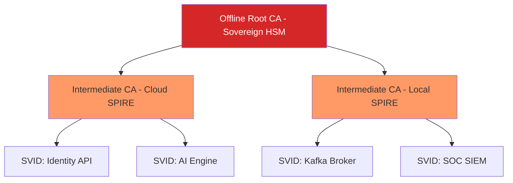
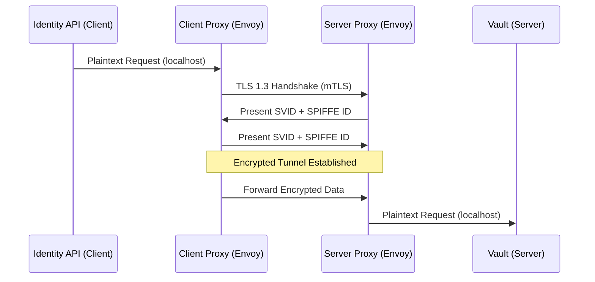

# SNISID: National mTLS Communication Architecture

This document defines the cryptographic standards and operational flows for Mutual TLS (mTLS) across the SNISID platform. It ensures that every bit of data in transit is encrypted, authenticated, and bound to a verified identity.

---

## 1. Cryptographic Standards (The "Sovereign" Profile)

SNISID enforces a strict TLS profile to mitigate modern cryptographic attacks.

| Parameter | Enforcement |
| :--- | :--- |
| **Protocol** | **TLS 1.3 only**. (TLS 1.2 allowed only for specific agency legacy gateways). |
| **Ciphers** | `TLS_AES_256_GCM_SHA384`, `TLS_CHACHA20_POLY1305_SHA256` |
| **Key Exchange** | ECDHE (Elliptic Curve Diffie-Hellman Ephemeral) with P-384 or X25519. |
| **Certificates** | ECDSA (256/384-bit) for faster handshakes and smaller payloads. |
| **mTLS Mode** | `STRICT` (Non-mTLS traffic is rejected at the network layer). |

---

## 2. Certificate Authority (CA) Hierarchy

Trust is distributed to avoid a single point of catastrophic failure.

- **Root CA**: Stored in a physical, air-gapped HSM. Only used to sign Intermediate CAs.
- **Intermediate CAs**: Integrated with SPIRE Servers. They reside in memory (ephemeral) and are backed by regional HSMs (Cloud KMS or physical HSM).

---

## 3. Communication Workflows

### 3.1. Synchronous (HTTP/gRPC) via Istio Sidecar
Workloads communicate through Envoy proxies that handle the mTLS handshake transparently.

### 3.2. Asynchronous (Kafka)
Kafka brokers and clients use SPIRE-provisioned certificates to secure the event backbone.
- **Broker Auth**: Brokers present SVIDs to clients.
- **Client Auth**: Clients present SVIDs to brokers for ACL enforcement.
- **Protocol**: `security.protocol=SSL` with `ssl.client.auth=required`.

### 3.3. WebSockets
Secured using mTLS at the Ingress Gateway.
- **Session Pinning**: The Gateway binds the WebSocket session to the specific SPIFFE ID of the client, preventing session hijacking.

---

## 4. Ingress & Egress Security

### 4.1. Secure Ingress (The Frontier)
- **MTLS Upgrade**: The Istio Ingress Gateway terminates public TLS (if applicable) and upgrades the request to internal mTLS.
- **Certificate Pinning**: For agency clients, the Gateway enforces pinning against the agency's specific intermediate CA.

### 4.2. Secure Egress (Data Containment)
- **Strict Egress Policies**: Services cannot reach the internet directly.
- **Egress Gateway**: All outbound traffic to external agencies must pass through an Egress Gateway that performs mTLS with the external endpoint, ensuring no data leaks over unencrypted channels.

---

## 5. Operational Lifecycle

### 5.1. Automatic Rotation
- **Frequency**: Certificates are rotated every **12 hours**.
- **Zero-Downtime**: Envoy supports hot-reloading certificates via the Secret Discovery Service (SDS) without dropping active connections.

### 5.2. Revocation & Expiration
- **Short-lived certificates**: SNISID relies on expiration as the primary revocation mechanism.
- **CRL (Certificate Revocation List)**: For long-lived agency certs, the Ingress Gateway checks an automated CRL updated every 15 minutes.

---

## 6. Failure Handling & Monitoring

| Scenario | Behavior | Recovery |
| :--- | :--- | :--- |
| **Handshake Failure** | Connection dropped immediately. | Logged as 403/ConnectionReset. Alert SOC on high failure rate (potential MITM). |
| **Expired Certificate** | Peer rejects the connection. | SPIRE Agent health-check should have caught the rotation failure. Automated pod restart. |
| **Intermediate CA Outage** | No new handshakes possible once SVIDs expire. | Failover to secondary Regional CA. |

### Monitoring Metrics
- `envoy_cluster_ssl_handshake`: Total handshakes and failure codes.
- `envoy_server_certificate_expiration`: Days until cert expiry (threshold: < 2 hours).
- `istio_request_security_policy`: Tracks ALLOW/DENY based on mTLS principals.
