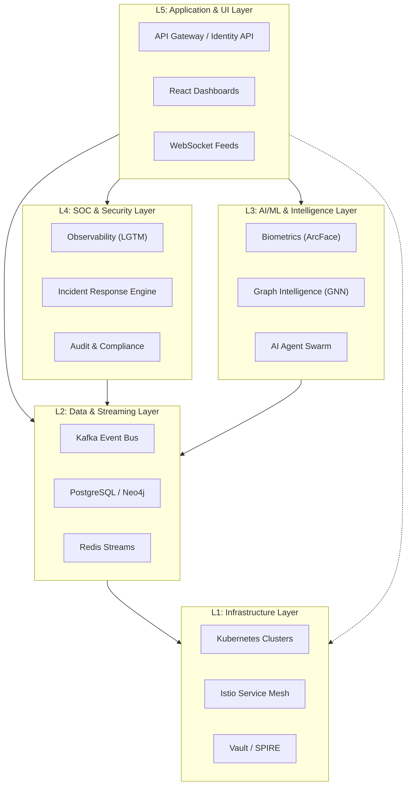

# SNISID: High-Level Layered Architecture Design

This document defines the formal architectural layers of the **SNISID** National Platform, establishing clear boundaries, responsibilities, and dependency flows.

## 🏛️ Layered Architecture Diagram

---

## 📋 Layer Responsibilities

### L5: Application & UI Layer
- **External Integration**: Exposing REST/gRPC endpoints for government agencies.
- **Orchestration**: Directing requests to internal logic and intelligence tiers.
- **User Interface**: Providing the immersive SOC and administrative command centers.
- **Session Management**: Handling user authentication and WebSocket connections.

### L4: SOC & Security Layer
- **Observability**: Centralizing logs, metrics, and distributed traces.
- **Threat Detection**: Correlating events to identify high-level security incidents.
- **Mitigation**: Executing automated playbooks and quarantine workflows.
- **Governance**: Ensuring all actions are audited and compliant with national law.

### L3: AI/ML & Intelligence Layer
- **Inference**: High-speed biometric matching and deepfake detection.
- **Relationship Analysis**: Modeling identity clusters and fraud propagation in the graph.
- **Autonomous Collaboration**: Agent swarms performing cross-domain security investigations.

### L2: Data & Streaming Layer
- **Event Backbone**: Providing a durable, high-throughput log of all system events.
- **State Persistence**: Managing the relational identity records and complex graph relationships.
- **Real-time Propagation**: Delivering sub-millisecond status updates and alerts.

### L1: Infrastructure Layer
- **Resource Management**: Providing compute, memory, and network resources.
- **Connectivity**: Enforcing strict mTLS and micro-segmentation across the mesh.
- **Trust & Identity**: Issuing and rotating cryptographic workload identities and secrets.

---

## 📡 Data Flow Between Layers

1.  **Ingress Flow (L5 -> L1)**: External requests enter through L5, validated against L1 identity policies (SPIRE/Istio).
2.  **Processing Flow (L5 -> L2 -> L3)**: The Application layer commits data to L2, which triggers asynchronous intelligence processing in L3.
3.  **Governance Flow (L5/L4/L3 -> L2)**: All layers push telemetry and audit logs down to L2 (Kafka/Loki).
4.  **Action Flow (L4 -> L5/L1)**: SOC incidents in L4 trigger response actions in L5 (APIs) or L1 (Network Policies).

## 🔒 Critical Design Constraints

1.  **Unidirectional Dependency**: Higher layers may depend on lower layers, but lower layers (e.g., L1 Infrastructure) must remain entirely agnostic of higher-layer application logic.
2.  **Stateless L5**: The Application/UI layer must be entirely stateless, with all state persisted in L2 to support seamless horizontal scaling.
3.  **Strict mTLS Boundary**: No communication is permitted between any components in any layer without L1-enforced mutual TLS.
4.  **Durable Audit Trail**: Every cross-layer transaction must result in an immutable audit entry in the L2 data tier.
