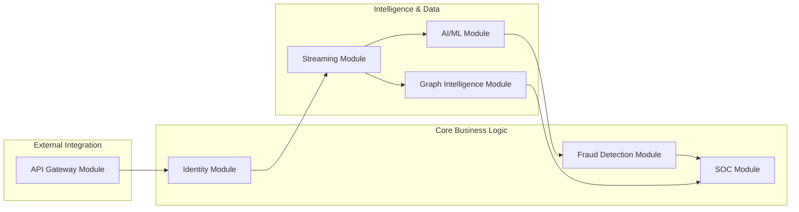

# SNISID: Modular Architecture Blueprint

This document defines the modular structure of the **SNISID** distributed system, ensuring that each functional area is implemented as a self-contained, independently deployable microservice group.

## 🗺️ Modular System Map

---

## 📋 Module Responsibilities

### 1. Identity Module (IM)
- **Primary Ownership**: National Identity Registry (PostgreSQL).
- **Responsibilities**: Enrollment, lifecycle management (CRUDE), status verification, and PII management.
- **Independence**: Can function in "Read-Only" mode even if the AI/ML or Fraud modules are offline.

### 2. Fraud Detection Module (FDM)
- **Primary Ownership**: Real-time scoring state (Redis).
- **Responsibilities**: Rule-based detection, anomaly correlation, and fraud severity scoring.
- **Independence**: Consumes from the Streaming Module asynchronously; failures do not block identity enrollment.

### 3. SOC Module (SM)
- **Primary Ownership**: Incident repository and alert logs.
- **Responsibilities**: Alert aggregation, MITRE ATT&CK mapping, and automated quarantine playbooks.
- **Independence**: Decoupled from core operations; provides visibility and governance without being in the critical data path.

### 4. AI/ML Module (AM)
- **Primary Ownership**: Model weights and feature embeddings.
- **Responsibilities**: Face recognition, deepfake detection, and GNN-based cluster inference.
- **Independence**: Scaled independently on GPU-accelerated nodes.

### 5. Streaming Module (STM)
- **Primary Ownership**: Event backbone (Kafka) and Real-time streams (Flink).
- **Responsibilities**: Event orchestration, data enrichment pipelines, and cross-module state synchronization.
- **Independence**: Acts as the "glue" but is architected for high availability and persistence.

### 6. Graph Intelligence Module (GIM)
- **Primary Ownership**: Identity Relationship Graph (Neo4j).
- **Responsibilities**: Relationship modeling, synthetic identity detection, and data lineage tracking.
- **Independence**: Provides deep intelligence services that can be queried on-demand or via triggers.

### 7. API Gateway Module (AGM)
- **Primary Ownership**: API definitions and security policies.
- **Responsibilities**: Global authentication (JWT), rate limiting, request routing, and WAF protection.
- **Independence**: The entry point that shields all internal modules from the public internet.

---

## 📡 Inter-Module Communication Rules

1.  **Contract-First**: Every module must expose a formal OpenAPI (REST) or Protobuf (gRPC) contract.
2.  **Event-Driven Preference**: Use the Streaming Module (Kafka) for the majority of inter-module communication to maximize decoupling and fault tolerance.
3.  **Circuit Breakers**: All synchronous calls (e.g., Gateway to Identity) must be wrapped in circuit breakers (e.g., Go-breaker) to prevent cascading failures.
4.  **Shared Secret / No Trust**: Modules must verify the SPIFFE ID of any calling peer before processing a request.

## 🚀 Deployment Independence Strategy

- **Granular Helm Charts**: Each module is defined by its own Helm chart, allowing for independent versioning and deployment.
- **Resource Isolate**: Modules are deployed to specific K8s namespaces with dedicated resource quotas and HPAs.
- **Database per Service**: Each module owns its specific data tier (PostgreSQL for IM, Neo4j for GIM), preventing "God Database" bottlenecks and ensuring that schema changes in one module do not impact others.
