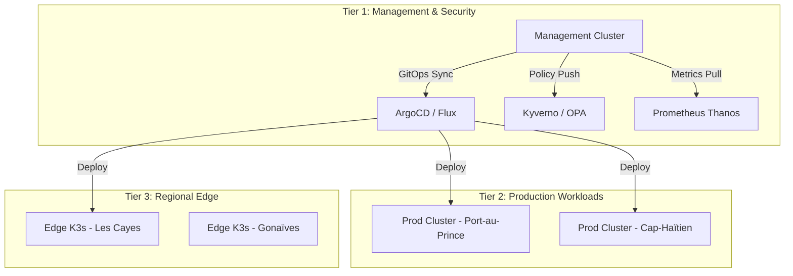

# VOLUME 1 : Plateforme Kubernetes Nationale (Kubernetes Platform)
## Infrastructure de Production Souveraine — SNISID

Kubernetes (K8s) agit comme le système d'exploitation de l'infrastructure étatique. Le SNISID s'appuie sur une distribution durcie pour environnements Bare-Metal (ex: RKE2 ou Talos Linux), dépourvue d'accès internet sortant (Air-Gapped Ready).

---

## 🗺️ CHAPITRE 1 : TOPOLOGIE MULTI-CLUSTER SOUVERAINE

L'infrastructure évite le concept du "Single Point of Failure" (SPOF) en isolant les domaines de responsabilités sur des clusters distincts, coordonnés par un plan de contrôle de flotte (ex: Rancher ou Cluster API).

### 1.1 Air-Gapped GitOps (Déploiement Continu)
*   Aucun accès direct n'est autorisé vers les API Kubernetes (`kubectl` est banni pour les opérateurs).
*   **ArgoCD** surveille un dépôt Git interne hébergé sur un serveur GitLab souverain (on-premise).
*   Chaque changement d'infrastructure est un `git commit` nécessitant l'approbation cryptographique (GPG) d'un ingénieur SRE Senior avant que le cluster ne se synchronise de lui-même (Pull Architecture).

---

## 🛡️ CHAPITRE 2 : SERVICE MESH ET ZERO TRUST RÉSEAU

Au sein des clusters, le réseau interne est considéré comme hostile.

### 2.1 Istio Service Mesh
*   **mTLS Obligatoire :** Istio chiffre 100% des flux réseau Est-Ouest (entre les microservices) en injectant un proxy Envoy (Sidecar) ou via architecture Ambient. Un pod `civil-registration` communiquant avec `identity-database` le fait au travers d'un tunnel cryptographique dont les certificats tournent automatiquement toutes les 24 heures.
*   **Micro-segmentation :** Par défaut, la politique est `Deny-All`. Les NetworkPolicies Kubernetes et les AuthorizationPolicies Istio doivent déclarer explicitement qui a le droit de parler à qui.

---

## 🔒 CHAPITRE 3 : GESTION DES SECRETS (SECRETS MANAGEMENT)

Il est interdit de stocker des mots de passe ou certificats dans les ConfigMaps ou les dépôts Git.

### 3.1 HashiCorp Vault (Mode Haute Disponibilité)
*   Les mots de passe des bases de données et les clés API sont générés dynamiquement et injectés à la volée dans les pods (Vault Agent Injector).
*   **Unsealing Mécanique (Shamir's Secret Sharing) :** Lors d'un redémarrage à froid (Blackout électrique du datacenter), Vault est verrouillé (Sealed). Il nécessite l'insertion physique de 3 clés USB YubiKey distinctes détenues par 3 directeurs de l'État différents pour être déverrouillé.

---

## 📦 CHAPITRE 4 : STOCKAGE ET OBSERVABILITÉ BARE-METAL

### 4.1 Stockage Distribué (Ceph / Rook)
Contrairement au Cloud où l'on provisionne des EBS/PersistentVolumes via API, le SNISID gère ses propres grappes de disques NVMe.
*   **Rook-Ceph** transforme les disques locaux des nœuds K8s en une baie de stockage (SAN) distribuée et résiliente, permettant aux pods de bases de données de survivre à la perte d'un châssis serveur complet.

### 4.2 Observability Stack (eBPF & Metrics)
*   **Hubble / Cilium :** Cartographie en temps réel des flux réseaux rejetés.
*   **Prometheus / Thanos :** Collecte des métriques vitales, avec agrégation à long terme sur S3 (Thanos) pour analyser les comportements sur plusieurs années.
*   **Runtime Security :** Falco / Tetragon (eBPF) auditent les appels systèmes Linux pour détecter si un shell est exécuté dans le conteneur du moteur de workflows.
