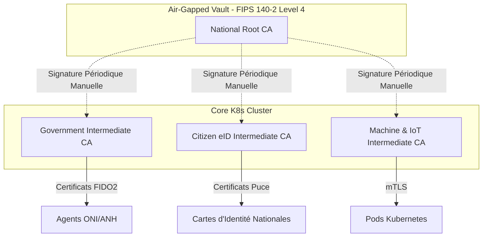

# VOLUME 3 : Infrastructure à Clé Publique (National PKI)
## Infrastructure de Production Souveraine — SNISID

L'AN-PKI (Autorité Nationale d'Infrastructure à Clé Publique) est la racine de confiance absolue du SNISID. Si la Root CA est compromise, l'intégralité de la confiance de l'État s'effondre.

---

## 🏛️ CHAPITRE 1 : HIÉRARCHIE DE CERTIFICATION (CA HIERARCHY)

La topologie respecte les standards militaires et gouvernementaux de haute sécurité (CP/CPS).

### 1.1 Root CA (Air-Gapped)
*   **Hors-Ligne Absolu :** Le serveur hébergeant la clé privée de la Root CA n'est connecté à aucun réseau (ni LAN, ni Internet).
*   **Cérémonie des Clés :** La génération de la Root Key se fait dans un coffre-fort souterrain en présence de témoins (Magistrats, Officiers de sécurité).
*   Son seul but est de signer les "Intermediate CAs" (Sub-CA) une fois tous les 10 ans via un transfert physique par clé USB chiffrée.

---

## 🔒 CHAPITRE 2 : HSM (HARDWARE SECURITY MODULE)

Même pour les CA Intermédiaires (qui elles, sont en ligne pour émettre des certificats en temps réel), la clé privée ne doit jamais résider dans la RAM d'un serveur.

*   **Appliance HSM Dédiée :** Le SNISID utilise des boîtiers HSM matériels (ex: Thales Luna ou YubiHSM Enterprise).
*   La clé privée de la Sub-CA est générée *à l'intérieur* de la puce HSM et ne peut matériellement pas en être extraite.
*   Lorsque le logiciel PKI (ex: HashiCorp Vault PKI Engine ou EJBCA) doit signer une nouvelle carte d'identité, il envoie le payload au HSM. Le HSM signe et renvoie le payload signé.

---

## 🔄 CHAPITRE 3 : M-TLS INTER-AGENCES ET MACHINE IDENTITY

Le paradigme Zero Trust exige que chaque machine ou microservice ait une identité propre.

### 3.1 Certificats de Courte Durée (Short-Lived Certificates)
*   Via le protocole SPIFFE/SPIRE intégré au Service Mesh, chaque pod Kubernetes génère une demande de signature (CSR) au démarrage.
*   Le certificat émis a une durée de vie extrêmement courte (TTL de 24 heures).
*   **Avantage de Sécurité :** Si un attaquant vole le certificat d'un microservice, il sera inutile le lendemain, réduisant drastiquement la surface d'attaque sans nécessiter de lourdes listes de révocation (CRL).

### 3.2 X-Road Security Server
*   Chaque agence externe (DGI, Douane) installe un "Security Server" certifié X-Road.
*   L'AN-PKI émet un certificat X.509 d'agence.
*   Toutes les communications API entre la Douane et le SNISID sont chiffrées en mTLS (Mutual TLS), garantissant l'identité de l'émetteur et du récepteur, empêchant les attaques Man-in-the-Middle (MitM) même sur le réseau fibre interne de l'État.

---

## 🧑‍💻 CHAPITRE 4 : IDENTITÉ CITOYENNE ET GOUVERNEMENTALE (LIFECYCLE)

### 4.1 Cartes d'Identité eID (Citizen Certificates)
*   La puce électronique de la carte nationale contient une paire de clés (Public/Private Key).
*   La clé privée est générée sur la puce lors de l'enrôlement et ne peut pas être exportée.
*   Permet la signature électronique qualifiée pour les démarches administratives en ligne ou la validation hors-ligne par la police (Voir Volume 2 de la Résilience).

### 4.2 Agents de l'État (Government Certificates)
*   Chaque officier d'état civil reçoit un Token FIDO2 (ex: YubiKey) contenant un certificat d'agent.
*   En cas de licenciement ou de compromission, l'API de révocation (OCSP) de l'AN-PKI est appelée par le moteur SOAR, révoquant instantanément la capacité de l'agent à se connecter ou à valider des actes civils.
