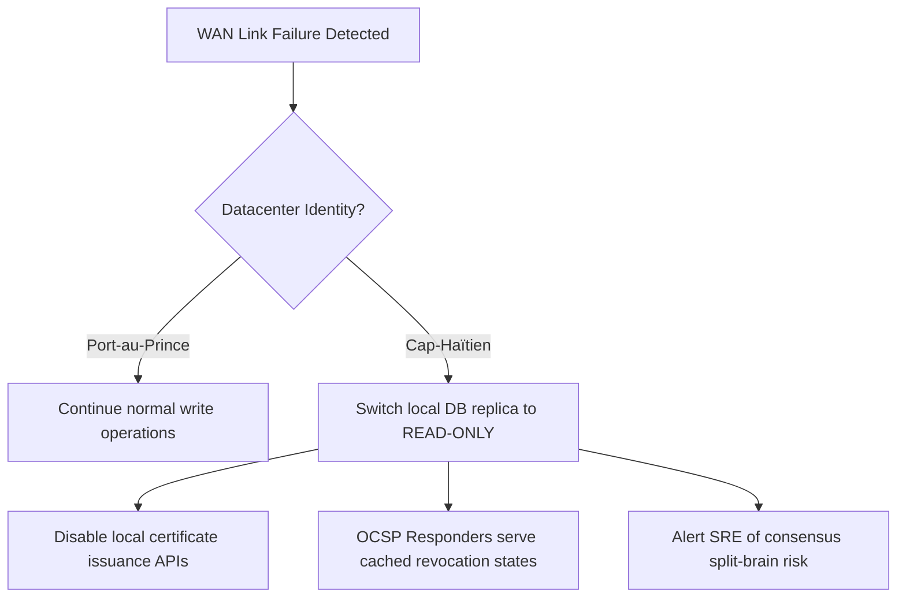

# SNISID PKI Operational Procedures & Configuration Playbook

**Classification:** RESTRICTED / SOVEREIGN CRYPTO
**Compliance:** WebTrust for CAs / NIST SP 800-57 / FIPS 140-3 Level 4

This operational playbook defines the technical procedures, commands, configurations, and recovery scripts for the management of the SNISID National PKI.

---

## 1. Step-by-Step Root CA Key Ceremony Checklist

This checklist must be executed and recorded by the external auditor during any key generation, sub-CA signing, or CRL generation event for the offline Root CA.

### 1.1. Physical Phase: SCIF Verification
1. [ ] **Verify Room Clear:** The Security Officer verifies the SCIF is clear of all unauthorized personnel, devices (no phones, smartwatches, or laptops allowed), and that Faraday cage doors are sealed.
2. [ ] **Visual Tamper Check:** Inspect the vault combination lock, the HSM physical enclosure, and the dedicated ceremony laptop for any physical tamper signs (e.g., broken glitter-paint seals, micro-scratches on screws).
3. [ ] **Audited Power-On:** Power on the air-gapped laptop using the bootable SNISID secure OS USB (SHA-256 validated).

### 1.2. Cryptographic Phase: HSM Partition Activation (Quorum)
The Ceremony Administrator prompts the Key Custodians to insert their smart cards.

```bash
# Verify connection to the physical HSM
pkcs11-tool --module /usr/lib/libcs_pkcs11_R2.so --list-slots

# Initialize HSM partition (Run only during initial generation ceremony)
cmu init -slot=0 -label="SNISID_ROOT_PARTITION"

# Custodians present 3-of-5 cards. Collect PINs and authenticate
# The partition is unlocked when the PIN quorum is met
pkcs11-tool --module /usr/lib/libcs_pkcs11_R2.so --login --login-type user --slot 0
```

### 1.3. Execution Phase: Generate and Sign Root
Run the following commands using the pre-configured [openssl-root.cnf](file:///c:/Users/sopil/Desktop/snisid%20system/pki/root-ca/openssl-root.cnf):

```bash
# 1. Generate Root CA Private Key inside the HSM (Non-extractable)
pkcs11-tool --module /usr/lib/libcs_pkcs11_R2.so --slot 0 \
  --keypairgen --key-type rsa:4096 \
  --label "SNISID_Root_CA_Key" \
  --id 01 \
  --pin $HSM_USER_PIN

# 2. Generate Self-Signed Root Certificate
openssl req -config /pki/root-ca/openssl-root.cnf \
  -engine pkcs11 -keyform engine -key "label_SNISID_Root_CA_Key" \
  -new -x509 -days 7300 -sha384 \
  -out /pki/root-ca/snisid_root_ca.cert.pem \
  -subj "/C=HT/ST=Ouest/L=Port-au-Prince/O=SNISID/CN=SNISID Sovereign Root CA"

# 3. Verify Certificate Structure
openssl x509 -in /pki/root-ca/snisid_root_ca.cert.pem -text -noout
```

### 1.4. Sub-CA Signing Phase (Intermediate CA Validation)
During the ceremony, the signed Certificate Signing Request (CSR) generated by the online HashiCorp Vault is imported from a read-only USB block:

```bash
# 1. Verify Vault Intermediate CA CSR structure
openssl req -in /pki/ceremony/vault_intermediate.csr -text -noout

# 2. Sign Intermediate CA CSR using the HSM-backed Root CA
openssl ca -config /pki/root-ca/openssl-root.cnf \
  -engine pkcs11 -keyform engine -ss_cert /pki/root-ca/snisid_root_ca.cert.pem \
  -in /pki/ceremony/vault_intermediate.csr \
  -out /pki/ceremony/vault_intermediate.cert.pem \
  -extensions v3_intermediate_ca \
  -days 3650 \
  -md sha384

# 3. Export signed certificate and chain to the transfer USB
```

---

## 2. HSM Partition Management & Key Wrapping

The Vault cluster in the online datacenter uses Transit-level wrapping to secure intermediate keys.

### 2.1. PKCS#11 Configuration for Vault
Below is the HCL config snippet for Vault to utilize Seal Wrapping, ensuring all sub-keys in the Raft database are wrapped using the HSM's Master Key:

```hcl
# File: /vault/config/vault-pki-hsm-config.hcl
seal "pkcs11" {
  lib            = "/usr/lib/libcs_pkcs11_R2.so"
  slot           = "0"
  pin            = "SNISID_HSM_PIN_INJECTED_AT_RUNTIME"
  key_label      = "vault-master-key"
  hmac_key_label = "vault-hmac-key"
}
```

### 2.2. Command to Initialize HSM Keys on Network HSM
For the online Issuing CAs, the security officer runs:

```bash
# Log into the Network HSM (Luna SA)
vtl verify

# Generate AES-256 Master Key Wrapping Key (KEK) on partition 1
pkcs11-tool --module /usr/lib/libcs_pkcs11_R2.so --slot 1 \
  --login --pin $ONLINE_HSM_PIN \
  --keygen --key-type AES:256 \
  --label "vault-master-key"
```

---

## 3. OCSP & CRL Responder Operations

To maintain high availability and instant revocation verification, OCSP and CRL responders are deployed at the edge.

### 3.1. Nginx OCSP Stapling and Caching Configuration
This configuration is deployed on the Ingress controllers to fetch and staple OCSP responses locally.

```nginx
# Enforce OCSP Stapling on all API Gateway endpoints
server {
    listen 443 ssl http2;
    server_name api.snisid.gov.ht;

    ssl_certificate /etc/ssl/certs/gateway.cert.pem;
    ssl_certificate_key /etc/ssl/private/gateway.key.pem;

    # OCSP Stapling activation
    ssl_stapling on;
    ssl_stapling_verify on;
    ssl_trusted_certificate /etc/ssl/certs/pki_chain.pem;

    # Use local Anycast DNS for OCSP resolution
    resolver 10.0.0.10 valid=300s;
    resolver_timeout 5s;

    # Limit TLS to 1.3 only
    ssl_protocols TLSv1.3;
    ssl_ciphers TLS_AES_256_GCM_SHA384:TLS_CHACHA20_POLY1305_SHA256;
}
```

### 3.2. Automated Delta CRL Generation Cron Job
Run on the intermediate/issuing CA servers to publish CRL updates to the Anycast CDN nodes every 4 hours:

```bash
#!/bin/bash
# File: /opt/snisid/pki/generate_crl.sh
set -e

EXPORT_DIR="/var/www/pki/crl"
VAULT_TOKEN_FILE="/var/run/secrets/vault/token"

# Log into Vault and generate a new Delta CRL
export VAULT_TOKEN=$(cat $VAULT_TOKEN_FILE)
export VAULT_ADDR="https://vault.snisid-security.svc.cluster.local:8200"

echo "[*] Generating new CRL..."
curl -sS --header "X-Vault-Token: $VAULT_TOKEN" \
  $VAULT_ADDR/v1/pki_int/crl/pem > $EXPORT_DIR/snisid_crl.pem

# Sign the CRL hash for log integrity
openssl dgst -sha256 -sign /etc/pki/log-signer.key \
  -out $EXPORT_DIR/snisid_crl.pem.sig $EXPORT_DIR/snisid_crl.pem

# Sync to CDN nodes using rsync
rsync -avz --quiet $EXPORT_DIR/snisid_crl.pem* cdn-node:/var/www/html/crl/
```

### 3.3. Probabilistic Bloom Filter Generation
This script processes the active CRL and converts it into a lightweight Bloom Filter for deployment to offline biometric kits:

```python
# File: /opt/snisid/pki/generate_bloom_filter.py
import math
import sys
from pybloom_live import BloomFilter
import cryptography.x509 as x509
from cryptography.hazmat.primitives import serialization

def generate_filter(crl_path, output_path):
    # Load the PEM CRL
    with open(crl_path, "rb") as f:
        crl_data = f.read()
    
    crl = x509.load_pem_x509_crl(crl_data)
    revoked_certs = crl.get_revoked_certificates()
    
    num_items = len(revoked_certs) if revoked_certs else 0
    if num_items == 0:
        print("No revoked certificates found. Creating empty filter.")
        num_items = 100
        
    # Create Bloom Filter with 0.1% false-positive rate
    bf = BloomFilter(capacity=num_items * 2, error_rate=0.001)
    
    if revoked_certs:
        for cert in revoked_certs:
            bf.add(str(cert.serial_number))
            
    # Serialize filter to disk
    with open(output_path, "wb") as out:
        bf.tofile(out)
    print(f"Bloom Filter written to {output_path} ({num_items} serials)")

if __name__ == "__main__":
    generate_filter(sys.argv[1], sys.argv[2])
```

---

## 4. Disaster Recovery Execution Runbook

In the event of a catastrophic site outage or network partition, execute these procedures.

### 4.1. Network Split (Port-au-Prince <=> Cap-Haïtien)


### 4.2. Emergency Sub-CA Re-keying Runbook
If an Intermediate Policy CA is compromised, it must be revoked by the offline Root CA:

1. **Assemble Quorum:** Retrieve the Root CA HSM activation smart cards (3 Key Custodians).
2. **Boot Ceremony Environment:** Boot the air-gapped laptop in the SCIF.
3. **Revoke compromised CA:**
   ```bash
   # Load Root CA database and run revocation command
   openssl ca -config /pki/root-ca/openssl-root.cnf \
     -engine pkcs11 -keyform engine -ss_cert /pki/root-ca/snisid_root_ca.cert.pem \
     -revoke /pki/ceremony/compromised_intermediate.cert.pem \
     -crl_reason keyCompromise
     
   # Generate new Base CRL immediately
   openssl ca -config /pki/root-ca/openssl-root.cnf \
     -engine pkcs11 -keyform engine -gencrl \
     -out /pki/root-ca/snisid_root_ca.crl.pem
   ```
4. **Publish CRL:** Export the new Root CRL and distribute it to all active online Issuing CAs and Kubernetes secrets engines.

---

## 5. WebTrust Audit Log Compliance Workflows

To pass external WebTrust audits, all PKI logs must be continuously monitored and cryptographically sealed.

### 5.1. File Integrity Monitoring (FIM) Policy
Wazuh agents monitor all configuration files in `/etc/ssl/` and `/vault/config/`.
* Any modification to `openssl-root.cnf` or `vault-pki-hsm-config.hcl` triggers a Severity 15 alert to the SOC.
* The system automatically puts a freeze on the affected CA service account.

### 5.2. Audit Verification Command
To verify that the logs on the WORM storage have not been altered:

```bash
# Check log signatures against the TPM public key
openssl dgst -sha256 -verify /etc/pki/tpm-signing-pub.pem \
  -signature /var/log/audit/vault-audit.log.sig /var/log/audit/vault-audit.log
```

---

*Verified and signed by the SNISID Security Operations Board.*
