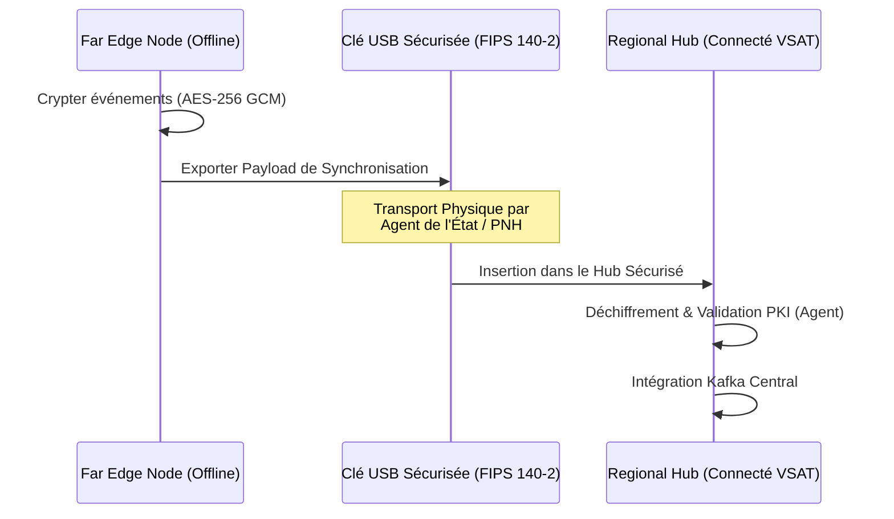

# VOLUME 1 : Architecture Edge Nationale (National Edge Architecture)
## Infrastructure Souveraine de Continuité de l'État — SNISID

L'architecture centralisée est une vulnérabilité mortelle dans un pays sujet aux séismes et aux instabilités d'infrastructures télécoms. Le SNISID décentralise son intelligence grâce à un réseau maillé Edge (Périphérie).

---

## 🗺️ CHAPITRE 1 : TOPOLOGIE KUBERNETES DÉCENTRALISÉE

Le réseau est fragmenté en trois couches autonomes : Le Core (Cœur), le Regional Edge (Départements), et le Far Edge (Communes/Terrain).

```mermaid
graph TD
    subgraph Core_Tier [Tier 1: Core Datacenters - Haute Disponibilité]
        DC1[Datacenter Port-au-Prince]
        DC2[Datacenter Cap-Haïtien]
        DC1 <-->|Fibre Dédiée| DC2
    end

    subgraph Regional_Edge [Tier 2: Regional Edge Clusters - K3s]
        RE1[Cluster Sud - Les Cayes]
        RE2[Cluster Artibonite - Gonaïves]
        RE3[Cluster Nord-Ouest - Port-de-Paix]
    end

    subgraph Far_Edge [Tier 3: Mobile & Offline Nodes - MicroK8s]
        FE1[Hôpital Communal]
        FE2[Tribunal de Paix]
        FE3[Kit Mobile Enrôlement]
    end

    DC1 -.->|VSAT / VPN 4G| RE1
    DC1 -.->|VSAT / VPN 4G| RE2
    DC2 -.->|VPN 4G| RE3

    RE1 -.->|Réseau Mesh Local| FE1
    RE2 -.->|Asynchrone| FE2
    RE3 -.->|Asynchrone (USB/Store & Forward)| FE3
```

---

## 🏛️ CHAPITRE 2 : CLUSTERS EDGE RÉGIONAUX (TIER 2)

Les 10 chefs-lieux départementaux d'Haïti sont équipés de **Mini-Datacenters de type "Edge"** fonctionnant sous K3s (Kubernetes léger).

*   **Capacité de Survie (Survivability):** En cas de coupure avec la capitale, le cluster régional prend le relais complet. Il contient un miroir partiel de la base de données (identité du département) et un cache ABIS réduit.
*   **Composants locaux :**
    *   Serveur d'authentification (Keycloak Edge).
    *   Nœud Kafka régional (Broker MirrorMaker).
    *   Base de données CockroachDB avec géo-partitionnement (les données du Sud sont stockées physiquement dans le cluster Sud).
*   **Alimentation :** Onduleurs (UPS) haute capacité + Générateurs Diesel redondants.

---

## 🏥 CHAPITRE 3 : NŒUDS DE VALIDATION HORS-LIGNE (TIER 3)

Les hôpitaux, postes de police et mairies opèrent souvent dans des zones blanches (sans signal internet).

### Appareils "Far Edge" (Offline Validation Nodes)
*   **Matériel :** Serveurs durcis (Ruggedized servers) ou terminaux industriels sans ventilateur.
*   **Logique Applicative (Zero Trust) :** 
    *   L'appareil possède un certificat cryptographique X.509 d'appartenance à l'État.
    *   Il permet de signer des actes de naissance ou d'enregistrer des preuves cryptographiques (ex: validation d'une carte d'identité via NFC) de manière 100% hors-ligne.
*   **Store & Forward :** L'appareil met en cache toutes les transactions dans une base SQLite chiffrée. Dès qu'il capte un signal (Wi-Fi, 4G sporadique), il vide sa file d'attente vers le cluster régional (Tier 2).

---

## 🔄 CHAPITRE 4 : HUBS DE SYNCHRONISATION (SNEAKERNET / USB)

Dans l'éventualité d'une coupure totale d'infrastructure télécom prolongée (ex: après un ouragan de Catégorie 5 détruisant les antennes VSAT), l'État recourt au "Sneakernet" (transport physique de données).


*   **Sécurité du Sneakernet :** Les exports sont chiffrés avec la clé publique du Core Datacenter. Même si la clé USB est volée physiquement, les données ne peuvent pas être déchiffrées sans les HSM (Hardware Security Modules) centralisés à Port-au-Prince.
