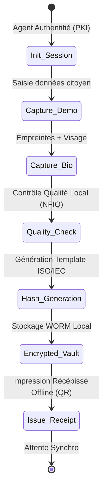

# VOLUME 2 : Enrôlement Déconnecté (Offline Enrollment)
## Infrastructure Souveraine de Continuité de l'État — SNISID

Atteindre les citoyens dans les zones reculées d'Haïti exige des équipements capables de fonctionner sans réseau électrique national (EDH) ni couverture internet. 

---

## 🎒 CHAPITRE 1 : KIT MOBILE D'ENRÔLEMENT (MOBILE ENROLLMENT KITS)

Le MEK (Mobile Enrollment Kit) est une valise durcie de qualité militaire (IP67) contenant tout le nécessaire pour enrôler un citoyen de bout en bout.

### 1.1 Spécifications Matérielles
*   **Énergie:** Batterie interne (autonomie 12h) + Panneaux solaires pliables (100W) intégrés.
*   **Connectivité:** Module 4G multi-SIM, Antenne VSAT portable (Starlink / Inmarsat), Wi-Fi Mesh.
*   **Biométrie:** Scanner 10 empreintes certifié FBI/FAP60, caméra biométrique infrarouge, scanner d'iris.
*   **Informatique:** Tablette durcie (Windows/Linux) avec TPM 2.0 (Trusted Platform Module).

### 1.2 Spécifications Logicielles (Zero Trust App)
*   L'application cliente est conçue en architecture "Local-First".
*   La base de données locale (Realm / SQLite) est chiffrée en AES-256 GCM. La clé de déchiffrement n'est déverrouillée que par l'insertion de la carte eID de l'agent de l'ONI + PIN + son empreinte digitale.

---

## 🔒 CHAPITRE 2 : CAPTURE BIOMÉTRIQUE HORS-LIGNE

Le principal défi de l'enrôlement hors-ligne est l'impossibilité de vérifier l'unicité (ABIS) en temps réel.

### 2.1 Résolution du Cas des Doublons Asynchrones
Lorsqu'un kit offline se synchronise, il envoie 50 enrôlements au central.
*   Si l'ABIS central détecte un hit > 95% pour l'enregistrement n°12, seul cet enregistrement est flaggé "Suspect".
*   L'agent enrôleur reçoit une alerte sur son terminal lors de la prochaine synchronisation, et le citoyen est convoqué au bureau départemental.

---

## 🔑 CHAPITRE 3 : PKI PORTABLE ET VALIDATION CITOYENNE HORS-LIGNE

Comment la police (PNH) ou une banque peut-elle vérifier l'identité d'un citoyen sans internet ?

### 3.1 Validation par Code QR Cryptographique
1.  La carte d'identité (eID) possède un **Code QR Haute Densité**.
2.  Ce QR code contient les données biographiques de base ET une signature cryptographique (ECDSA) générée par l'AN-PKI de l'État.
3.  L'application mobile de la PNH contient la *Clé Publique* de l'État (mise à jour régulièrement).
4.  Le policier scanne le QR code. L'application vérifie la validité mathématique de la signature hors-ligne.

### 3.2 Contrôle Biométrique Match-on-Card (MoC)
Pour les contrôles de haute sécurité (Douanes, Aéroports sans réseau) :
*   La puce NFC de la carte eID contient le template des empreintes du citoyen.
*   Le lecteur de la douane lit la carte, demande à la puce d'ouvrir une session, le citoyen pose son doigt sur le lecteur local, et la puce valide *elle-même* si le doigt correspond. (Le template ne quitte jamais la carte).
