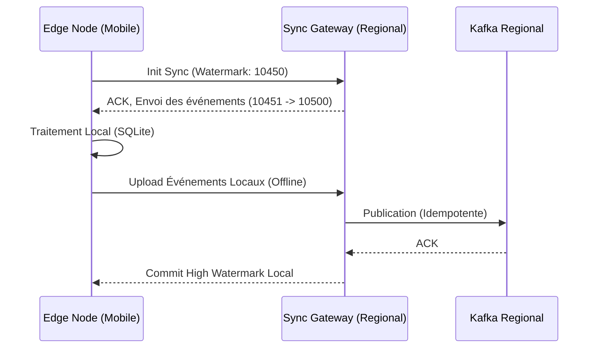

# VOLUME 3 : Moteur de Synchronisation (Synchronization Engine)
## Infrastructure Souveraine de Continuité de l'État — SNISID

Le moteur de synchronisation permet à des nœuds isolés de se reconnecter au réseau central et de fusionner leurs données sans perte, sans doublons et avec une résolution de conflits mathématiquement prouvable.

---

## 📡 CHAPITRE 1 : SYNCHRONISATION REPRENABLE (RESUMABLE SYNC)

Le réseau haïtien est sujet aux micro-coupures. Le protocole de synchronisation ne doit jamais recommencer de zéro.

### 1.1 Architecture Push-Pull Asynchrone
1.  **Handshake:** Le nœud Edge établit une session mTLS avec le Hub Régional.
2.  **Vector Clocks / Watermarks:** Le nœud envoie son dernier `High Watermark` (le dernier UUID d'événement qu'il a acquitté).
3.  **Chunking:** Les données sont envoyées par petits blocs compressés de 500 Ko.
4.  **Resumability:** Si la connexion casse au bloc 4, la prochaine session reprendra exactement au bloc 4 (comme un téléchargement torrent).

---

## ⚔️ CHAPITRE 2 : RÉSOLUTION DE CONFLITS DÉCONNECTÉS

Que se passe-t-il si un citoyen modifie son adresse à l'hôpital de Jacmel (hors-ligne), et que sa femme modifie la même adresse à Port-au-Prince (en-ligne) le même jour ?

### 2.1 Utilisation des CRDTs (Conflict-free Replicated Data Types)
Les bases de données relationnelles classiques créent des conflits insolubles. Le SNISID utilise des types de données convergents.
*   **LWW-Element-Set (Last-Writer-Wins) :** Chaque champ de l'identité possède une estampille temporelle absolue (NTP ou Logical Clock). Le moteur de base de données (CockroachDB) résout automatiquement le conflit en faveur de la transaction ayant l'horodatage le plus récent.
*   **Contrôle Administratif :** Si une modification critique entre en conflit absolu (ex: Déclaration de mariage hors-ligne écrasée par une déclaration de décès), le système déroute l'événement vers la file de **Résolution de Conflits de Niveau 3**, traitée par un humain au Ministère de la Justice.

---

## 🔁 CHAPITRE 3 : MÉCANISMES DE RETRY ET REPLAY

### 3.1 Retry Mechanism (Tolérance aux Pannes Transitoires)
Si le nœud régional est joignable mais que Kafka est saturé, la passerelle API renvoie une erreur HTTP 429 (Too Many Requests). Le nœud Edge implémente un *Exponential Backoff with Jitter* :
*   Tentative 1: +2s
*   Tentative 2: +4s
*   Tentative 3: +9s (+ bruit aléatoire pour éviter la congestion simultanée de tous les terminaux du pays).

### 3.2 Replay Mechanism (Restauration après sinistre complet)
Le journal Kafka central est conservé indéfiniment (WORM).
Si un cluster régional est entièrement détruit par un tremblement de terre :
1.  L'État déploie un nouveau cluster régional via Satellite (VSAT).
2.  Le cluster vide contacte le central : `Consumer.SeekToBeginning()`.
3.  Le cluster télécharge et rejoue la totalité de l'histoire de la nation haïtienne le concernant (tous les événements liés à son département).
4.  L'état du registre régional est reconstruit exactement comme il était avant le séisme en quelques heures.
